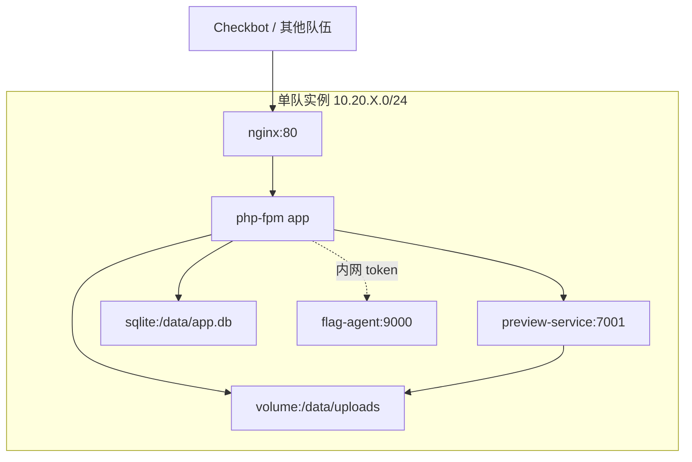

# 校园网盘

## challenge.yml 草案

```yaml
api_version: v1
kind: challenge

meta:
  slug: awd-campus-drive
  title: 校园网盘
  category: awd
  difficulty: medium
  points: 300
  tags:
    - mode:awd
    - stack:web
    - stack:php
    - topic:file-upload
    - topic:path-traversal
    - topic:webshell

content:
  statement: statement.md
  attachments: []

flag:
  type: dynamic
  prefix: flag

hints:
  - level: 1
    title: Hint 1
    content: 文件预览和下载接口对路径的处理方式不一致。

runtime:
  type: container
  image:
    ref: registry.example.edu/ctf/awd/awd-campus-drive:latest
```

## statement.md 草案

校园网盘提供课程资料上传、在线预览和共享链接功能。比赛中你需要维护本队网盘服务，避免其他队伍读取动态 Flag 或破坏共享文件。

请在不影响正常上传、下载和预览的前提下完成加固。

## 网络拓扑



## 服务角色

- `nginx`：Web 入口，转发 PHP 请求和静态文件下载。
- `php-fpm app`：登录、上传、分享链接、文件管理。
- `preview-service`：把文档或图片转为预览页。
- `uploads volume`：持久化用户上传文件。
- `flag-agent`：提供动态 Flag 检查接口。

## 漏洞设计

- 上传校验只检查 MIME 和扩展名末尾，存在双扩展绕过空间。
- 预览服务接收文件路径时未做规范化，存在目录穿越读取。
- 分享链接 token 使用可预测随机数，可枚举他人文件。
- Nginx 静态目录可执行 PHP 时，上传文件可能形成 WebShell。

## 防守目标

- 上传文件统一重命名，保存到非 Web 可执行目录。
- 禁止上传目录执行脚本，只允许静态下载。
- 预览服务使用文件 ID 查询真实路径，不接受原始路径参数。
- 分享 token 使用足够随机的不可预测值，并限制访问频率。

## Checkbot 检查点

- 普通用户登录后上传 `.txt` 和 `.png` 文件。
- 使用分享链接下载文件。
- 预览合法文件，确认预览服务正常。
- 检查上传目录中的历史课程文件未被删除。

## 演示流程

1. 上传伪装脚本文件并尝试访问，展示可执行上传风险。
2. 使用预览接口读取非授权路径，拿到 Flag。
3. 防守方调整 Nginx 和上传逻辑。
4. 复测上传、下载、预览均正常，攻击路径失效。
