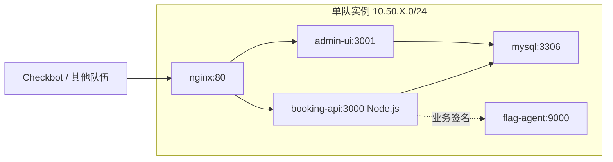

# 医疗预约平台

## challenge.yml 草案

```yaml
api_version: v1
kind: challenge

meta:
  slug: awd-clinic-booking
  title: 医疗预约平台
  category: awd
  difficulty: easy
  points: 250
  tags:
    - mode:awd
    - stack:web
    - stack:node
    - topic:idor
    - topic:sqli
    - topic:business-security

content:
  statement: statement.md
  attachments: []

flag:
  type: dynamic
  prefix: flag

hints:
  - level: 1
    title: Hint 1
    content: 预约详情接口需要同时校验资源存在和资源归属。

runtime:
  type: container
  image:
    ref: registry.example.edu/ctf/awd-clinic-booking:latest
```

## statement.md 草案

医疗预约平台提供患者注册、科室查询、医生排班、预约挂号和病历摘要查看功能。

你需要保护本队患者数据和动态 Flag，同时保持挂号主流程可用。

## 网络拓扑



## 服务角色

- `booking-api`：患者注册、登录、预约和病历摘要接口。
- `admin-ui`：医生排班和预约统计界面。
- `mysql`：保存用户、医生、排班、预约、病历摘要。
- `flag-agent`：根据当前轮次生成动态 Flag。

## 漏洞设计

- 预约详情接口只按 `appointment_id` 查询，缺少患者归属校验。
- 科室搜索接口存在 SQL 拼接，可读取敏感表字段。
- 管理员统计接口缺少 CSRF 防护，可被诱导修改排班状态。
- 病历摘要字段回显未做输出转义，存在轻量存储型 XSS。

## 防守目标

- 所有对象详情接口增加当前用户归属校验。
- 搜索接口改为参数化查询。
- 管理端状态变更接口增加 CSRF token 或 SameSite 策略。
- 病历摘要和用户备注统一输出转义。

## Checkbot 检查点

- 注册患者并登录。
- 查询科室和医生排班。
- 创建预约并查看自己的预约详情。
- 管理端更新一条合法排班。

## 演示流程

1. 枚举预约 ID，读取其他用户的预约信息。
2. 通过搜索接口证明 SQL 拼接可访问敏感字段。
3. 防守方加入归属校验和参数化查询。
4. 复测业务主流程和越权访问。
