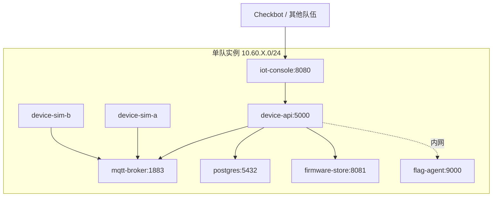

# IoT 设备管理平台

## challenge.yml 草案

```yaml
api_version: v1
kind: challenge

meta:
  slug: awd-iot-hub
  title: IoT 设备管理平台
  category: awd
  difficulty: hard
  points: 400
  tags:
    - mode:awd
    - stack:mqtt
    - stack:web
    - topic:default-credential
    - topic:topic-acl
    - topic:firmware-security

content:
  statement: statement.md
  attachments: []

flag:
  type: dynamic
  prefix: flag

hints:
  - level: 1
    title: Hint 1
    content: MQTT Topic 的读写权限应该按队伍和设备维度隔离。

runtime:
  type: container
  image:
    ref: registry.example.edu/ctf/awd/awd-iot-hub:latest
```

## statement.md 草案

IoT 设备管理平台用于登记设备、查看遥测数据、下发控制指令和管理固件版本。

比赛中每队拥有一组虚拟设备。你需要保证设备在线、遥测数据正常，同时防止其他队伍读取设备密钥或下发恶意指令。

## 网络拓扑



## 服务角色

- `iot-console`：Web 控制台，查看设备和固件版本。
- `device-api`：设备注册、密钥签发、命令下发和 Flag 读取代理。
- `mqtt-broker`：设备遥测和控制 Topic。
- `device-sim-*`：虚拟设备，定期上报状态。
- `firmware-store`：固件下载和版本发布服务。
- `flag-agent`：动态 Flag 与设备密钥校验绑定。

## 漏洞设计

- 初始设备使用默认凭据，攻击者可登录 MQTT Broker。
- Topic ACL 只按前缀判断，`team1/#` 与 `team10/#` 存在匹配绕过。
- 固件下载接口存在路径穿越，可读取设备密钥文件。
- 控制台 API 使用弱 JWT secret，可伪造管理员身份发布固件。

## 防守目标

- 为每台设备生成独立强随机密钥。
- MQTT ACL 使用精确队伍 ID 和设备 ID 匹配。
- 固件下载接口只允许读取数据库登记的固件对象。
- 轮换 JWT secret，管理员接口增加权限校验和审计日志。

## Checkbot 检查点

- 设备模拟器正常上报遥测。
- 控制台能显示设备在线状态。
- 下发合法控制指令后设备状态变化。
- 下载合法固件文件。

## 演示流程

1. 使用默认 MQTT 凭据订阅其他队伍 Topic。
2. 利用 Topic 前缀绕过读取遥测或下发控制指令。
3. 通过固件下载路径读取设备密钥或动态 Flag 线索。
4. 防守方修复 ACL、轮换凭据、限制固件路径后复测。
