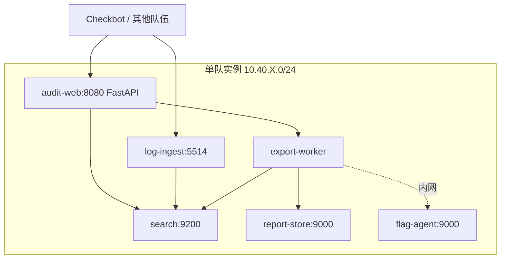

# 日志审计中心

## challenge.yml 草案

```yaml
api_version: v1
kind: challenge

meta:
  slug: awd-log-center
  title: 日志审计中心
  category: awd
  difficulty: medium
  points: 300
  tags:
    - mode:awd
    - stack:python
    - stack:elasticsearch
    - topic:command-injection
    - topic:log-poisoning
    - topic:audit

content:
  statement: statement.md
  attachments: []

flag:
  type: dynamic
  prefix: flag

hints:
  - level: 1
    title: Hint 1
    content: 日志导出功能会调用系统压缩命令。

runtime:
  type: container
  image:
    ref: registry.example.edu/ctf/awd-log-center:latest
```

## statement.md 草案

日志审计中心汇总多个业务系统的访问日志，并提供搜索、导出、告警规则和审计报表功能。

比赛中需要保证日志写入和搜索可用，同时避免攻击者通过日志内容或导出功能执行非预期操作。

## 网络拓扑



## 服务角色

- `audit-web`：日志搜索、规则配置、报表下载入口。
- `log-ingest`：接收 syslog 风格日志并写入搜索索引。
- `search`：简化 Elasticsearch/OpenSearch 服务。
- `export-worker`：生成压缩报表。
- `report-store`：保存导出的报表文件。
- `flag-agent`：动态 Flag 只允许 worker 按签名请求读取。

## 漏洞设计

- 报表导出文件名拼接到 shell 命令，存在命令注入。
- 告警模板把日志字段直接渲染到 HTML，存在日志投毒和存储型 XSS。
- 搜索索引默认开启匿名写入，攻击者可污染审计记录。
- 报表对象存储 bucket 策略过宽，可枚举历史导出文件。

## 防守目标

- 导出功能改为参数数组调用，不通过 shell 拼接命令。
- 告警模板对日志字段做 HTML escape。
- 搜索服务关闭匿名写入，只允许 `log-ingest` 写索引。
- 报表下载必须经过 Web 鉴权和一次性 token。

## Checkbot 检查点

- 写入一条合法访问日志。
- 搜索日志并按时间筛选。
- 创建告警规则。
- 导出报表并下载压缩文件。

## 演示流程

1. 通过日志写入接口投递带特殊字段的日志。
2. 触发报表导出，利用文件名参数读取 Flag。
3. 防守方修复命令调用和模板转义。
4. 使用 Checkbot 证明日志写入、搜索、导出没有被破坏。
