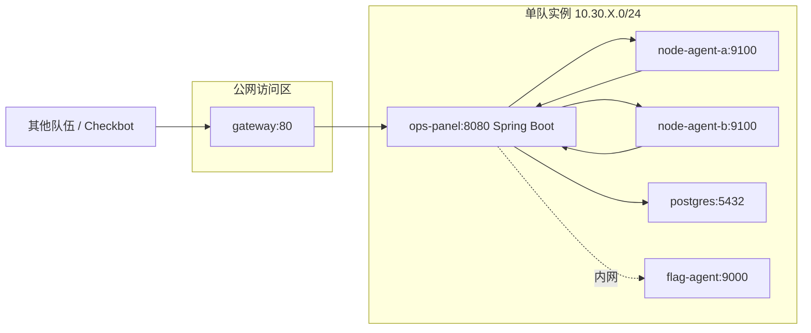

# 内网运维面板

## challenge.yml 草案

```yaml
api_version: v1
kind: challenge

meta:
  slug: awd-ops-panel
  title: 内网运维面板
  category: awd
  difficulty: hard
  points: 400
  tags:
    - mode:awd
    - stack:java
    - stack:spring
    - topic:ssrf
    - topic:deserialization
    - topic:secret-rotation

content:
  statement: statement.md
  attachments: []

flag:
  type: dynamic
  prefix: flag

hints:
  - level: 1
    title: Hint 1
    content: Agent 回调数据不是可信边界，签名校验和反序列化方式都要检查。

runtime:
  type: container
  image:
    ref: registry.example.edu/ctf/awd-ops-panel:latest
```

## statement.md 草案

内网运维面板用于管理服务器巡检任务。每台被管节点会通过 Agent 上报 CPU、内存、磁盘和自定义脚本执行结果。

比赛目标是在保持巡检、告警和节点列表功能可用的同时，修复面板中的远程攻击面。

## 网络拓扑



## 服务角色

- `ops-panel`：Spring Boot 管理后台，提供节点注册、巡检任务和告警查询。
- `node-agent-*`：模拟内网节点，接收巡检命令并回传结果。
- `postgres`：保存节点、任务、告警、审计日志。
- `flag-agent`：仅允许运维面板按轮次读取动态 Flag。

## 漏洞设计

- Agent 上报接口使用 Java 原生反序列化处理扩展字段。
- 巡检 URL 探测功能存在 SSRF，可访问内网 Flag Agent。
- Agent 签名密钥硬编码在镜像内，攻击者可伪造节点上报。
- 管理后台存在未授权节点详情接口，可泄露内网服务地址。

## 防守目标

- 用 JSON DTO 替代不安全反序列化。
- 巡检 URL 只允许访问已登记节点，拒绝 `127.0.0.0/8`、内网网段和元数据地址。
- 轮换 Agent 签名密钥，并使旧签名立即失效。
- 节点详情接口加鉴权，保留 Checkbot 所需的只读健康检查接口。

## Checkbot 检查点

- 注册一个合法节点。
- 下发巡检任务并获取 Agent 回传结果。
- 查看告警列表和节点详情。
- 验证动态 Flag API 只能通过合法业务路径读取。

## 演示流程

1. 通过未授权接口拿到 Agent 地址。
2. 用 SSRF 探测内网服务并读取 Flag Agent。
3. 展示反序列化入口的风险点和日志痕迹。
4. 防守方加白名单、替换序列化格式、轮换密钥后复测。
