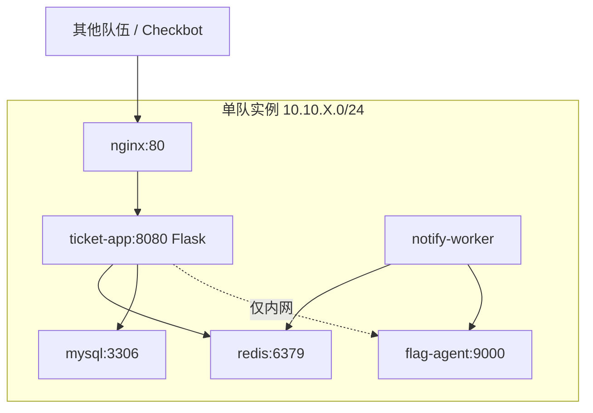

# 供应链工单系统

## challenge.yml 草案

```yaml
api_version: v1
kind: challenge

meta:
  slug: awd-supply-ticket
  title: 供应链工单系统
  category: awd
  difficulty: medium
  points: 300
  tags:
    - mode:awd
    - stack:web
    - stack:redis
    - topic:ssti
    - topic:weak-password
    - topic:session

content:
  statement: statement.md
  attachments: []

flag:
  type: dynamic
  prefix: flag

hints:
  - level: 1
    title: Hint 1
    content: 工单模板会把用户可控字段渲染到通知内容中。

runtime:
  type: container
  image:
    ref: registry.example.edu/ctf/awd-supply-ticket:latest
```

## statement.md 草案

你接手了一套供应链工单系统。系统用于登记采购、物流异常和售后处理记录，比赛开始后每队会获得一套相同实例。

保护自己的系统持续可用，同时分析其他队伍实例中的漏洞并获取动态 Flag。

## 网络拓扑



## 服务角色

- `nginx`：统一入口，只暴露 `80/tcp`。
- `ticket-app`：工单创建、查询、模板预览、管理员后台。
- `notify-worker`：从 Redis 队列取通知任务并渲染模板。
- `mysql`：保存用户、工单、供应商和审计记录。
- `flag-agent`：每轮刷新动态 Flag，只允许业务服务内网读取。

## 漏洞设计

- 初始管理员口令可从默认配置推断，用于第一轮快速建立攻击节奏。
- 通知模板存在 SSTI，攻击者可通过恶意工单标题影响 worker 渲染逻辑。
- Session secret 固定在镜像环境变量中，可伪造低权限用户会话。
- Redis 队列未设置认证，若网络策略配置错误，可被直接写入任务。

## 防守目标

- 修改默认管理员密码并轮换 Session secret。
- 修复模板渲染，只允许白名单变量，不执行表达式。
- 为 Redis 加认证或限制只允许 App / Worker 访问。
- 保持工单创建、查询和通知状态更新接口可用。

## Checkbot 检查点

- 创建普通用户并提交工单。
- 查询工单状态，确认数据库读写正常。
- 触发通知任务，确认 worker 消费正常。
- 从业务链路读取本队动态 Flag，确认 Flag Agent 未被破坏。

## 演示流程

1. 展示弱口令登录管理员后台，说明初始风险。
2. 构造包含模板表达式的工单，触发 worker 读取 Flag。
3. 防守方修改模板渲染逻辑并重启服务。
4. Checkbot 继续通过，攻击 payload 失效。
