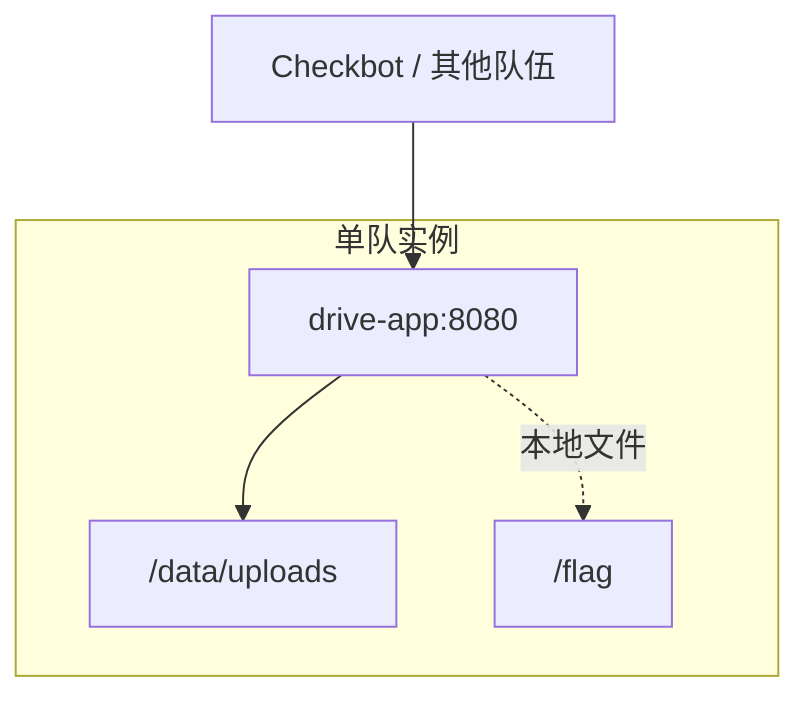

校园网盘提供课程资料上传、在线预览和共享下载功能。比赛中你需要维护本队网盘服务，避免其他队伍读取动态 Flag 或破坏共享文件。

请在不影响正常上传、下载和预览的前提下完成加固。

## 访问入口

- Web：`http://<team-host>:80/`

## 目标

- 保持上传、文件列表、下载和预览功能可用。
- 修复上传校验和预览路径穿越。
- 获取其他队伍实例中的动态 Flag。

## 网络拓扑

