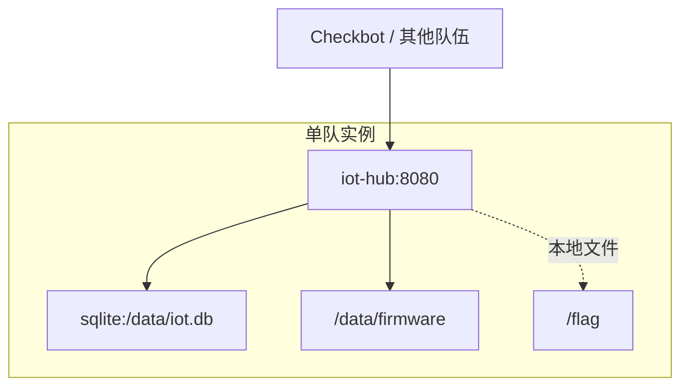

IoT 设备管理平台用于登记设备、查看遥测数据、下发控制指令和管理固件版本。

比赛中每队拥有一组虚拟设备。你需要保证设备在线、遥测数据正常，同时防止其他队伍读取设备密钥或下发恶意指令。

## 访问入口

- Web/API：`http://<team-host>:80/`
- 默认设备密钥：`device-demo-key`

## 目标

- 保持设备列表、遥测查询和控制指令功能可用。
- 修复默认设备密钥、Topic 越权和固件路径读取。
- 获取其他队伍实例中的动态 Flag。

## 网络拓扑

