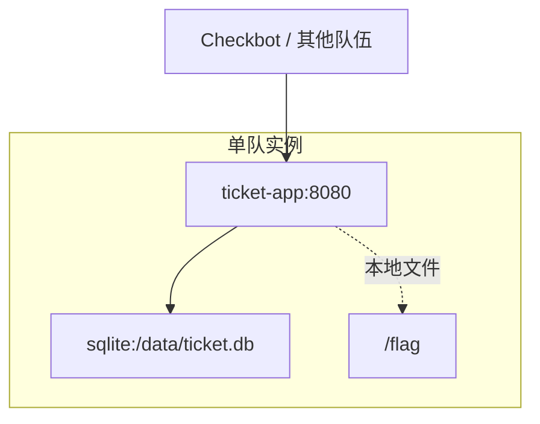

你接手了一套供应链工单系统。系统用于登记采购、物流异常和售后处理记录，比赛开始后每队会获得一套相同实例。

保护自己的系统持续可用，同时分析其他队伍实例中的漏洞并获取动态 Flag。

## 访问入口

- Web：`http://<team-host>:80/`
- 默认管理员：`admin / admin123`

## 目标

- 保持登录、创建工单、查看工单和通知预览功能可用。
- 修复默认口令和模板注入问题。
- 从其他队伍实例中获取动态 Flag。

## 网络拓扑

