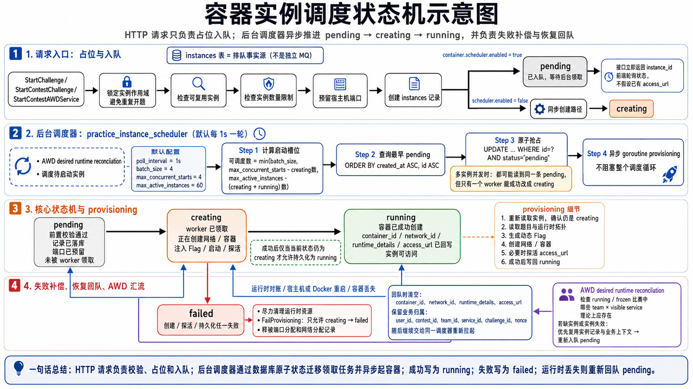
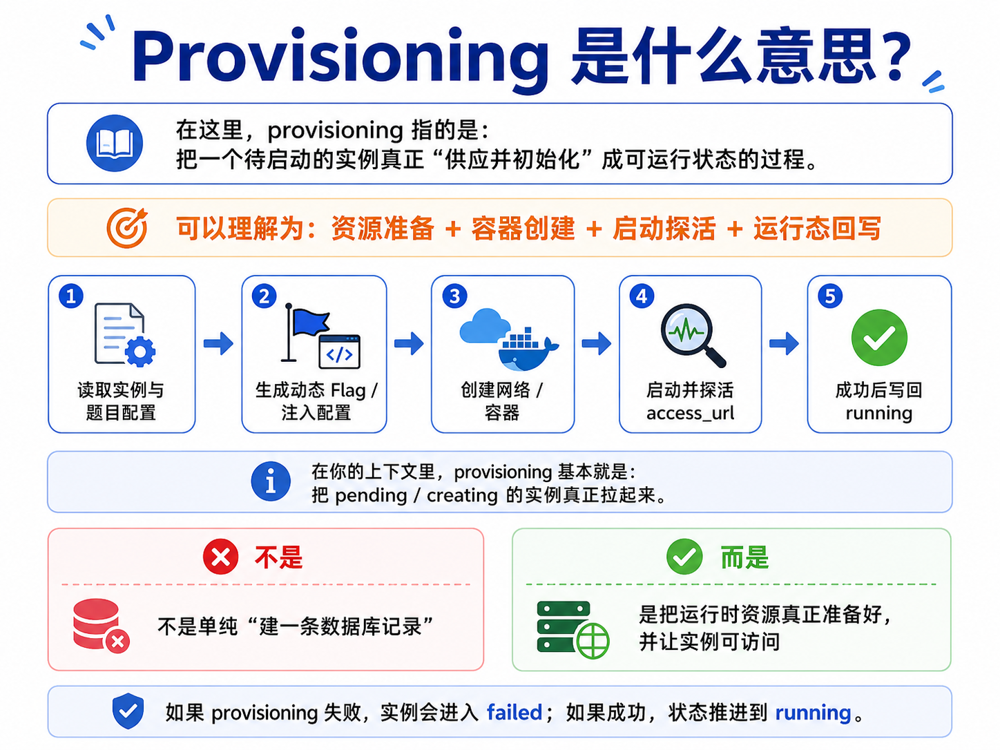

# Q&A：容器状态机调度是怎么实现的？

本文回答当前实例运行链路里的 `pending -> creating -> running` 状态机是如何被调度的，以及失败、回队和恢复是怎么收口的。

关联文档：

- `ctf/docs/Q&A/题目包上传后学生如何启动题目实例.md`
- `ctf/docs/architecture/backend/05-key-flows.md`
- `ctf/docs/architecture/backend/design/instance-sharing.md`

---

## 1. 这套状态机在解决什么问题

> 关键点：**平台没有把容器创建放在单次 HTTP 请求里同步完成，而是先占位入队，再由后台调度器异步推进。**

这样做主要是为了把 Docker 冷启动、探活和失败补偿从请求链路里剥离出去，避免课堂或竞赛高峰期大量学生同时开题时接口直接超时。

当前实现不是单独再挂一套 Redis / MQ 队列，而是直接把 `instances` 表作为排队事实源。

---

## 2. `pending / creating / running` 各自表示什么

### `pending`

- 前置校验已经通过。
- 实例记录已经写入数据库。
- 如需暴露宿主机端口，端口也已经预留。
- 但后台 worker 还没有正式领取这条实例。

这一阶段接口可以直接返回“排队中”，前端应根据 `instance_id` 轮询状态，而不是假设此时已经拿到 `access_url`。

### `creating`

- 某个调度 worker 已经抢到这条实例。
- 当前正在执行运行时编排，例如创建网络、创建容器、注入 Flag、启动、探活。

`creating` 表示“任务已被领取”，不是“实例已经可访问”。

### `running`

- 容器已经创建成功。
- 运行时字段已经成功回写数据库，包括 `container_id`、`network_id`、`runtime_details`、`access_url`。
- 对外可以视为实例已经启动完成。

---

## 3. 请求阶段怎么把实例送进这条状态机

当前入口在 `StartChallenge` / `StartContestChallenge` / `StartContestAWDService` 这条链路里，核心逻辑在 `startChallengeWithScope`。

请求阶段做的事主要是：

1. 锁定实例作用域，避免同一用户 / 队伍并发重复开题。
2. 检查是否已有可复用实例。
3. 检查实例数量限制。
4. 预留宿主机端口。
5. 创建实例记录。

当 `container.scheduler.enabled=true` 时，新实例不会直接进入同步创建，而是以 `status=pending` 落库，然后接口立即返回。

可以把它理解成：

- 请求链路负责“占位和入队”；
- 后台调度器负责“真正起容器并把状态推到 running”。

如果显式关闭 `container.scheduler.enabled`，则会回退到同步创建路径，实例初始状态直接走 `creating`，随后在同一请求中尝试完成启动。

---

## 4. 后台调度器是谁，多久跑一次

`practice` 模块会注册一个后台任务：`practice_instance_scheduler`。

它的循环做两件事：

1. 周期性执行 AWD desired runtime reconciliation。
2. 调度待启动实例，把最早的 `pending` 推进到 `creating`。

当前默认配置是：

- `container.scheduler.enabled = true`
- `container.scheduler.poll_interval = 1s`
- `container.scheduler.batch_size = 4`
- `container.scheduler.max_concurrent_starts = 4`
- `container.scheduler.max_active_instances = 60`

也就是说，默认每秒会尝试调度一次，但是否真的继续拉起新实例，还要看当前 `creating` 和 `creating + running` 的数量。

---

## 5. 调度器每一轮是怎么推进状态的

### Step 1：先算还有多少启动槽位

调度器不会无脑把所有 `pending` 都拉起来，而是先计算本轮还能启动多少个实例：

- 先取 `max_concurrent_starts`
- 减去当前 `creating` 数量
- 再用 `max_active_instances` 限制 `creating + running` 总量
- 最后再被 `batch_size` 截断

如果宿主机当前容量不足，这一轮就什么都不做，实例继续留在 `pending`，等待下一轮。

### Step 2：按创建时间取最早的 `pending`

调度器从数据库里查：

- `status = pending`
- `ORDER BY created_at ASC, id ASC`
- `LIMIT 本轮可调度数量`

这让排队顺序以“最早入队优先”为主。

### Step 3：通过原子更新把任务抢成 `creating`

真正的“领取任务”不是靠进程内锁，而是靠数据库条件更新：

- 先拿到候选实例 ID
- 再执行 `UPDATE ... WHERE id=? AND status='pending'`

只有更新成功的那个 worker 才算真正抢到任务。

这意味着多台后端实例同时跑调度循环时：

- 都可能读到同一条 `pending`
- 但只有一个实例能把它改成 `creating`
- 其他实例因为 `RowsAffected=0` 会自动跳过

这就是当前实现的并发抢占机制。

### Step 4：异步执行单实例 provisioning

调度器抢到任务后，不会阻塞整个循环，而是起一个 goroutine 异步处理这条实例：

1. 重新读取实例，确认它仍然处于 `creating`
2. 读取题目与运行时拓扑
3. 生成动态 Flag
4. 创建网络 / 容器
5. 必要时做访问地址探活
6. 成功后把状态写成 `running`

这里没有额外的固定 worker pool，真正的并发度是通过前面的“槽位计算”来控制的。

---

## 6. `creating -> running` 是怎么落库的

容器创建和探活成功后，服务会把实例对象的状态改成 `running`，然后调用持久化接口写回数据库。

这里还有一道重要保护：

- 持久化 SQL 只会更新“当前仍然是 `creating`”的实例。

也就是说，如果这条实例在 provisioning 过程中已经被别的维护流程改状态了，当前 worker 不会强行再把它写成 `running`。

这样可以避免：

- 已被回收或重置的实例被旧 worker 覆盖回去
- 同一条实例被多个恢复 / 清理流程交错写坏

---

## 7. 启动失败时怎么补偿

只要创建容器、探活或运行态持久化任一环节失败，都会走失败补偿：

1. 先尽力清理已经创建出来的运行时资源。
2. 再把实例从 `creating` 改成 `failed`。
3. 同时释放端口分配和网络分配记录。

这里同样带状态保护：

- `FailProvisioning` 只允许从 `creating` 写成 `failed`。

如果实例已经不再是 `creating`，这次失败写回就会被跳过，不会把别的合法状态覆盖掉。

---

## 8. 为什么 `running` 还可能回到 `pending`

`running` 不是绝对终态。

当 Docker daemon 重启、宿主机重启，或者维护逻辑发现数据库里记着活跃实例、但实际容器已经丢失时，后台运行时对账会把这条实例重新入队：

- 允许从 `creating` 或 `running` 回到 `pending`
- 清空 `container_id`
- 清空 `network_id`
- 清空 `runtime_details`
- 清空 `access_url`

但不会丢掉这条实例本身的业务归属信息，例如：

- `user_id`
- `contest_id`
- `team_id`
- `service_id`
- `challenge_id`
- `nonce`

这样做的结果是：

- 业务作用域不变
- 运行时句柄被视为失效
- 后续仍交给同一个 `practice_instance_scheduler` 重新拉起

所以这条状态机不是单向的“创建完成即结束”，它本质上还承担了运行时丢失后的再调度职责。

---

## 9. 和 AWD 有什么额外关系

这套调度器除了推进普通 `pending` 实例外，还会在循环里周期性执行 AWD desired runtime reconciliation。

它负责检查：

- 当前 `running / frozen` 的 AWD 比赛里
- 哪些 `team × visible service` 理论上应该活着
- 哪些 scope 当前缺实例或实例失效

发现缺口后，会优先复用已有实例记录和业务上下文，再交回同一套 `pending -> creating -> running` 链路处理。

因此当前实现里：

- 普通训练实例启动
- AWD 队伍服务实例补齐
- 宿主机重启后的实例回队恢复

最终都汇到同一条实例状态机主链上。

---

## 10. 可以怎么概括这套调度模型

可以把当前实现总结成一句话：

> HTTP 请求只负责校验、占位和入队；后台调度器用数据库原子状态迁移把实例从 `pending` 领取到 `creating`；容器创建和探活成功后再持久化为 `running`；失败或运行时丢失则通过 `failed` / 重新入队机制补偿。

如果要继续往下查代码，优先看这些入口：

- `internal/module/practice/application/commands/instance_start_service.go`
- `internal/module/practice/application/commands/instance_provisioning_scheduler.go`
- `internal/module/practice/application/commands/instance_provisioning.go`
- `internal/module/runtime/infrastructure/repository.go`
- `internal/module/instance/application/commands/maintenance_service.go`
