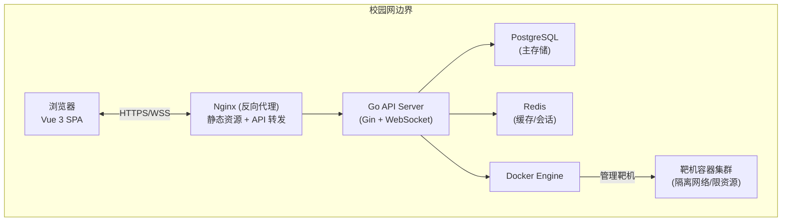
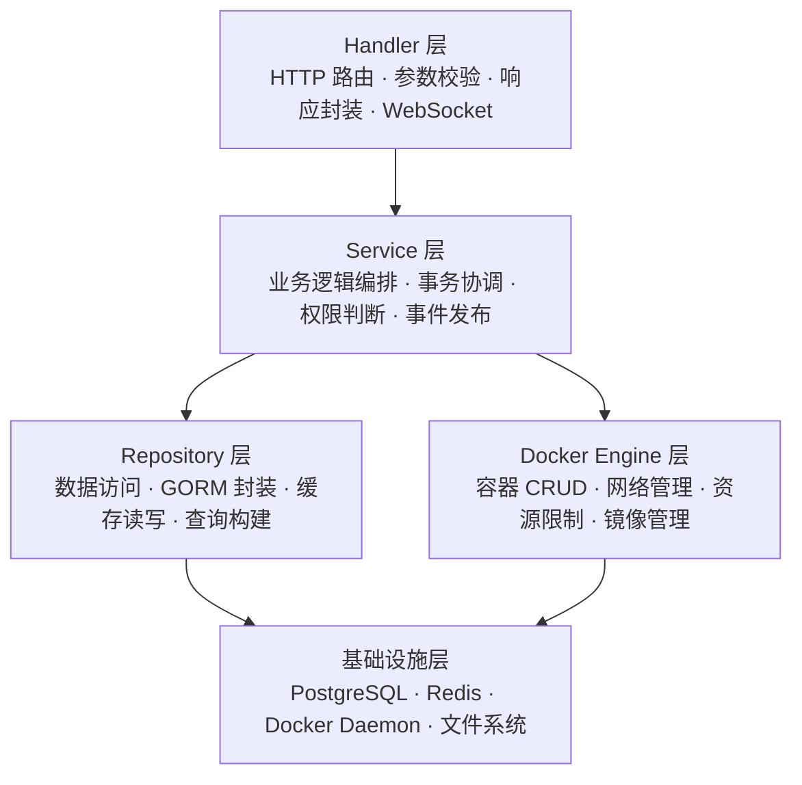
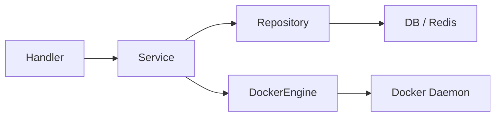
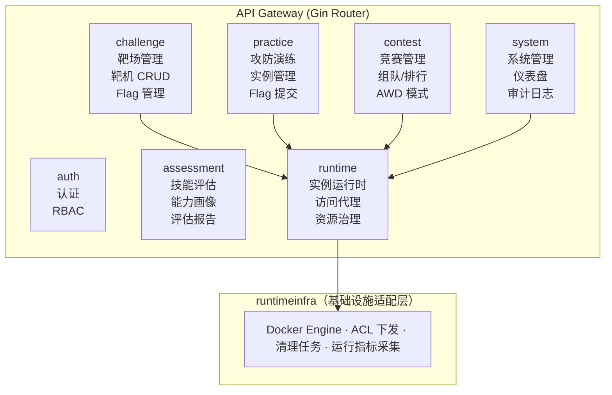
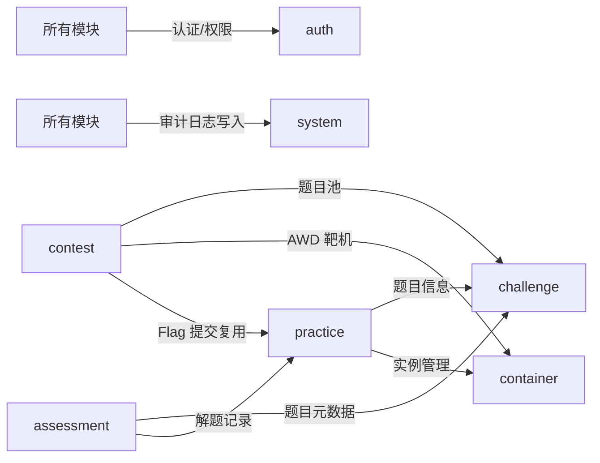
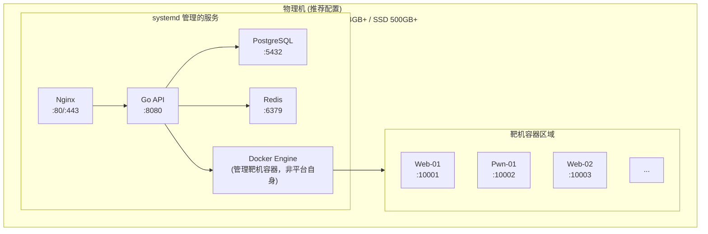
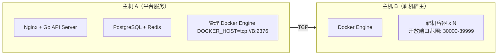
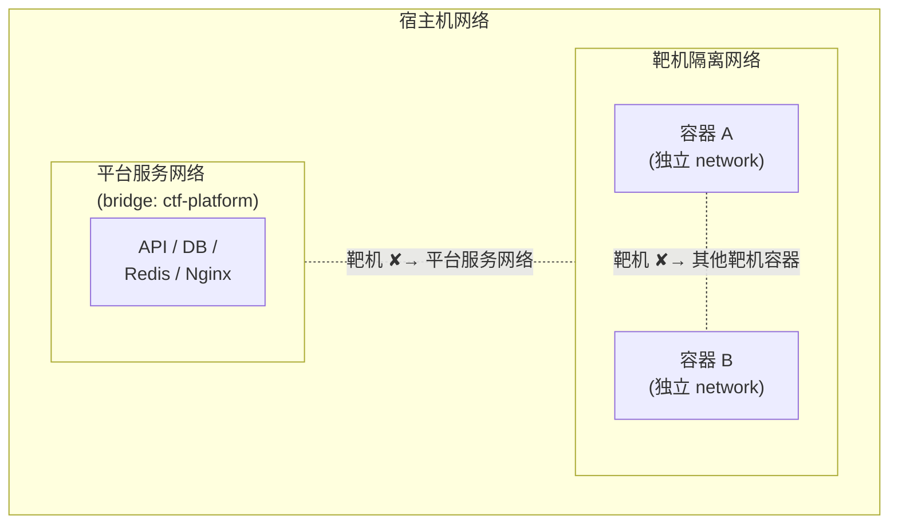

# CTF 网络攻防靶场平台 — 整体架构设计

> 版本：v1.0 | 日期：2026-03-01 | 状态：初稿

---

## 1. 架构概览

**一句话定位**：基于 Go + Docker 的校园级 CTF 攻防靶场平台，支撑信息安全专业日常训练、竞赛对抗和技能评估，设计目标为 200 并发用户、单机可部署、运维零门槛。

### 1.1 系统上下文图



### 1.2 关键设计约束

| 约束项 | 说明 |
|--------|------|
| 部署环境 | 学校物理机，校园网内网，无公网暴露 |
| 用户规模 | 注册用户 ≤ 2000，日常训练并发 ≤ 200 |
| 容器上限 | 单机同时运行靶机容器 ≤ 200（推荐配置 16 核 64GB 下的评估值）；竞赛模式下通过降低单容器配额（small 级别）和容器池预热提升密度；如单机仍不足，一期支持双机方案（详见 03-container-architecture §9） |
| 可用性目标 | 日常训练 99%+（允许计划内停机维护）；竞赛期间 99.5%+（竞赛窗口内禁止维护操作，通过健康检查 + systemd 自动重启保障） |
| 安全边界 | 靶机容器必须网络隔离，禁止访问宿主机和平台内部服务 |

---

## 2. 分层架构设计

### 2.1 分层总览



### 2.2 各层职责与规则

#### Handler 层

- 职责：接收 HTTP 请求，参数绑定与校验，调用 Service，封装统一响应
- 规则：
  - 禁止包含任何业务逻辑，只做"入参 → Service 调用 → 出参"的转换
  - 参数校验使用 Gin 的 `binding` tag + 自定义 validator
  - 统一通过 `response.Success()` / `response.Error()` 返回，禁止直接 `c.JSON()`
  - WebSocket 连接的建立和消息分发在此层处理，业务逻辑下沉到 Service
- 依赖：仅依赖 Service 层接口

```go
// 示例：Handler 只做参数绑定和调用转发
func (h *ChallengeHandler) Create(c *gin.Context) {
    var req dto.CreateChallengeReq
    if err := c.ShouldBindJSON(&req); err != nil {
        response.ValidationError(c, err)
        return
    }
    result, err := h.challengeService.Create(c.Request.Context(), &req)
    if err != nil {
        response.FromError(c, err)
        return
    }
    response.Success(c, result)
}
```

#### Service 层

- 职责：业务逻辑编排、事务管理、跨模块协调、权限判断、事件发布
- 规则：
  - 核心业务逻辑全部在此层实现
  - 通过接口依赖 Repository 层和 Docker Engine 层，不直接操作数据库或 Docker API
  - 跨模块调用通过注入对方 Service 接口，禁止直接访问对方 Repository
  - 事务边界在 Service 层控制，Repository 层不自行开启事务
  - 对外暴露接口（interface），便于单元测试 mock
- 依赖：Repository 接口、Docker Engine 接口、其他模块 Service 接口

```go
// 示例：Service 接口定义
type ChallengeService interface {
    Create(ctx context.Context, req *dto.CreateChallengeReq) (*dto.ChallengeResp, error)
    Update(ctx context.Context, id int64, req *dto.UpdateChallengeReq) error
    Delete(ctx context.Context, id int64) error
    GetByID(ctx context.Context, id int64) (*dto.ChallengeResp, error)
    ListByCategory(ctx context.Context, query *dto.ChallengeQuery) (*dto.PageResult, error)
}
```

#### Repository 层

- 职责：数据持久化、缓存读写、查询构建
- 规则：
  - 封装所有 GORM 操作，对上层屏蔽 ORM 细节
  - 缓存逻辑（Redis）在此层实现，Service 层无需感知缓存存在
  - 返回领域模型（model），不返回 GORM 的 `*gorm.DB`
  - 复杂查询使用 QueryBuilder 模式，避免在 Service 层拼接查询条件
- 依赖：GORM DB 实例、Redis Client

#### Docker Engine 层

- 职责：封装 Docker SDK，提供容器生命周期管理的高层 API
- 规则：
  - 对上层屏蔽 Docker SDK 的底层细节（types、API 版本差异等）
  - 所有容器操作必须设置超时（context.WithTimeout）
  - 容器创建必须强制设置资源限制（CPU、内存、磁盘）
  - 网络隔离逻辑在此层实现，上层只需指定隔离级别
- 依赖：Docker Client（`client.NewClientWithOpts`）

### 2.3 依赖规则



> 规则：
> - ✅ 上层可以依赖下层的接口
> - ❌ 下层禁止依赖上层（禁止反向依赖）
> - ❌ 同层禁止直接依赖（通过上层 Service 协调）
> - ✅ 所有跨层依赖通过 interface 注入，不依赖具体实现

### 2.4 Composition Root 与生命周期

- 当前实现以 `internal/app/buildRouterRuntime` 作为统一 composition root，负责集中装配 repository、service、handler 与共享基础设施依赖。
- HTTP 路由与后台任务共享同一套关键运行时组件，当前已确认：
  - `runtimeService` 由路由层创建一次，同时复用于：
    - HTTP Handler 链路
    - 运行时清理任务 `runtimeinfra.Cleaner`
    - AWD Flag 注入器 `contest.DockerAWDFlagInjector`
  - `assessmentService` 由路由层创建一次，同时复用于：
    - HTTP Handler 链路
    - 能力画像后台任务 `assessment.Cleaner`
- `internal/app/HTTPServer` 只负责启动和停止后台任务，不再重复构建上述核心 service；其关闭流程统一收口：
  - 先取消 contest 状态更新与 AWD 轮次推进
  - 再停止 cleaner / assessment rebuild
  - 最后依次关闭带异步任务的应用组件（当前包括 `reportService`、`imageService`、`practiceService`）
- 约束：
  - 新增后台任务时必须优先复用 composition root 中已创建的共享 service
  - 禁止在子流程或后台协程内部私自重新构建同类运行时组件
  - 需要显式关闭的组件必须纳入统一 lifecycle 管理

---

## 3. 模块划分与边界

### 3.1 模块全景图



### 3.2 各模块职责

#### auth 模块 — 认证与权限

| 项目 | 说明 |
|------|------|
| 核心职责 | 用户注册/登录、JWT 签发与刷新、RBAC 权限控制 |
| 角色模型 | `admin`（平台管理员）、`teacher`（教师）、`student`（学生） |
| 关键接口 | 注册、登录、刷新 Token、获取当前用户、角色管理 |
| 数据表 | `users`、`roles`、`user_roles`、`permissions`、`role_permissions` |
| 对外暴露 | `AuthService` 接口（Token 校验）、`AuthMiddleware`（Gin 中间件） |
| 安全要求 | 密码 bcrypt 加盐、JWT 双 Token（Access 15min + Refresh 7d）、登录失败锁定 |

#### challenge 模块 — 靶场管理

| 项目 | 说明 |
|------|------|
| 核心职责 | 靶机题目 CRUD、分类管理、Flag 生成策略、难度分级、附件管理 |
| 题目类型 | `static`（静态 Flag）、`dynamic`（动态 Flag，每用户唯一）、`manual`（人工评判） |
| Flag 策略 | 静态：管理员手动设置（只存哈希+盐）；动态：`HMAC-SHA256(global_secret + contest_salt, user_id + ":" + challenge_id + ":" + instance_nonce)`（三层密钥分离，详见 ADR-004） |
| 分类体系 | Web、Pwn、Reverse、Crypto、Misc、Forensics（可扩展） |
| 数据表 | `challenges`、`challenge_categories`、`challenge_tags`、`challenge_attachments` |
| 依赖模块 | runtime（获取镜像信息与运行时资源操作） |

#### practice 模块 — 攻防演练

| 项目 | 说明 |
|------|------|
| 核心职责 | 用户开启/销毁靶机实例、Flag 提交与判定、解题记录、积分计算 |
| 实例生命周期 | 创建 → 运行中 → 已过期/已销毁；每用户同时运行实例数上限可配置（默认 3） |
| 实例超时 | 默认 2 小时自动回收，用户可手动续期一次（+1 小时），通过后台定时任务扫描过期实例 |
| Flag 提交 | 防刷机制：同一题目 60 秒内限提交 5 次（Redis 滑动窗口）；提交记录全量入库用于分析 |
| 积分规则 | 静态积分 或 动态积分（首血加成、解题人数衰减），由 challenge 配置决定 |
| 数据表 | `practice_instances`、`submissions`、`user_scores`、`first_blood_records` |
| 依赖模块 | challenge（题目信息、Flag 校验）、runtime（实例创建/销毁与访问代理）、auth（用户信息） |

#### contest 模块 — 竞赛管理

| 项目 | 说明 |
|------|------|
| 核心职责 | 竞赛创建与配置、组队管理、实时排行榜、多赛制支持 |
| 赛制支持 | Jeopardy（解题积分）、AWD（攻防对抗）、混合赛制 |
| 竞赛状态机 | 草稿 → 报名中 → 进行中 → 已结束 → 已归档 |
| 组队规则 | 可配置：个人赛/团队赛、队伍人数上限、是否允许跨班组队 |
| 排行榜 | Redis Sorted Set 实时排名 + WebSocket 推送；冻结机制（赛前 N 分钟冻结榜单） |
| AWD 模式 | 每轮自动检测存活（checker）、攻击得分/防守失分、轮次定时推进 |
| 数据表 | `contests`、`contest_challenges`、`teams`、`team_members`、`submissions`、`contest_announcements`、`cheat_reports` |
| 依赖模块 | challenge（题目池）、runtime（AWD 靶机编排）、practice（Flag 提交复用） |

#### assessment 模块 — 技能评估

| 项目 | 说明 |
|------|------|
| 核心职责 | 技能评估任务管理、能力画像生成、评估报告导出 |
| 评估维度 | 按 CTF 分类维度（Web/Pwn/Reverse/Crypto/Misc/Forensics）+ 难度维度交叉评分 |
| 能力画像 | 基于用户历史解题数据（分类通过率、平均耗时、难度分布）生成雷达图数据 |
| 评估任务 | 教师可创建定向评估任务：指定题目集 + 时间限制 + 目标班级 |
| 报告内容 | 个人能力雷达图、班级排名、薄弱项分析、推荐练习题目 |
| 数据表 | `assessments`、`assessment_tasks`、`assessment_results`、`user_skill_profiles` |
| 依赖模块 | challenge（题目元数据）、practice（解题记录与积分） |

#### runtime 模块 — 实例运行时与资源治理

| 项目 | 说明 |
|------|------|
| 核心职责 | 实例查询、访问代理、运行时拓扑编排、容器/网络/ACL 生命周期治理 |
| 容器生命周期 | 创建 → 启动 → 运行中 → 停止 → 删除；异常状态自动检测与清理 |
| 网络隔离 | 每个靶机实例分配独立 Docker Network，禁止容器间互访（AWD 模式除外） |
| 资源限制 | CPU（默认 0.5 核）、内存（默认 256MB）、磁盘（默认 1GB）、网络带宽，均可按题目配置 |
| 端口映射 | 动态分配宿主机端口（范围可配置，默认 30000-39999），映射到容器服务端口 |
| 镜像管理 | 题目镜像元数据由 challenge 模块持有，runtime 负责运行时镜像探测与删除 |
| 健康检查 | 定时探活（TCP/HTTP），连续失败 N 次标记为异常并通知用户 |
| 运行时基础设施 | `runtimeinfra` 提供 Docker Engine、ACL 下发、清理任务和运行指标采集 |
| 数据表 | `instances`、`port_allocations` |
| 依赖模块 | 无业务上游依赖，被 challenge / practice / contest / system 模块调用 |

#### system 模块 — 系统管理

| 项目 | 说明 |
|------|------|
| 核心职责 | 管理仪表盘、审计日志、系统通知、全局配置、资源监控 |
| 仪表盘 | 用户统计、题目统计、容器资源使用率、近期活跃度趋势图 |
| 审计日志 | 记录关键操作（登录、权限变更、题目修改、容器操作），支持按时间/用户/操作类型筛选 |
| 通知机制 | 站内通知（WebSocket 推送）：竞赛开始/结束、靶机到期提醒、系统公告 |
| 全局配置 | 平台名称、注册开关、容器资源默认值、端口范围等运行时可调参数 |
| 数据表 | `audit_logs`、`notifications`、`system_configs` |
| 依赖模块 | auth（操作人信息）、runtime（资源监控数据） |

### 3.3 模块间通信方式

校园级单体应用，模块间通信采用**进程内直接调用 + 轻量事件总线**的混合方式：

| 通信方式 | 适用场景 | 实现方案 |
|----------|----------|----------|
| 直接调用 | 同步、强一致性场景（如 Flag 提交需实时校验） | Service 接口注入，方法调用 |
| 事件总线 | 异步、弱一致性场景（如解题后更新排行榜、记录审计日志） | 进程内 EventBus（Go channel） |

#### 事件总线设计

```go
// 事件定义
type Event struct {
    Type      string      // 事件类型，如 "submission.accepted"
    Payload   interface{} // 事件载体
    Timestamp time.Time
    UserID    int64
}

// 事件类型常量
const (
    EventSubmissionAccepted = "submission.accepted"  // Flag 提交成功
    EventSubmissionRejected = "submission.rejected"  // Flag 提交失败
    EventContainerCreated   = "container.created"    // 容器创建
    EventContainerExpired   = "container.expired"    // 容器过期
    EventContestStarted     = "contest.started"      // 竞赛开始
    EventContestEnded       = "contest.ended"        // 竞赛结束
    EventUserLoggedIn       = "user.logged_in"       // 用户登录
)
```

#### 模块依赖关系图



---

## 4. 技术选型细节

### 4.1 后端核心依赖

| 组件 | 选型 | 版本要求 | 选型理由 |
|------|------|----------|----------|
| Web 框架 | Gin | v1.9+ | 高性能、生态成熟、中间件丰富，校园项目学习成本低 |
| ORM | GORM | v2.x | Go 生态最主流 ORM，文档完善，支持 PostgreSQL 全特性 |
| 数据库迁移 | golang-migrate | v4.x | 支持 SQL 文件迁移，版本可控，CI 友好 |
| 配置管理 | Viper | v1.x | 支持 YAML/ENV/命令行多源配置，热加载 |
| 日志 | Zap | v1.x | 高性能结构化日志，支持日志级别动态调整 |
| Redis 客户端 | go-redis | v9.x | 功能完整，支持 Pipeline/Lua 脚本/Pub-Sub |
| Docker SDK | Docker SDK for Go | latest | 官方 SDK，API 覆盖完整 |
| WebSocket | github.com/coder/websocket | v1.8+ | gorilla/websocket 已归档，coder/websocket 是活跃维护的继任者，API 兼容，支持并发读写控制 |
| JWT | golang-jwt | v5.x | 社区标准库，支持多种签名算法 |
| 密码哈希 | bcrypt | golang.org/x/crypto | 标准库，自带盐值管理 |
| 参数校验 | validator | v10.x | Gin 内置集成，支持自定义校验规则 |
| 定时任务 | robfig/cron | v3.x | 容器过期清理、竞赛轮次推进等定时场景 |

### 4.2 前端核心依赖

| 组件 | 选型 | 说明 |
|------|------|------|
| 框架 | Vue 3 | Composition API，TypeScript 支持 |
| 构建工具 | Vite | 开发热更新快，生产构建高效 |
| UI 组件库 | Arco Design Vue / Naive UI | 功能丰富，适合管理后台 + 竞赛前台 |
| 状态管理 | Pinia | Vue 3 官方推荐，TypeScript 友好 |
| 路由 | Vue Router 4 | 支持路由守卫做权限控制 |
| HTTP 客户端 | Axios | 拦截器统一处理 Token 刷新和错误 |
| 图表 | ECharts | 能力雷达图、排行榜趋势图、仪表盘统计 |
| Markdown | md-editor-v3 | 题目描述编辑与渲染 |
| 终端模拟 | xterm.js | WebSocket + xterm 实现浏览器内终端连接靶机 |

### 4.3 基础设施

| 组件 | 选型 | 配置建议 |
|------|------|----------|
| 数据库 | PostgreSQL 15+ | 主存储，JSONB 存储灵活字段（如题目 hints、容器配置） |
| 缓存 | Redis 7+ | 会话管理、排行榜、限流计数器、分布式锁 |
| 容器运行时 | Docker Engine 24+ | 靶机容器编排，通过 Unix Socket 通信 |
| 反向代理 | Nginx | 静态资源、API 转发、WebSocket 代理、SSL 终止 |
| 进程管理 | systemd | Go 二进制直接部署，systemd 管理进程生命周期 |

---

## 5. 项目目录结构

```
ctf-platform/
├── cmd/
│   └── server/
│       └── main.go                  # 程序入口，初始化依赖并启动 HTTP Server
├── configs/
│   ├── config.yaml                  # 主配置文件
│   ├── config.dev.yaml              # 开发环境覆盖配置
│   └── config.prod.yaml             # 生产环境覆盖配置
├── internal/
│   ├── app/
│   │   ├── app.go                   # 应用初始化（依赖注入、路由注册、生命周期管理）
│   │   └── router.go                # 路由总表，按模块分组注册
│   ├── config/
│   │   └── config.go                # 配置结构体定义 + Viper 加载逻辑
│   ├── middleware/
│   │   ├── auth.go                  # JWT 认证中间件
│   │   ├── rbac.go                  # RBAC 权限校验中间件
│   │   ├── audit.go                 # 审计日志中间件
│   │   ├── ratelimit.go             # 限流中间件（令牌桶 / 滑动窗口）
│   │   ├── cors.go                  # CORS 中间件
│   │   ├── recovery.go              # Panic 恢复中间件
│   │   └── requestid.go             # 请求 ID 注入中间件
│   ├── model/
│   │   ├── user.go                  # 用户、角色等领域模型
│   │   ├── challenge.go             # 靶机题目模型
│   │   ├── practice.go              # 演练实例、提交记录模型
│   │   ├── contest.go               # 竞赛、队伍模型
│   │   ├── assessment.go            # 评估任务、技能画像模型
│   │   ├── container.go             # 容器实例模型
│   │   └── system.go                # 审计日志、通知、配置模型
│   ├── dto/
│   │   ├── request/                 # 按模块组织的请求 DTO
│   │   └── response/                # 按模块组织的响应 DTO
│   ├── module/
│   │   ├── auth/
│   │   │   ├── handler.go           # 认证相关 HTTP Handler
│   │   │   ├── service.go           # 认证 Service 接口 + 实现
│   │   │   └── repository.go        # 用户/角色 Repository
│   │   ├── challenge/
│   │   │   ├── handler.go
│   │   │   ├── service.go
│   │   │   └── repository.go
│   │   ├── practice/
│   │   │   ├── handler.go
│   │   │   ├── service.go
│   │   │   └── repository.go
│   │   ├── contest/
│   │   │   ├── handler.go
│   │   │   ├── service.go
│   │   │   └── repository.go
│   │   ├── assessment/
│   │   │   ├── handler.go
│   │   │   ├── service.go
│   │   │   └── repository.go
│   │   ├── runtime/
│   │   │   ├── api/http/handler.go  # 实例访问与运行时 HTTP API
│   │   │   ├── application/         # Query / UseCase 入口（分层迁移中）
│   │   │   ├── contracts.go         # 模块对外 contract
│   │   │   ├── module.go            # 模块 facade
│   │   │   ├── service.go           # 实例运行时编排 Service
│   │   │   └── repository.go        # 旧 persistence，后续继续内聚到 infrastructure
│   │   ├── runtimeinfra/
│   │   │   ├── engine.go            # Docker SDK 封装层
│   │   │   ├── cleaner.go           # 运行时清理任务
│   │   │   ├── acl.go               # ACL 下发
│   │   │   └── runtime_metrics.go   # 运行指标采集
│   │   └── system/
│   │       ├── handler.go
│   │       ├── service.go
│   │       └── repository.go
│   └── pkg/
│       ├── response/
│       │   └── response.go          # 统一响应封装（Success/Error/Page）
│       ├── errcode/
│       │   └── errcode.go           # 错误码定义与错误类型
│       ├── logger/
│       │   └── logger.go            # Zap 日志初始化与封装
│       ├── event/
│       │   └── bus.go               # 进程内事件总线
│       ├── crypto/
│       │   └── flag.go              # Flag 生成与校验工具
│       └── pagination/
│           └── pagination.go        # 分页查询工具
├── migrations/
│   ├── 000001_init_schema.up.sql    # 初始表结构
│   └── 000001_init_schema.down.sql  # 回滚脚本
├── docker/
│   ├── Dockerfile                   # Go API Server 构建镜像
│   ├── docker-compose.yml           # 平台自身服务编排
│   └── challenges/                  # 靶机镜像 Dockerfile 存放目录
│       ├── web-sql-injection/
│       │   └── Dockerfile
│       └── pwn-buffer-overflow/
│           └── Dockerfile
├── web/                             # Vue 3 前端项目（独立子目录）
│   ├── src/
│   ├── package.json
│   └── vite.config.ts
├── scripts/
│   ├── setup.sh                     # 一键部署脚本
│   └── seed.sh                      # 初始数据填充脚本
├── go.mod
├── go.sum
└── Makefile                         # 构建、迁移、测试等常用命令
```

---

## 6. 跨切面关注点

### 6.1 统一错误处理

#### 错误码体系
本平台错误码采用 **5 位整数**，按模块划分区间，便于快速定位问题来源；完整列表见 `ctf/docs/architecture/backend/04-api-design.md` §3。

| 模块 | 区间 | 示例 |
|------|------|------|
| 通用 | 10000-10999 | 10002 参数校验失败、10003 未认证、10004 无权限、10005 资源不存在 |
| 认证 | 11000-11999 | 11001 用户名或密码错误、11002 Access Token 过期 |
| 靶场 | 12000-12999 | 12001 镜像构建失败、12003 靶机未配置 Flag |
| 演练 | 13000-13999 | 13002 实例数上限、13003 Flag 错误、13005 实例过期 |
| 竞赛 | 14000-14999 | 14001 竞赛未开始、14003 队伍人数已满 |
| 评估 | 15000-15999 | 15002 报告生成失败 |
| 容器 | 16000-16999 | 16001 容器启动超时、16004 容器镜像不存在 |

#### 错误类型定义

```go
// AppError 统一业务错误类型
type AppError struct {
    Code    int    `json:"code"`    // 业务错误码
    Message string `json:"message"` // 用户可见的错误描述
    HTTPStatus int `json:"-"`       // HTTP 状态码，不序列化
    Err     error  `json:"-"`       // 原始错误，用于日志记录，不返回给前端
}

func (e *AppError) Error() string {
    return e.Message
}

// 预定义错误构造函数
func ErrUnauthorized() *AppError {
    return &AppError{Code: 10003, Message: "未认证，请先登录", HTTPStatus: 401}
}

func ErrForbidden() *AppError {
    return &AppError{Code: 10004, Message: "无权限访问该资源", HTTPStatus: 403}
}

func ErrNotFound(resource string) *AppError {
    return &AppError{Code: 10005, Message: resource + "不存在", HTTPStatus: 404}
}
```

### 6.2 统一日志

#### 日志规范

- 日志库：Zap（JSON 格式输出，便于后续接入 ELK 等日志平台）
- 每个请求注入唯一 `request_id`，贯穿整个调用链
- 日志级别：`DEBUG`（开发）、`INFO`（生产默认）、`WARN`、`ERROR`
- 敏感信息脱敏：密码、Token、Flag 值禁止出现在日志中

#### 请求日志格式

```json
{
  "level": "info",
  "ts": "2026-03-01T10:30:00.000Z",
  "msg": "HTTP 请求完成",
  "request_id": "req-a1b2c3d4",
  "method": "POST",
  "path": "/api/v1/practice/submit",
  "status": 200,
  "latency_ms": 45,
  "user_id": 1024,
  "client_ip": "10.0.1.100"
}
```

#### 请求 ID 传递

```go
// RequestID 中间件：为每个请求生成唯一 ID 并注入 context
func RequestID() gin.HandlerFunc {
    return func(c *gin.Context) {
        requestID := c.GetHeader("X-Request-ID")
        if requestID == "" {
            requestID = "req-" + uuid.NewString()[:8]
        }
        c.Set("request_id", requestID)
        c.Header("X-Request-ID", requestID)
        // 注入到 context，供 Service/Repository 层日志使用
        ctx := context.WithValue(c.Request.Context(), "request_id", requestID)
        c.Request = c.Request.WithContext(ctx)
        c.Next()
    }
}
```

### 6.3 统一响应格式

所有 API 响应遵循统一 JSON 结构，前端只需一套解析逻辑：

```go
// 成功响应
{
  "code": 0,
  "message": "success",
  "data": { ... },
  "request_id": "req_xxx"
}

// 分页响应
{
  "code": 0,
  "message": "success",
  "data": {
    "list": [ ... ],
    "total": 150,
    "page": 1,
    "page_size": 20
  },
  "request_id": "req_xxx"
}

// 错误响应
{
  "code": 13003,
  "message": "Flag 错误",
  "data": null,
  "request_id": "req_xxx"
}
```

#### 响应封装工具

```go
// response 包：统一响应构建
func Success(c *gin.Context, data interface{}) {
    requestID := c.GetString("request_id")
    c.JSON(http.StatusOK, gin.H{
        "code":    0,
        "message": "success",
        "data":    data,
        "request_id": requestID,
    })
}

func Error(c *gin.Context, err *errcode.AppError) {
    requestID := c.GetString("request_id")
    c.JSON(err.HTTPStatus, gin.H{
        "code":    err.Code,
        "message": err.Message,
        "data":    nil,
        "request_id": requestID,
    })
}

// FromError 自动识别错误类型并返回对应响应
func FromError(c *gin.Context, err error) {
    var appErr *errcode.AppError
    if errors.As(err, &appErr) {
        Error(c, appErr)
        return
    }
    // 未知错误，返回 500 并记录日志
    logger.ErrorCtx(c.Request.Context(), "未处理的内部错误", zap.Error(err))
    requestID := c.GetString("request_id")
    c.JSON(http.StatusInternalServerError, gin.H{
        "code":    10009,
        "message": "服务器内部错误",
        "data":    nil,
        "request_id": requestID,
    })
}
```

### 6.4 中间件链

#### 中间件执行顺序


#### 各中间件职责

| 中间件 | 作用域 | 职责 |
|--------|--------|------|
| Recovery | 全局 | 捕获 panic，返回 500 并记录堆栈，防止单个请求崩溃影响整个进程 |
| RequestID | 全局 | 生成/透传请求 ID，注入 context，用于链路追踪 |
| CORS | 全局 | 处理跨域请求（开发环境宽松，生产环境限制 Origin 白名单） |
| Logger | 全局 | 记录请求方法、路径、状态码、耗时、客户端 IP |
| RateLimiter | 全局 | 基于 IP 或用户 ID 的请求限流，防止恶意刷接口 |
| Auth | 需认证路由 | 解析 JWT Token，校验有效性，将用户信息注入 context |
| RBAC | 需权限路由 | 根据用户角色和路由权限配置，判断是否有权访问 |
| Audit | 写操作路由 | 记录关键写操作（创建/修改/删除）到审计日志表 |

#### 路由分组与中间件挂载

```go
func RegisterRoutes(r *gin.Engine, deps *Dependencies) {
    // 全局中间件
    r.Use(
        middleware.Recovery(),
        middleware.RequestID(),
        middleware.CORS(deps.Config.CORS),
        middleware.Logger(deps.Logger),
        middleware.RateLimiter(deps.Redis, deps.Config.RateLimit),
    )

    // 公开路由（无需认证）
    public := r.Group("/api/v1")
    {
        public.POST("/auth/register", deps.AuthHandler.Register)
        public.POST("/auth/login", deps.AuthHandler.Login)
        public.POST("/auth/refresh", deps.AuthHandler.RefreshToken)
    }

    // 需认证路由
    authed := r.Group("/api/v1")
    authed.Use(middleware.Auth(deps.AuthService))
    {
        // 学生可访问的路由
        authed.GET("/challenges", deps.ChallengeHandler.List)
        authed.POST("/practice/instances", deps.PracticeHandler.CreateInstance)
        authed.POST("/practice/submit", deps.PracticeHandler.SubmitFlag)
        authed.GET("/contests", deps.ContestHandler.List)
        // ...
    }

    // 管理员路由
    admin := r.Group("/api/v1/admin")
    admin.Use(middleware.Auth(deps.AuthService), middleware.RBAC("admin"))
    admin.Use(middleware.Audit(deps.AuditService))
    {
        admin.POST("/challenges", deps.ChallengeHandler.Create)
        admin.PUT("/challenges/:id", deps.ChallengeHandler.Update)
        admin.DELETE("/challenges/:id", deps.ChallengeHandler.Delete)
        admin.GET("/containers", deps.ContainerHandler.List)
        // ...
    }
}
```

#### 限流策略

| 场景 | 策略 | 参数 |
|------|------|------|
| 全局 API | 令牌桶（按 IP） | 每秒 50 请求，突发 100 |
| 登录接口 | 滑动窗口（按 IP + 用户名） | 5 分钟内最多 10 次，超限锁定 15 分钟 |
| Flag 提交 | 滑动窗口（按用户 + 题目） | 60 秒内最多 5 次 |
| 容器创建 | 固定窗口（按用户） | 每分钟最多 3 次 |

限流使用 Redis 实现，key 格式统一为 `ratelimit:{场景}:{标识}`，TTL 与窗口大小一致。

---

## 7. 部署架构

### 7.1 单机部署方案（推荐起步方案）

适用于大多数校园场景，一台物理机承载全部服务：



#### 单机部署要点

| 项目 | 说明 |
|------|------|
| 平台服务部署方式 | Go 编译为单二进制，systemd 管理，不容器化（减少一层抽象，便于调试） |
| PostgreSQL / Redis | 直接安装在宿主机或用 Docker Compose 编排，数据目录挂载到宿主机磁盘 |
| Docker Engine | 仅用于管理靶机容器，平台自身服务不跑在 Docker 里 |
| Nginx | 反向代理 + 静态资源托管，SSL 终止（校园内可用自签证书或 HTTP） |
| 前端部署 | `vite build` 产物放到 Nginx 静态目录，Nginx 配置 SPA fallback |
| 数据备份 | cron 定时 `pg_dump` 备份数据库，保留最近 7 天 |

### 7.2 多物理机方案（竞赛高峰扩展）

当单机资源不足（如大型竞赛 500+ 并发）时，可拆分为两台物理机：



#### 多机部署要点

| 项目 | 说明 |
|------|------|
| Docker 远程访问 | 主机 B 开启 Docker TCP 监听（2376 端口），配置 TLS 双向认证 |
| 网络要求 | 主机 A 和 B 在同一内网段，延迟 < 1ms |
| 端口转发 | 用户通过 Nginx 访问主机 A，靶机端口直接暴露在主机 B 上，Nginx 按需代理 |
| 容器配置 | Go API Server 通过配置文件切换 `DOCKER_HOST`，代码无需修改 |
| 扩展性 | 可继续增加主机 C、D 作为靶机宿主，API Server 轮询分配 |

### 7.3 Docker Compose 编排（平台基础设施）

用于快速搭建 PostgreSQL + Redis 开发/生产环境：

```yaml
# docker/docker-compose.yml
version: "3.8"

services:
  postgres:
    image: postgres:16-alpine
    container_name: ctf-postgres
    restart: unless-stopped
    environment:
      POSTGRES_DB: ${DB_NAME:-ctf_platform}
      POSTGRES_USER: ${DB_USER:-ctf}
      POSTGRES_PASSWORD: ${DB_PASSWORD}
    ports:
      - "${DB_PORT:-5432}:5432"
    volumes:
      - pgdata:/var/lib/postgresql/data
    healthcheck:
      test: ["CMD-SHELL", "pg_isready -U ${DB_USER:-ctf}"]
      interval: 10s
      timeout: 5s
      retries: 5

  redis:
    image: redis:7.4-alpine
    container_name: ctf-redis
    restart: unless-stopped
    command: redis-server --requirepass ${REDIS_PASSWORD} --maxmemory 512mb --maxmemory-policy allkeys-lru
    ports:
      - "${REDIS_PORT:-6379}:6379"
    volumes:
      - redisdata:/data
    healthcheck:
      test: ["CMD", "redis-cli", "-a", "${REDIS_PASSWORD}", "ping"]
      interval: 10s
      timeout: 5s
      retries: 5

volumes:
  pgdata:
    driver: local
  redisdata:
    driver: local
```

### 7.4 资源规划

#### 单机推荐配置

| 资源 | 最低配置 | 推荐配置 | 说明 |
|------|----------|----------|------|
| CPU | 8 核 | 16 核+ | 靶机容器是 CPU 消耗大户 |
| 内存 | 32 GB | 64 GB+ | 平台服务约 2GB，每个靶机容器 256MB，100 容器需 25GB |
| 磁盘 | 200 GB SSD | 500 GB SSD | 镜像存储 + 数据库 + 日志 |
| 网络 | 千兆内网 | 千兆内网 | 校园网内部署，带宽充足 |

#### 资源分配策略

| 组件 | CPU 预留 | 内存预留 | 说明 |
|------|----------|----------|------|
| Go API Server | 2 核 | 1 GB | 单进程，goroutine 并发 |
| PostgreSQL | 2 核 | 4 GB | shared_buffers = 1GB，effective_cache_size = 3GB |
| Redis | 1 核 | 512 MB | maxmemory 512mb，LRU 淘汰 |
| Nginx | 1 核 | 256 MB | worker_processes auto |
| 靶机容器池 | 剩余核心 | 剩余内存 | 每容器默认限制 0.5 核 / 256MB |

### 7.5 安全边界设计

CTF 靶场的核心安全挑战：靶机容器本身就是"有漏洞的服务"，必须严格隔离，防止选手通过靶机攻击平台或其他用户。

#### 网络隔离模型



> iptables 规则：
> - 靶机 ✘ → 平台服务网络
> - 靶机 ✘ → 宿主机管理端口
> - 靶机 ✘ → 其他靶机容器
> - 靶机 ✔ → 外网(可选)

#### 容器安全加固措施

| 措施 | 实现方式 | 说明 |
|------|----------|------|
| 网络隔离 | 每个靶机实例创建独立 Docker Network | 禁止容器间互访（AWD 模式例外，AWD 同组容器共享网络） |
| 资源限制 | `--cpus`、`--memory`、`--storage-opt` | 防止单个容器耗尽宿主机资源 |
| 进程数限制 | `--pids-limit=100` | 防止 fork 炸弹 |
| 只读根文件系统 | `--read-only`（按需开放 tmpfs） | 减少容器内持久化攻击面 |
| 禁止特权模式 | 禁止 `--privileged`，最小化 capabilities | Drop ALL，仅保留必要的 NET_BIND_SERVICE 等 |
| 禁止访问宿主机 | iptables 规则阻断靶机到宿主机 IP 的流量 | 防止通过 Docker Gateway 攻击宿主机服务 |
| 自动清理 | 过期容器定时扫描 + 强制删除 | 防止僵尸容器堆积 |

### 7.6 配置文件结构

```yaml
# configs/config.yaml — 主配置文件模板
server:
  host: "0.0.0.0"
  port: 8080
  mode: "release"                    # debug / release

database:
  host: "localhost"
  port: 5432
  name: "ctf_platform"
  user: "ctf"
  password: "${DB_PASSWORD}"         # 通过环境变量注入
  max_open_conns: 50
  max_idle_conns: 10
  conn_max_lifetime: "1h"

redis:
  host: "localhost"
  port: 6379
  password: "${REDIS_PASSWORD}"
  db: 0
  pool_size: 20

jwt:
  algorithm: "RS256"                 # RS256 / ES256 / HS256（仅开发环境）
  private_key_path: "/etc/ctf/jwt_private.pem" # 生产环境：私钥签名
  public_key_path: "/etc/ctf/jwt_public.pem"   # 生产环境：公钥验签
  secret: "${JWT_SECRET}"            # 开发环境（HS256）使用，生产环境可不配置
  access_token_ttl: "15m"
  refresh_token_ttl: "168h"          # 7 天

docker:
  host: "unix:///var/run/docker.sock" # 单机模式
  # host: "tcp://10.0.1.2:2376"      # 多机模式
  api_version: "1.43"
  timeout: "30s"

container:
  port_range_start: 30000            # 动态端口分配范围（可配置）
  port_range_end: 39999
  default_cpu_limit: 0.5             # 核
  default_memory_limit: "256m"
  default_storage_limit: "1g"
  default_pids_limit: 100
  max_instances_per_user: 3
  instance_ttl: "2h"
  instance_extend_ttl: "1h"
  cleanup_interval: "5m"            # 过期容器扫描间隔

rate_limit:
  global_qps: 50                    # 全局每 IP 每秒请求数
  global_burst: 100
  login_max_attempts: 10            # 登录 5 分钟内最大尝试次数
  login_lock_duration: "15m"
  submit_max_attempts: 5            # Flag 提交 60 秒内最大次数
  submit_window: "60s"

log:
  level: "info"                     # debug / info / warn / error
  format: "json"                    # json / console
  output: "stdout"                  # stdout / file
  file_path: "/var/log/ctf/app.log"
  max_size_mb: 100
  max_backups: 10
  max_age_days: 30

cors:
  allowed_origins:
    - "http://localhost:5173"       # Vite 开发服务器
    - "https://ctf.campus.edu"      # 生产域名
  allowed_methods: ["GET", "POST", "PUT", "DELETE", "OPTIONS"]
  allowed_headers: ["Authorization", "Content-Type", "X-Request-ID"]
```

---

## 8. 关键架构决策记录（ADR）

### ADR-001：单体架构 vs 微服务

- 决策：采用模块化单体架构（Modular Monolith）
- 理由：
  - 校园级项目，用户规模有限（≤ 2000），单体完全能承载
  - 团队规模小，微服务带来的运维复杂度（服务发现、链路追踪、分布式事务）远超收益
  - 模块间通过 interface 解耦，未来如需拆分可沿模块边界拆出独立服务
- 风险：单点故障（单进程挂掉全部不可用），通过 systemd 自动重启 + 健康检查缓解

### ADR-002：平台服务不容器化

- 决策：Go API Server / PostgreSQL / Redis 直接部署在宿主机，不跑在 Docker 容器里
- 理由：
  - Docker Engine 专门用于管理靶机容器，职责清晰
  - 避免"Docker in Docker"或 Docker Socket 挂载带来的安全风险
  - 宿主机直接部署便于调试、日志查看、性能分析
- 权衡：牺牲了部署一致性（不同机器环境可能有差异），通过 setup.sh 脚本和文档缓解

### ADR-003：进程内事件总线 vs 消息队列

- 决策：使用 Go channel 实现进程内事件总线，不引入 RabbitMQ / Kafka 等外部 MQ
- 理由：
  - 单体架构下进程内通信足够，无需跨进程消息传递
  - 减少运维组件，降低部署复杂度
  - 事件消费失败可通过重试 + 日志告警处理，不需要 MQ 的持久化和死信队列
- 风险：进程重启时未消费的事件会丢失，对于审计日志等关键事件，采用同步写库兜底
- 演进：如未来需要跨进程通信（如多机部署），可替换为 Redis Pub/Sub 或 NATS

### ADR-004：动态 Flag 生成策略

- 决策：动态 Flag 采用 `HMAC-SHA256(global_secret + contest_salt, user_id + ":" + challenge_id + ":" + instance_nonce)` 生成
- 算法要点：
  - `global_secret`：全局密钥，存储于环境变量 `CTF_FLAG_SECRET`，禁止写入数据库或日志
  - `contest_salt`：每场竞赛独立的随机 salt（32 字节），竞赛创建时生成，加密存储于数据库
  - `instance_nonce`：实例级随机值，容器创建时生成，防止同一用户同一题的不同实例产生相同 Flag
  - HMAC key = `global_secret + contest_salt`，message = `user_id:challenge_id:instance_nonce`
- 理由：
  - 每用户每题每实例唯一 Flag，防止选手之间共享答案
  - 三层密钥分离（global_secret / contest_salt / instance_nonce），单一泄露不会导致全部 Flag 可计算
  - 基于 HMAC 的确定性生成，无需额外存储每用户的 Flag 值
  - 校验时服务端重新计算比对，不依赖容器内的 Flag 值
- Flag 格式：`flag{<hex_prefix_32chars>}`，统一前缀便于正则匹配和防作弊检测
- 安全存储：contest_salt 在数据库中使用 AES-GCM 加密存储，解密密钥来自 `CTF_FLAG_SECRET`

---

## 9. 后续架构文档索引

本文档为整体架构设计，以下为各子系统的详细设计文档：

| 编号 | 文档 | 内容 |
|------|------|------|
| 02 | `02-database-design.md` | 数据库表结构设计、索引策略、ER 图 |
| 03 | `03-container-architecture.md` | 容器与网络隔离、资源调度、安全边界落地 |
| 04 | `04-api-design.md` | REST API 规范、接口清单、认证与 WebSocket 设计 |
| 05 | `05-key-flows.md` | 关键业务链路（提交流程、计分、实例生命周期等） |
| 06 | `../frontend/01-architecture-overview.md` | 前端架构总览（路由/状态/API 层/WebSocket/部署） |

---

> 文档结束。如有疑问或需要调整，请在对应章节标注评审意见。
