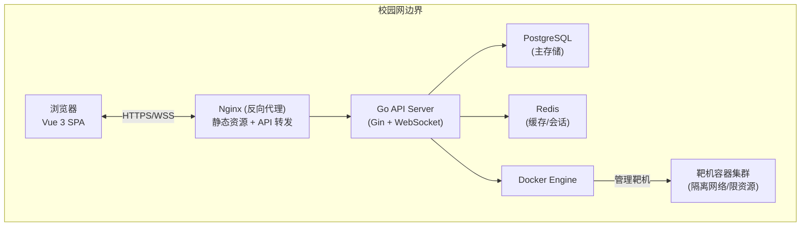
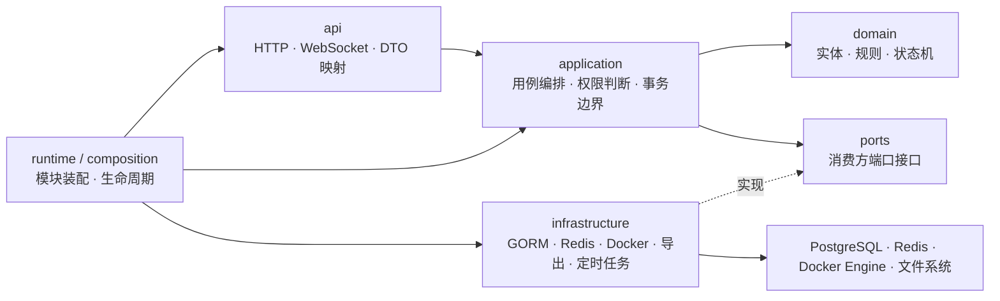
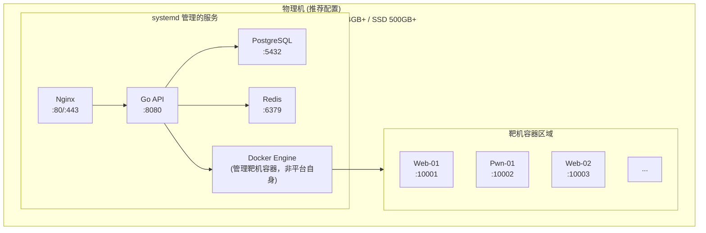
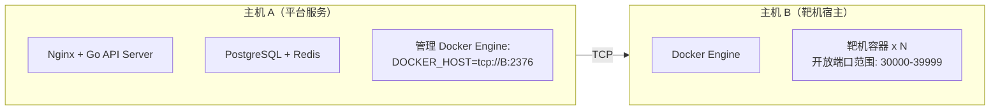
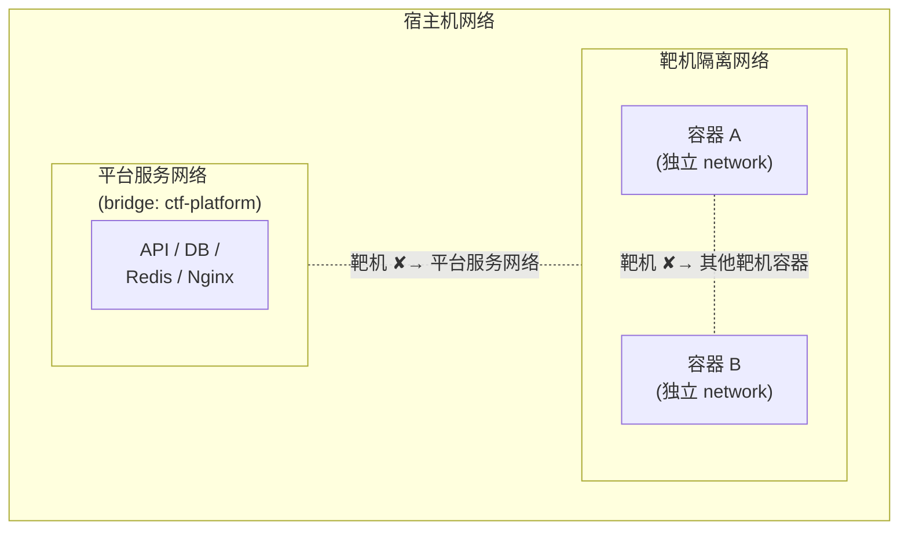

# CTF 网络攻防靶场平台 — 整体架构设计

> 状态：Current
> 事实源：`code/backend/internal/app/`、`code/backend/internal/module/`、`docs/contracts/`
> 替代：无

## 当前设计

- `code/backend/internal/app/router.go`、`code/backend/internal/app/composition/*.go`
  - 负责：装配 `auth`、`identity`、`challenge`、`container_runtime`、`instance`、`practice`、`contest`、`assessment`、`ops`、`teaching_query` 模块，注册 HTTP 路由、后台任务和进程生命周期关闭逻辑；其中 `ContainerRuntimeModule` 收口 challenge/contest/ops 的 container-facing 能力，`InstanceModule` 收口实例与 AWD 访问入口；`practice` 现在同时承接用户态 `progress` / `timeline` 查询；Guardrail 见 `code/backend/internal/app/router_test.go` 与 `code/backend/internal/app/full_router_integration_test.go`
  - 不负责：实现具体业务规则、状态迁移或持久化细节

- `code/backend/internal/module/*/application`、`code/backend/internal/module/*/domain`、`code/backend/internal/module/*/ports`、`code/backend/internal/module/*/infrastructure`
  - 负责：按模块 owner 承担用例编排、状态机、端口定义与外部适配；依赖方向由 `code/backend/internal/module/architecture_test.go` 和各模块 `architecture_test.go` 约束
  - 不负责：跨模块直接依赖对方 `infrastructure`，也不在 `api` 层写业务规则

- `code/backend/internal/module/practice`、`code/backend/internal/module/teaching_query`
  - 负责：`practice` 负责训练写路径以及用户态 `GET /api/v1/users/me/progress`、`GET /api/v1/users/me/timeline` 查询；`teaching_query` 负责教师视角、班级洞察和复盘场景的跨 owner 查询聚合
  - 不负责：把只读取 practice 自有事实的用户态查询继续拆成独立查询模块，或作为业务 owner 模块修改练习、竞赛、评估等业务状态

- `code/backend/internal/module/runtime`、`code/backend/internal/module/instance`、`code/backend/internal/app/composition/runtime_module.go`、`code/backend/internal/app/composition/instance_module.go`
  - 负责：`internal/module/runtime/*` 当前承接 container runtime capability、共享 adapter 与底层运行时 ports，并通过显式 capability fields 暴露 provisioning / cleanup / file / inventory / interactive 等能力；`internal/module/instance/*` 负责实例命令、查询、proxy ticket 与 maintenance owner；app 层再把它们收口成 `ContainerRuntimeModule` 与 `InstanceModule` 两个组合视图，并在 composition 本地拼出 maintenance 所需的 inspect/start 视图
  - 不负责：把 `runtime` 继续当成实例业务 owner，或让 `practice`、用户实例路由重新直接依赖整块容器运行时视图

## 1. 架构概览

**一句话定位**：基于 Go + Docker 的校园级 CTF 攻防靶场平台，支撑信息安全专业日常训练、竞赛对抗和技能评估，设计目标为 200 并发用户、单机可部署、运维零门槛。

### 1.1 系统上下文图



### 1.2 关键设计约束

| 约束项 | 说明 |
|--------|------|
| 部署环境 | 学校物理机，校园网内网，无公网暴露 |
| 用户规模 | 注册用户 ≤ 2000，日常训练并发 ≤ 200 |
| 容器上限 | 单机同时运行靶机容器 ≤ 200（推荐配置 16 核 64GB 下的评估值）；竞赛模式下通过降低单容器配额（small 级别）和容器池预热提升密度；如单机仍不足，一期支持双机方案（详见 03-container-architecture §9） |
| 可用性目标 | 日常训练 99%+（允许计划内停机维护）；竞赛期间 99.5%+（竞赛窗口内禁止维护操作，通过健康检查 + systemd 自动重启保障） |
| 安全边界 | 靶机容器必须网络隔离，禁止访问宿主机和平台内部服务 |

---

## 2. Onion 分层架构

### 2.1 分层总览

当前后端采用**单体部署下的 Onion Architecture**：运行时仍是一个 Go API 进程，但代码按模块分域，并在模块内部保持依赖向内。



### 2.2 分层职责

| 层级 | 当前位置 | 主要职责 | 约束 |
|------|----------|----------|------|
| `api` | `internal/module/*/api` | HTTP / WebSocket 入口、参数校验、请求上下文提取、响应映射 | 不写业务规则；只做协议适配 |
| `application` | `internal/module/*/application` | 用例编排、事务边界、权限判断、跨模块协作、事件发布 | 通过 `ports` / `contracts` 依赖外部能力，不直接依赖 GORM / Redis / Docker |
| `domain` | `internal/module/*/domain` | 纯业务规则、状态机、领域对象与校验 | 不感知 Gin、GORM、Redis、Docker SDK |
| `ports` | `internal/module/*/ports` | 由消费方定义的最小接口，如读写能力、运行时探针、报告查询 | 接口粒度按用例稳定边界组织，而不是按 provider 拼大接口 |
| `infrastructure` | `internal/module/*/infrastructure` | GORM 仓储、Redis 存储、Docker Engine、导出器、定时任务、外部适配器 | 只实现端口，不向内倒灌框架类型 |
| `runtime` | `internal/module/*/runtime` | 模块内 wiring、对外暴露组合后的 handler / service / background jobs | 模块唯一允许集中装配依赖的位置 |
| `contracts` | `internal/module/*/contracts` | 模块对外稳定数据契约 | 只暴露必要 contract，不泄漏内部 persistence 结构 |

补充约定：

- `teaching_query` 是跨 owner 的只读查询聚合模块；`practice` 内的 progress / timeline query 只读取本模块自有事实。
- 并不是每个模块都必须拥有全部子目录；例如查询聚合模块可以没有 `domain`，但依赖方向仍保持一致。

### 2.3 依赖规则

- `api -> application -> domain` 是主链路，业务依赖只能向内。
- `application -> ports`，由消费方定义所需能力接口。
- `infrastructure` 负责实现 `ports`，并连接 PostgreSQL、Redis、Docker、文件系统等外部资源。
- `runtime` 与 `internal/app/composition` 位于最外层，只负责装配，不承载业务规则。
- 跨模块调用优先走对方的 `application` / `contracts` / `ports`，禁止直接依赖对方 `infrastructure`。
- 需要跨模块做复杂只读聚合时，进入 `teaching_query`，而不是把教师视角或页面视角写成业务 owner。

### 2.4 Composition Root 与生命周期

- 进程级 composition root 是 `internal/app/composition.Root`，统一持有：
  - `config`
  - `logger`
  - `db`
  - `cache`
  - `events.Bus`
  - 后台任务注册表
- HTTP 路由装配入口是 `internal/app/buildRouterRuntime`。当前装配顺序为：
  - `container_runtime`
  - `ops`
  - `instance`
  - `identity`
  - `auth`
  - `challenge`
  - `assessment`
  - `teaching_query`
  - `contest`
  - `practice`
- 当前 app 层把同一个 `runtime` 物理模块收口成两种视图：
  - `ContainerRuntimeModule`：供 `challenge`、`contest`、`ops` 使用的镜像探针、容器文件和运行时统计能力
  - `InstanceModule`：供 `practice` 和用户/教师实例路由使用的实例仓储、运行时服务与实例访问 handler，并在开启防守 SSH 时注册网关任务
- `internal/module/runtime/*` 当前主要承接容器适配实现与共享 runtime bridge；实例命令、查询、proxy ticket、maintenance owner 已经进入 `internal/module/instance/*`，但部分 runtime ports 与 adapter 仍未完全物理拆出。
- `HTTPServer` 复用同一套 composition 结果，只负责：
  - 启动 `composition.Root` 已注册的后台任务
  - 关闭各模块异步组件
  - 统一执行进程退出时的 shutdown
- 约束：
  - 后台任务必须通过 `composition.Root.RegisterBackgroundJob` 注册
  - 禁止在 handler、协程或子流程中自行重建模块 service
  - 需要显式关闭的组件必须纳入 `routerRuntime.closers`

### 2.5 当前后端组合装配图

```mermaid
flowchart TD
    subgraph Root["composition.Root"]
        RootNode["config · logger · db · cache · events.Bus"]
    end

    subgraph Views["app/composition 组合视图"]
        CR["ContainerRuntimeModule"]
        IM["InstanceModule"]
    end

    subgraph Modules["模块 runtime 输出"]
        Identity["IdentityModule"]
        Auth["AuthModule"]
        Challenge["ChallengeModule"]
        Assessment["AssessmentModule"]
        Teaching["TeachingQueryModule"]
        Contest["ContestModule"]
        Practice["PracticeModule"]
        Ops["OpsModule"]
    end

    RootNode --> CR
    RootNode --> IM
    RootNode --> Identity
    RootNode --> Auth
    RootNode --> Challenge
    RootNode --> Assessment
    RootNode --> Teaching
    RootNode --> Contest
    RootNode --> Practice
    RootNode --> Ops

    CR -->|runtime query / stats| Ops
    CR -->|capability / repo| IM
    CR -->|image runtime / probe| Challenge
    CR -->|container files / probe| Contest

    Identity -->|users / profile services| Auth
    Ops -.audit recorder 注入.-> Auth
    Auth -.token service 注入.-> Ops

    Challenge -->|catalog| Assessment
    Assessment -->|recommendations| Teaching

    Challenge -->|catalog / image store / flag validator| Contest
    Challenge -.challenge.publish_check_finished event.-> Ops
    Contest -.contest realtime events.-> Ops

    Challenge -->|catalog / image store| Practice
    IM -->|instance repo / runtime svc| Practice
    Practice -.practice.flag_accepted event.-> Assessment
```

补充说明：

- 实线表示当前 app/composition 的装配或能力提供关系。
- 虚线表示 capability injection，例如 `ops` 向 `auth` 注入审计记录器、`auth` 向 `ops` 注入 token service；它们不是模块内部互相 import。

---

## 3. 模块划分与边界

### 3.1 模块全景图

```mermaid
flowchart LR
    subgraph Views["app/composition 组合视图"]
        CR["container_runtime"]
        IM["instance"]
    end

    subgraph Modules["业务 owner / 查询聚合"]
        Identity["identity"]
        Auth["auth"]
        Challenge["challenge"]
        Assessment["assessment"]
        Teaching["teaching_query"]
        Contest["contest"]
        Practice["practice"]
        Ops["ops"]
    end

    Identity -->|users / profile services| Auth
    Ops -.audit capability.-> Auth
    Auth -.token service.-> Ops

    CR -->|runtime query / stats| Ops
    CR -->|capability / repo| IM
    CR -->|image runtime / probe| Challenge
    CR -->|container files / probe| Contest

    Challenge -->|catalog| Assessment
    Assessment -->|recommendations| Teaching

    Challenge -->|catalog / image store / flag validator| Contest
    Contest -.contest realtime events.-> Ops

    Challenge -->|catalog / image store| Practice
    IM -->|instance repo / runtime svc| Practice
    Practice -.practice.flag_accepted event.-> Assessment
```

### 3.2 当前模块职责

| 模块 | 类型 | 当前职责 | 主要依赖（装配 / 代码） |
|------|------|----------|----------|
| `auth` | 业务 owner | 注册、登录、登出、CAS、会话票据、WebSocket ticket | `identity`（代码），`ops`（装配注入审计记录器） |
| `identity` | 业务 owner | 用户、角色、权限、当前用户解析、管理端用户能力 | 无业务上游依赖 |
| `challenge` | 业务 owner | 题目元数据、附件、镜像信息、Flag 规则、题包导入/导出 | `container_runtime`（装配注入运行时探针与镜像探测），代码级无跨模块 import；发布自检结果通知通过 `challenge.publish_check_finished` 事件交给 `ops` 消费 |
| `runtime` | 基础运行时物理模块 | Docker 运行时、镜像探针、容器文件访问、运行时统计、共享 runtime adapter；底层实现仍落在 `internal/module/runtime/*`，并向上暴露显式 container runtime capability fields | `challenge`、`contest`、`ops`、`practice`、`instance`（代码），以及 PostgreSQL / Redis / Docker Engine |
| `container_runtime` | app 层组合视图（迁移中） | challenge / contest / ops 依赖的容器与运行时能力；当前主类型是 `ContainerRuntimeModule`，`RuntimeModule` 仅保留兼容别名 | `runtime` 物理模块 |
| `instance` | 业务 owner + app 层组合视图 | `internal/module/instance/*` 负责实例 owner；`InstanceModule` 负责实例访问 handler、AWD target / defense SSH 入口，以及 `practice` 依赖的实例仓储与运行时服务 | `runtime`（装配依赖 `ContainerRuntimeModule` 提供的显式 runtime capability / repo） |
| `practice` | 业务 owner | 练习开题、排队与 provisioning、Flag 提交、个人训练进度与时间线查询 | `challenge`、`instance`（装配），`contest`、`runtime`（代码）；画像与推荐刷新通过 `practice.flag_accepted` 事件异步触发 `assessment` 消费 |
| `contest` | 业务 owner | 竞赛配置、队伍、排行榜、公告、AWD 轮次与服务运行态 | `challenge`、`container_runtime`（装配），`auth`、`runtime`（代码）；公告、榜单刷新和 AWD 预览进度通过 `contest` 事件交给 `ops` relay |
| `assessment` | 业务 owner | 评估任务、技能画像、报告导出、评估归档 | `challenge`（装配），`practice`、`contest`（代码） |
| `ops` | 业务 owner / 运营支撑 | 审计日志、站内通知、WebSocket 管理、运行时概览与后台运营支撑 | `container_runtime`（装配），`auth`、`challenge`、`contest`、`practice`（代码）；其中 challenge / practice 通知与 contest realtime relay 都由事件消费者处理 |
| `teaching_query` | 查询聚合模块 | 教师视角证据、复盘、学员画像、教学分析聚合查询 | `assessment`（装配 + 代码），其余聚合查询由本模块 repository 完成 |

边界说明：

- `/api/v1/teacher/*` 只是路由命名空间，不代表存在名为 `teacher` 的业务 owner 模块。
- `ops` 替代旧的 `system` 叙事，承接通知、审计、运营支撑与运行时可观测能力。
- `teaching_query` 负责跨 owner 的只读查询聚合，不承担业务状态修改。
- `instance` 已经有独立的 `internal/module/instance/*` owner；app 层 `InstanceModule` 只是它当前对外暴露的组合视图与访问入口。
- 更细的模块依赖表与代码级 allowlist 说明见 [07-modular-monolith-refactor.md](./07-modular-monolith-refactor.md)。

### 3.3 模块协作方式

校园级单体应用当前采用**应用服务直连 + 查询聚合 + 进程内事件总线**的混合方式：

| 方式 | 适用场景 | 当前做法 |
|------|----------|----------|
| 应用服务调用 | 同步、强一致性用例 | 模块间通过 `application`、`ports`、`contracts` 暴露最小能力 |
| 查询聚合 | 教师端、复盘、统计、跨模块列表页 | 进入 `teaching_query`，避免写模块互相穿透 SQL |
| 进程内事件 | 异步、非关键路径通知 | 统一复用 `internal/platform/events.Bus` |

### 3.4 架构守卫

- `internal/app/composition/architecture_test.go` 当前已经阻止 composition 和 runtime 回退到旧的 `internal/module/container` 依赖。
- `internal/app/router_test.go` 当前已经约束 `ContainerRuntimeModule` 不再暴露 `Handler` / `PracticeRuntimeService`，并要求 `BuildPracticeModule` 依赖 `InstanceModule`。
- `internal/module/architecture_allowlist_test.go` 当前记录了代码级跨模块依赖白名单，用来校验哪些 import 仍属于已审阅例外。
- 新模块必须先确定 owner，再决定是否需要 `domain`、`ports`、`contracts`；禁止先堆目录、后找边界。
- 后端对外的长期事实源以 `docs/architecture/backend/` 与专题架构文档为准，不再保留迁移中间稿。

---

## 4. 技术选型细节

### 4.1 后端核心依赖

| 组件 | 选型 | 版本要求 | 选型理由 |
|------|------|----------|----------|
| Web 框架 | Gin | v1.9+ | 高性能、生态成熟、中间件丰富，校园项目学习成本低 |
| ORM | GORM | v2.x | Go 生态最主流 ORM，文档完善，支持 PostgreSQL 全特性 |
| 数据库迁移 | golang-migrate | v4.x | 支持 SQL 文件迁移，版本可控，CI 友好 |
| 配置管理 | Viper | v1.x | 支持 YAML/ENV/命令行多源配置，热加载 |
| 日志 | Zap | v1.x | 高性能结构化日志，支持日志级别动态调整 |
| Redis 客户端 | go-redis | v9.x | 功能完整，支持 Pipeline/Lua 脚本/Pub-Sub |
| Docker SDK | Docker SDK for Go | latest | 官方 SDK，API 覆盖完整 |
| WebSocket | github.com/coder/websocket | v1.8+ | gorilla/websocket 已归档，coder/websocket 是活跃维护的继任者，API 兼容，支持并发读写控制 |
| 密码哈希 | bcrypt | golang.org/x/crypto | 标准库，自带盐值管理 |
| 参数校验 | validator | v10.x | Gin 内置集成，支持自定义校验规则 |
| 定时任务 | robfig/cron | v3.x | 容器过期清理、竞赛轮次推进等定时场景 |

### 4.2 前端核心依赖

| 组件 | 选型 | 说明 |
|------|------|------|
| 框架 | Vue 3 | Composition API，TypeScript 支持 |
| 构建工具 | Vite | 开发热更新快，生产构建高效 |
| UI 组件库 | Arco Design Vue / Naive UI | 功能丰富，适合管理后台 + 竞赛前台 |
| 状态管理 | Pinia | Vue 3 官方推荐，TypeScript 友好 |
| 路由 | Vue Router 4 | 支持路由守卫做权限控制 |
| HTTP 客户端 | Axios | 拦截器统一处理 Token 刷新和错误 |
| 图表 | ECharts | 能力雷达图、排行榜趋势图、仪表盘统计 |
| Markdown | md-editor-v3 | 题目描述编辑与渲染 |
| 终端模拟 | xterm.js | WebSocket + xterm 实现浏览器内终端连接靶机 |

### 4.3 基础设施

| 组件 | 选型 | 配置建议 |
|------|------|----------|
| 数据库 | PostgreSQL 15+ | 主存储，JSONB 存储灵活字段（如题目 hints、容器配置） |
| 缓存 | Redis 7+ | 会话管理、排行榜、限流计数器、分布式锁 |
| 容器运行时 | Docker Engine 24+ | 靶机容器编排，通过 Unix Socket 通信 |
| 反向代理 | Nginx | 静态资源、API 转发、WebSocket 代理、SSL 终止 |
| 进程管理 | systemd | Go 二进制直接部署，systemd 管理进程生命周期 |

---

## 5. 当前代码目录骨架

```text
ctf/code/backend/
├── cmd/
│   ├── api/                         # API 入口
│   ├── server/                      # HTTPServer 启动入口
│   ├── import-challenge-packs/      # 题包导入工具
│   └── seed-demo-challenges/        # 演示数据初始化
├── configs/                         # 配置文件与密钥目录
├── data/                            # 题目附件、导入预览等数据目录
├── internal/
│   ├── app/
│   │   ├── router.go                # composition root 的 HTTP 路由装配入口
│   │   ├── http_server.go           # 后台任务启动/关闭与进程生命周期
│   │   └── composition/             # 模块组合装配与架构守卫测试
│   ├── config/                      # 配置加载与结构定义
│   ├── middleware/                  # RequestID、CORS、Auth、RateLimit 等中间件
│   ├── model/                       # 跨模块共享的持久化模型
│   ├── platform/events/             # 进程内事件总线
│   ├── shared/                      # 映射与轻量共享工具
│   ├── infrastructure/              # PostgreSQL / Redis 等进程级基础设施
│   ├── handler/health/              # 健康检查
│   ├── validation/                  # 请求校验规则
│   └── module/
│       ├── auth/
│       ├── identity/
│       ├── challenge/
│       ├── runtime/
│       ├── practice/
│       ├── contest/
│       ├── assessment/
│       ├── ops/
│       └── teaching_query/
│           └── {api,application,domain?,ports,infrastructure,runtime,contracts?}
├── migrations/                      # 当前生效迁移
├── pkg/
│   ├── errcode/
│   ├── logger/
│   ├── ratelimit/
│   ├── response/
│   └── websocket/
├── scripts/                         # 检查脚本、导入脚本、部署辅助脚本
├── storage/                         # 运行时与导出产物存储目录
└── docs/                            # 后端局部评审与辅助说明
```

---

## 6. 跨切面关注点

### 6.1 统一错误处理

#### 错误码体系
本平台错误码采用 **5 位整数**，按模块划分区间，便于快速定位问题来源；完整列表见 `ctf/docs/architecture/backend/04-api-design.md` §3。

| 模块 | 区间 | 示例 |
|------|------|------|
| 通用 | 10000-10999 | 10002 参数校验失败、10003 未认证、10004 无权限、10005 资源不存在 |
| 认证 | 11000-11999 | 11001 用户名或密码错误、11002 会话失效 |
| 靶场 | 12000-12999 | 12001 镜像构建失败、12003 靶机未配置 Flag |
| 演练 | 13000-13999 | 13002 实例数上限、13003 Flag 错误、13005 实例过期 |
| 竞赛 | 14000-14999 | 14001 竞赛未开始、14003 队伍人数已满 |
| 评估 | 15000-15999 | 15002 报告生成失败 |
| 运行时 | 16000-16999 | 16001 容器启动超时、16004 容器镜像不存在 |

#### 错误类型定义

```go
// AppError 统一业务错误类型
type AppError struct {
    Code    int    `json:"code"`    // 业务错误码
    Message string `json:"message"` // 用户可见的错误描述
    HTTPStatus int `json:"-"`       // HTTP 状态码，不序列化
    Err     error  `json:"-"`       // 原始错误，用于日志记录，不返回给前端
}

func (e *AppError) Error() string {
    return e.Message
}

// 预定义错误构造函数
func ErrUnauthorized() *AppError {
    return &AppError{Code: 10003, Message: "未认证，请先登录", HTTPStatus: 401}
}

func ErrForbidden() *AppError {
    return &AppError{Code: 10004, Message: "无权限访问该资源", HTTPStatus: 403}
}

func ErrNotFound(resource string) *AppError {
    return &AppError{Code: 10005, Message: resource + "不存在", HTTPStatus: 404}
}
```

### 6.2 统一日志

#### 日志规范

- 日志库：Zap（JSON 格式输出，便于后续接入 ELK 等日志平台）
- 每个请求注入唯一 `request_id`，贯穿整个调用链
- 日志级别：`DEBUG`（开发）、`INFO`（生产默认）、`WARN`、`ERROR`
- 敏感信息脱敏：密码、Token、Flag 值禁止出现在日志中

#### 请求日志格式

```json
{
  "level": "info",
  "ts": "2026-03-01T10:30:00.000Z",
  "msg": "HTTP 请求完成",
  "request_id": "req-a1b2c3d4",
  "method": "POST",
  "path": "/api/v1/practice/submit",
  "status": 200,
  "latency_ms": 45,
  "user_id": 1024,
  "client_ip": "10.0.1.100"
}
```

#### 请求 ID 传递

```go
// RequestID 中间件：为每个请求生成唯一 ID 并注入 context
func RequestID() gin.HandlerFunc {
    return func(c *gin.Context) {
        requestID := c.GetHeader("X-Request-ID")
        if requestID == "" {
            requestID = "req-" + uuid.NewString()[:8]
        }
        c.Set("request_id", requestID)
        c.Header("X-Request-ID", requestID)
        // 注入到 context，供 application / infrastructure 层日志使用
        ctx := context.WithValue(c.Request.Context(), "request_id", requestID)
        c.Request = c.Request.WithContext(ctx)
        c.Next()
    }
}
```

### 6.3 统一响应格式

所有 API 响应遵循统一 JSON 结构，前端只需一套解析逻辑：

```go
// 成功响应
{
  "code": 0,
  "message": "success",
  "data": { ... },
  "request_id": "req_xxx"
}

// 分页响应
{
  "code": 0,
  "message": "success",
  "data": {
    "list": [ ... ],
    "total": 150,
    "page": 1,
    "page_size": 20
  },
  "request_id": "req_xxx"
}

// 错误响应
{
  "code": 13003,
  "message": "Flag 错误",
  "data": null,
  "request_id": "req_xxx"
}
```

#### 响应封装工具

```go
// response 包：统一响应构建
func Success(c *gin.Context, data interface{}) {
    requestID := c.GetString("request_id")
    c.JSON(http.StatusOK, gin.H{
        "code":    0,
        "message": "success",
        "data":    data,
        "request_id": requestID,
    })
}

func Error(c *gin.Context, err *errcode.AppError) {
    requestID := c.GetString("request_id")
    c.JSON(err.HTTPStatus, gin.H{
        "code":    err.Code,
        "message": err.Message,
        "data":    nil,
        "request_id": requestID,
    })
}

// FromError 自动识别错误类型并返回对应响应
func FromError(c *gin.Context, err error) {
    var appErr *errcode.AppError
    if errors.As(err, &appErr) {
        Error(c, appErr)
        return
    }
    // 未知错误，返回 500 并记录日志
    logger.ErrorCtx(c.Request.Context(), "未处理的内部错误", zap.Error(err))
    requestID := c.GetString("request_id")
    c.JSON(http.StatusInternalServerError, gin.H{
        "code":    10009,
        "message": "服务器内部错误",
        "data":    nil,
        "request_id": requestID,
    })
}
```

### 6.4 中间件链

#### 中间件执行顺序


#### 各中间件职责

| 中间件 | 作用域 | 职责 |
|--------|--------|------|
| Recovery | 全局 | 捕获 panic，返回 500 并记录堆栈，防止单个请求崩溃影响整个进程 |
| RequestID | 全局 | 生成/透传请求 ID，注入 context，用于链路追踪 |
| CORS | 全局 | 处理跨域请求（开发环境宽松，生产环境限制 Origin 白名单） |
| Logger | 全局 | 记录请求方法、路径、状态码、耗时、客户端 IP |
| RateLimiter | 全局 | 基于 IP 或用户 ID 的请求限流，防止恶意刷接口 |
| Auth | 需认证路由 | 解析 session cookie，校验会话有效性，将用户信息注入 context |
| RBAC | 需权限路由 | 根据用户角色和路由权限配置，判断是否有权访问 |
| Audit | 写操作路由 | 记录关键写操作（创建/修改/删除）到审计日志表 |

#### 路由分组与中间件挂载

```go
containerRuntimeModule := buildContainerRuntimeModule(root)
opsModule := buildOpsModule(root, containerRuntimeModule)
instanceModule := buildInstanceModule(root, containerRuntimeModule)

identityModule, err := buildIdentityModule(root)
authModule, err := buildAuthModule(root, opsModule, identityModule)
challengeModule, err := buildChallengeModule(root, containerRuntimeModule, opsModule)
assessmentModule := buildAssessmentModule(root, challengeModule)
teachingReadmodelModule := buildTeachingQueryModule(root, assessmentModule)
contestModule := buildContestModule(root, challengeModule, containerRuntimeModule)
practiceModule := buildPracticeModule(root, challengeModule, instanceModule)
instanceModule.BuildHandler(root, opsModule)
// 再把 handler 挂到 /api/v1、/teacher、/authoring、/admin 等路由组
// 统一复用 tokenService 和 identityModule.Users 做认证上下文解析
```

#### 限流策略

| 场景 | 策略 | 参数 |
|------|------|------|
| 全局 API | 令牌桶（按 IP） | 每秒 50 请求，突发 100 |
| 登录接口 | 滑动窗口（按 IP + 用户名） | 5 分钟内最多 10 次，超限锁定 15 分钟 |
| Flag 提交 | 滑动窗口（按用户 + 题目） | 60 秒内最多 5 次 |
| 实例创建 | 固定窗口（按用户） | 每分钟最多 3 次 |

限流使用 Redis 实现，key 格式统一为 `ratelimit:{场景}:{标识}`，TTL 与窗口大小一致。

---

## 7. 部署架构

### 7.1 单机部署方案（推荐起步方案）

适用于大多数校园场景，一台物理机承载全部服务：



#### 单机部署要点

| 项目 | 说明 |
|------|------|
| 平台服务部署方式 | Go 编译为单二进制，systemd 管理，不容器化（减少一层抽象，便于调试） |
| PostgreSQL / Redis | 直接安装在宿主机或用 Docker Compose 编排，数据目录挂载到宿主机磁盘 |
| Docker Engine | 仅用于管理靶机容器，平台自身服务不跑在 Docker 里 |
| Nginx | 反向代理 + 静态资源托管，SSL 终止（校园内可用自签证书或 HTTP） |
| 前端部署 | `vite build` 产物放到 Nginx 静态目录，Nginx 配置 SPA fallback |
| 数据备份 | cron 定时 `pg_dump` 备份数据库，保留最近 7 天 |

### 7.2 多物理机方案（竞赛高峰扩展）

当单机资源不足（如大型竞赛 500+ 并发）时，可拆分为两台物理机：



#### 多机部署要点

| 项目 | 说明 |
|------|------|
| Docker 远程访问 | 主机 B 开启 Docker TCP 监听（2376 端口），配置 TLS 双向认证 |
| 网络要求 | 主机 A 和 B 在同一内网段，延迟 < 1ms |
| 端口转发 | 用户通过 Nginx 访问主机 A，靶机端口直接暴露在主机 B 上，Nginx 按需代理 |
| 容器配置 | Go API Server 通过配置文件切换 `DOCKER_HOST`，代码无需修改 |
| 扩展性 | 可继续增加主机 C、D 作为靶机宿主，API Server 轮询分配 |

### 7.3 Docker Compose 编排（平台基础设施）

用于快速搭建 PostgreSQL + Redis 开发/生产环境：

```yaml
# docker/docker-compose.yml
version: "3.8"

services:
  postgres:
    image: postgres:16-alpine
    container_name: ctf-postgres
    restart: unless-stopped
    environment:
      POSTGRES_DB: ${DB_NAME:-ctf_platform}
      POSTGRES_USER: ${DB_USER:-ctf}
      POSTGRES_PASSWORD: ${DB_PASSWORD}
    ports:
      - "${DB_PORT:-5432}:5432"
    volumes:
      - pgdata:/var/lib/postgresql/data
    healthcheck:
      test: ["CMD-SHELL", "pg_isready -U ${DB_USER:-ctf}"]
      interval: 10s
      timeout: 5s
      retries: 5

  redis:
    image: redis:7.4-alpine
    container_name: ctf-redis
    restart: unless-stopped
    command: redis-server --requirepass ${REDIS_PASSWORD} --maxmemory 512mb --maxmemory-policy allkeys-lru
    ports:
      - "${REDIS_PORT:-6379}:6379"
    volumes:
      - redisdata:/data
    healthcheck:
      test: ["CMD", "redis-cli", "-a", "${REDIS_PASSWORD}", "ping"]
      interval: 10s
      timeout: 5s
      retries: 5

volumes:
  pgdata:
    driver: local
  redisdata:
    driver: local
```

### 7.4 资源规划

#### 单机推荐配置

| 资源 | 最低配置 | 推荐配置 | 说明 |
|------|----------|----------|------|
| CPU | 8 核 | 16 核+ | 靶机容器是 CPU 消耗大户 |
| 内存 | 32 GB | 64 GB+ | 平台服务约 2GB，每个靶机容器 256MB，100 容器需 25GB |
| 磁盘 | 200 GB SSD | 500 GB SSD | 镜像存储 + 数据库 + 日志 |
| 网络 | 千兆内网 | 千兆内网 | 校园网内部署，带宽充足 |

#### 资源分配策略

| 组件 | CPU 预留 | 内存预留 | 说明 |
|------|----------|----------|------|
| Go API Server | 2 核 | 1 GB | 单进程，goroutine 并发 |
| PostgreSQL | 2 核 | 4 GB | shared_buffers = 1GB，effective_cache_size = 3GB |
| Redis | 1 核 | 512 MB | maxmemory 512mb，LRU 淘汰 |
| Nginx | 1 核 | 256 MB | worker_processes auto |
| 靶机容器池 | 剩余核心 | 剩余内存 | 每容器默认限制 0.5 核 / 256MB |

### 7.5 安全边界设计

CTF 靶场的核心安全挑战：靶机容器本身就是"有漏洞的服务"，必须严格隔离，防止选手通过靶机攻击平台或其他用户。

#### 网络隔离模型



> iptables 规则：
> - 靶机 ✘ → 平台服务网络
> - 靶机 ✘ → 宿主机管理端口
> - 靶机 ✘ → 其他靶机容器
> - 靶机 ✔ → 外网(可选)

#### 容器安全加固措施

| 措施 | 实现方式 | 说明 |
|------|----------|------|
| 网络隔离 | 每个靶机实例创建独立 Docker Network | 禁止容器间互访（AWD 模式例外，AWD 同组容器共享网络） |
| 资源限制 | `--cpus`、`--memory`、`--storage-opt` | 防止单个容器耗尽宿主机资源 |
| 进程数限制 | `--pids-limit=100` | 防止 fork 炸弹 |
| 只读根文件系统 | `--read-only`（按需开放 tmpfs） | 减少容器内持久化攻击面 |
| 禁止特权模式 | 禁止 `--privileged`，最小化 capabilities | Drop ALL，仅保留必要的 NET_BIND_SERVICE 等 |
| 禁止访问宿主机 | iptables 规则阻断靶机到宿主机 IP 的流量 | 防止通过 Docker Gateway 攻击宿主机服务 |
| 自动清理 | 过期容器定时扫描 + 强制删除 | 防止僵尸容器堆积 |

### 7.6 配置文件结构

```yaml
# configs/config.yaml — 主配置文件模板
server:
  host: "0.0.0.0"
  port: 8080
  mode: "release"                    # debug / release

database:
  host: "localhost"
  port: 5432
  name: "ctf_platform"
  user: "ctf"
  password: "${DB_PASSWORD}"         # 通过环境变量注入
  max_open_conns: 50
  max_idle_conns: 10
  conn_max_lifetime: "1h"

redis:
  host: "localhost"
  port: 6379
  password: "${REDIS_PASSWORD}"
  db: 0
  pool_size: 20

auth:
  session_ttl: "168h"                # 7 天
  session_cookie_name: "ctf_session"
  session_cookie_path: "/api/v1"
  session_cookie_secure: true
  session_cookie_http_only: true
  session_cookie_same_site: "lax"

docker:
  host: "unix:///var/run/docker.sock" # 单机模式
  # host: "tcp://10.0.1.2:2376"      # 多机模式
  api_version: "1.43"
  timeout: "30s"

container:
  port_range_start: 30000            # 动态端口分配范围（可配置）
  port_range_end: 39999
  default_cpu_limit: 0.5             # 核
  default_memory_limit: "256m"
  default_storage_limit: "1g"
  default_pids_limit: 100
  max_instances_per_user: 3
  instance_ttl: "2h"
  instance_extend_ttl: "1h"
  cleanup_interval: "5m"            # 过期容器扫描间隔

rate_limit:
  global_qps: 50                    # 全局每 IP 每秒请求数
  global_burst: 100
  login_max_attempts: 10            # 登录 5 分钟内最大尝试次数
  login_lock_duration: "15m"
  submit_max_attempts: 5            # Flag 提交 60 秒内最大次数
  submit_window: "60s"

log:
  level: "info"                     # debug / info / warn / error
  format: "json"                    # json / console
  output: "stdout"                  # stdout / file
  file_path: "/var/log/ctf/app.log"
  max_size_mb: 100
  max_backups: 10
  max_age_days: 30

cors:
  allowed_origins:
    - "http://localhost:5173"       # Vite 开发服务器
    - "https://ctf.campus.edu"      # 生产域名
  allowed_methods: ["GET", "POST", "PUT", "DELETE", "OPTIONS"]
  allowed_headers: ["Content-Type", "X-Request-ID"]
```

---

## 8. 关键架构决策记录（ADR）

### ADR-001：单体部署下的 Onion Architecture

- 决策：运行时保持单体部署，代码结构采用按模块分域的 Onion Architecture
- 理由：
  - 校园级项目，用户规模有限（≤ 2000），单体完全能承载
  - 团队规模小，微服务带来的运维复杂度（服务发现、链路追踪、分布式事务）远超收益
  - 采用 `api -> application -> domain`、`application -> ports` 的依赖方向，更容易稳定边界并控制跨模块耦合
  - 如后续确有拆分需求，可以沿当前模块边界抽离，而不是回到大一统的 handler/service/repository 堆叠
- 风险：
  - 单进程仍是运行时单点，通过 systemd 自动重启 + 健康检查缓解
  - 若 composition root 继续膨胀，会重新把模块边界拉回路由层，因此必须把 wiring 留在 `runtime` 与 `internal/app/composition`

### ADR-002：平台服务不容器化

- 决策：Go API Server / PostgreSQL / Redis 直接部署在宿主机，不跑在 Docker 容器里
- 理由：
  - Docker Engine 专门用于管理靶机容器，职责清晰
  - 避免"Docker in Docker"或 Docker Socket 挂载带来的安全风险
  - 宿主机直接部署便于调试、日志查看、性能分析
- 权衡：牺牲了部署一致性（不同机器环境可能有差异），通过 setup.sh 脚本和文档缓解

### ADR-003：进程内事件总线 vs 消息队列

- 决策：使用 Go channel 实现进程内事件总线，不引入 RabbitMQ / Kafka 等外部 MQ
- 理由：
  - 单体架构下进程内通信足够，无需跨进程消息传递
  - 减少运维组件，降低部署复杂度
  - 事件消费失败可通过重试 + 日志告警处理，不需要 MQ 的持久化和死信队列
- 风险：进程重启时未消费的事件会丢失，对于审计日志等关键事件，采用同步写库兜底
- 演进：如未来需要跨进程通信（如多机部署），可替换为 Redis Pub/Sub 或 NATS

### ADR-004：动态 Flag 生成策略

- 决策：动态 Flag 采用 `HMAC-SHA256(global_secret + contest_salt, user_id + ":" + challenge_id + ":" + instance_nonce)` 生成
- 算法要点：
  - `global_secret`：全局密钥，存储于环境变量 `CTF_FLAG_SECRET`，禁止写入数据库或日志
  - `contest_salt`：每场竞赛独立的随机 salt（32 字节），竞赛创建时生成，加密存储于数据库
  - `instance_nonce`：实例级随机值，容器创建时生成，防止同一用户同一题的不同实例产生相同 Flag
  - HMAC key = `global_secret + contest_salt`，message = `user_id:challenge_id:instance_nonce`
- 理由：
  - 每用户每题每实例唯一 Flag，防止选手之间共享答案
  - 三层密钥分离（global_secret / contest_salt / instance_nonce），单一泄露不会导致全部 Flag 可计算
  - 基于 HMAC 的确定性生成，无需额外存储每用户的 Flag 值
  - 校验时服务端重新计算比对，不依赖容器内的 Flag 值
- Flag 格式：`flag{<hex_prefix_32chars>}`，统一前缀便于正则匹配和防作弊检测
- 安全存储：contest_salt 在数据库中使用 AES-GCM 加密存储，解密密钥来自 `CTF_FLAG_SECRET`

---

## 9. 后续架构文档索引

本文档为整体架构设计，以下为各子系统的详细设计文档：

| 编号 | 文档 | 内容 |
|------|------|------|
| 02 | `02-database-design.md` | 数据库表结构设计、索引策略、ER 图 |
| 03 | `03-container-architecture.md` | 容器与网络隔离、资源调度、安全边界落地 |
| 04 | `04-api-design.md` | REST API 规范、接口清单、认证与 WebSocket 设计 |
| 05 | `05-key-flows.md` | 关键业务链路（提交流程、计分、实例生命周期等） |
| 07 | `07-modular-monolith-refactor.md` | 后端 Onion 分层、模块边界、装配规则与查询聚合口径 |
| 专题 | `design/instance-sharing.md` | 题目实例共享策略的最终设计 |
| 06 | `../frontend/01-architecture-overview.md` | 前端架构总览（路由/状态/API 层/WebSocket/部署） |

---

> 文档结束。如有疑问或需要调整，请在对应章节标注评审意见。
