# 容器编排架构设计

> 版本：v1.0 | 日期：2026-03-01 | 状态：Draft

## 1. 容器管理架构概览

### 1.1 整体分层

平台采用两层隔离架构，将**平台服务层**与**靶机容器层**严格分离：

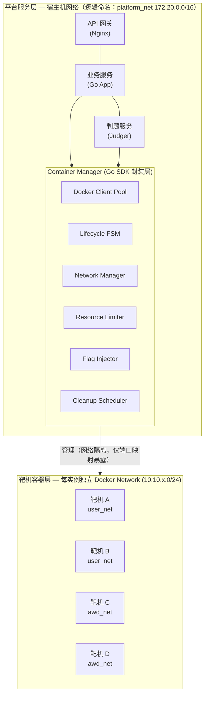

**核心原则：**
- 平台服务运行在宿主机网络（本文逻辑命名为 `platform_net`），靶机容器运行在各自独立 Docker Network，二者不互通
- 所有靶机操作通过 Container Manager 封装层执行，业务层不直接调用 Docker API
- 靶机容器禁止访问宿主机管理端口（Docker API 2375/2376、SSH 22 等）

### 1.2 Docker SDK for Go 封装层设计

封装层作为平台与 Docker Engine 之间的唯一桥梁，职责包括：

| 模块 | 职责 | 关键接口 |
|------|------|----------|
| `DockerClientPool` | Docker Client 连接池管理，支持多宿主机 | `Acquire()`, `Release()` |
| `LifecycleFSM` | 容器生命周期状态机驱动 | `Transition(instanceID, event)` |
| `NetworkManager` | 创建/销毁隔离网络，管理子网分配 | `CreateIsolatedNetwork()`, `Destroy()` |
| `ResourceLimiter` | 资源配额计算与注入 | `BuildResourceConfig(challenge)` |
| `FlagInjector` | Flag 生成与注入 | `InjectFlag(containerID, userID, challengeID)` |
| `PortAllocator` | 动态端口分配与回收 | `Allocate(count)`, `Release(ports)` |
| `CleanupScheduler` | 定时扫描与回收过期/异常容器 | `ScanAndCleanup()` |

```go
// Container Manager 核心接口定义
type ContainerManager interface {
    // 创建靶机实例（含网络、容器、Flag 注入）
    CreateInstance(ctx context.Context, req *CreateInstanceRequest) (*Instance, error)
    // 销毁靶机实例（含容器、网络、端口回收）
    DestroyInstance(ctx context.Context, instanceID string) error
    // 延长实例有效期
    ExtendInstance(ctx context.Context, instanceID string, duration time.Duration) error
    // 查询实例状态
    GetInstanceStatus(ctx context.Context, instanceID string) (*InstanceStatus, error)
    // 批量回收过期实例
    CleanupExpired(ctx context.Context) (cleaned int, errs []error)
}
```

## 2. 容器生命周期状态机

### 2.1 状态定义

| 状态 | 含义 | 持续时间 |
|------|------|----------|
| `pending` | 创建请求已入队，等待调度 | 通常 < 5s，高峰期受排队影响 |
| `creating` | 正在创建网络/容器/注入 Flag | 通常 < 30s |
| `running` | 容器正常运行，用户可访问 | 由题目配置决定（默认 2h） |
| `expired` | 已超过有效期，等待回收 | 等待下一次清理扫描周期 |
| `destroying` | 正在执行销毁流程 | 通常 < 10s |
| `destroyed` | 已完全销毁，资源已释放（终态） | - |
| `failed` | 创建过程中失败（异常态） | 等待清理或人工介入 |
| `crashed` | 运行期间容器异常退出（异常态） | 等待清理或用户重建 |

### 2.2 状态流转图

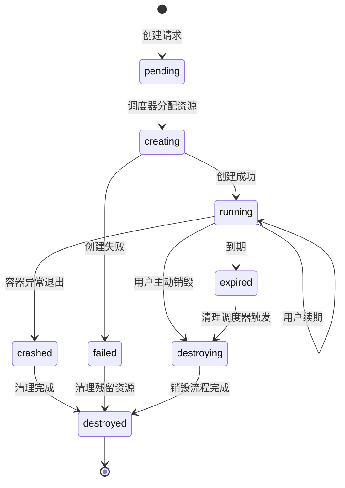

### 2.3 状态转换触发条件与处理逻辑

| 转换 | 触发条件 | 处理逻辑 |
|------|----------|----------|
| `pending → creating` | 调度器从队列取出请求，确认资源充足 | 1. 分配子网段 2. 分配端口 3. 开始创建流程 |
| `creating → running` | 容器启动成功且健康检查通过 | 1. 注入 Flag 2. 应用 iptables 规则 3. 记录到期时间 4. 通知用户 |
| `creating → failed` | 创建超时（30s）或 Docker API 报错 | 1. 记录错误日志 2. 清理已创建的部分资源（网络/卷） 3. 释放端口 4. 通知用户失败原因 |
| `running → expired` | 当前时间 > 实例到期时间 | 由 CleanupScheduler 定时扫描标记 |
| `running → crashed` | Docker 事件监听到容器非正常退出（exit code ≠ 0） | 1. 记录崩溃日志 2. 保留网络/端口（用户可能重建） 3. 通知用户 |
| `running → destroying` | 用户主动点击"销毁"或管理员强制回收 | 进入销毁流程 |
| `expired → destroying` | CleanupScheduler 触发回收 | 进入销毁流程 |
| `crashed → destroyed` | CleanupScheduler 清理或用户确认放弃 | 清理残留资源 |
| `failed → destroyed` | CleanupScheduler 清理残留 | 清理已分配但未完成的资源 |
| `destroying → destroyed` | 销毁流程完成 | 1. 停止并删除容器 2. 删除网络 3. 释放端口 4. 清理挂载卷 |

### 2.4 状态机实现要点

- 状态持久化到数据库（`container_instances` 表的 `status` 字段），避免进程重启丢失状态
- 每次状态转换使用**乐观锁**（`UPDATE ... WHERE status = ? AND version = ?`），防止并发竞争
- 异常状态（`failed`、`crashed`）设置最大保留时间（默认 30 分钟），超时后自动进入清理流程
- 所有状态转换记录到 `instance_events` 表，便于审计和问题排查

## 3. 网络隔离方案

### 3.1 Jeopardy 模式：每用户实例独立网络

每个用户启动的靶机实例拥有独立的 Docker Bridge Network，实例间完全隔离：

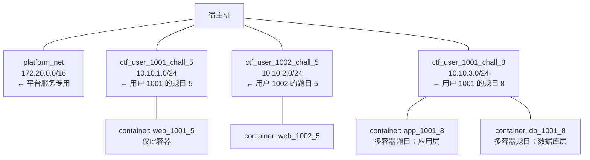

**子网分配策略：**
- 子网范围：`10.10.0.0/16`，按 `/24` 划分，最多支持 ~254 个并发实例网络
- 如需扩展，启用 `10.11.0.0/16` 作为第二段
- 子网 ID 通过数据库自增序列分配，销毁后回收复用
- 网络命名规则：`ctf_{userID}_{challengeID}_{instanceShortID}`

### 3.2 AWD 模式：各队独立子网 + 跨队攻击链路

AWD（Attack With Defense）模式下，各队拥有独立子网运行自己的靶机，同时需要开放跨队攻击链路：

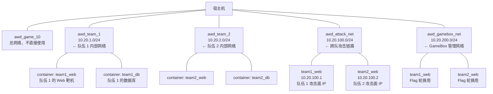

**AWD 网络规则：**
- 每队内部网络隔离，队伍 1 无法直接访问队伍 2 的 `10.20.2.0/24`
- 攻击面容器同时连接队内网络和 `awd_attack_net`，仅暴露指定服务端口
- `awd_gamebox_net` 仅平台 GameBox 服务可访问，用于 Flag 轮换写入
- 各队选手通过平台提供的 WebShell/SSH 代理访问自己队伍的靶机

当前代码边界（2026-03-10）：
- 拓扑/模板模型已可表达多网络分段与链路策略：网络段、节点挂载的 `network_keys`、以及基于节点对的 allow/deny 策略。
- 运行时编排已支持按拓扑配置创建多个 Docker Network，并按节点 `network_keys` 把容器挂到多个网络。
- 运行时已把“无端口/协议限定”的 `allow/deny` 策略下沉为节点对级别的网络隔离；这是一种对等、粗粒度的链路控制。
- 基于 `ports/protocol` 的细粒度 ACL 已在实例启动时按 `source_node_key -> target_node_key` 方向解析为容器 IP 级规则，并下发到宿主机 `DOCKER-USER` 链。
- 细粒度 `allow` 规则会让对应方向进入 allow-list 模式：显式允许的协议/端口先放行，其余同方向流量追加兜底 `DROP`；细粒度 `deny` 规则优先于同方向 `allow`。
- 已下发的 ACL 规则会写入实例 `runtime_details.acl_rules`，在实例销毁或过期清理时按记录精确回收。

### 3.3 网络拓扑编排：多容器组网方案

对于多容器题目（如 Web + DB + Redis 组合），平台基于题目配置动态生成 docker-compose 模板：

```yaml
# 动态生成的 compose 模板示例（Jeopardy 多容器题目）
# 模板变量由 Container Manager 在创建时填充
version: "3.8"
services:
  web:
    image: "${CHALLENGE_IMAGE_WEB}"
    networks:
      - instance_net
    ports:
      - "${HOST_PORT_HTTP}:80"
    environment:
      - FLAG=${GENERATED_FLAG}
      - DB_HOST=db
    depends_on:
      - db
    # 资源限制和安全配置由 Container Manager 统一注入

  db:
    image: "${CHALLENGE_IMAGE_DB}"
    networks:
      - instance_net
    # DB 不暴露端口到宿主机，仅内部可访问
    volumes:
      - db_data:/var/lib/mysql

networks:
  instance_net:
    driver: bridge
    ipam:
      config:
        - subnet: "${ALLOCATED_SUBNET}"

volumes:
  db_data:
    driver: local
```

**模板管理要点：**
- 题目创建者上传 compose 模板，平台校验后存储
- 创建实例时，Container Manager 填充变量并调用 Docker Compose SDK 部署
- 每个实例的 compose project name 唯一：`ctf_{instanceID}`

### 3.4 iptables 规则设计

容器创建后，Container Manager 通过 `iptables` 注入以下安全规则。

> **核心策略：白名单模式。** 靶机容器的出站流量默认全部 DROP，仅放行明确允许的目标。这比逐端口黑名单更安全——即使宿主机新增服务也不会被靶机访问到。

```bash
# ============================================================
# 规则 0（基础规则，平台启动时一次性注入）：
# 默认 DROP 靶机网段的所有出站流量（白名单基线）
# ============================================================
iptables -I DOCKER-USER -s 10.10.0.0/16 -j DROP \
    -m comment --comment "ctf:default-drop"

# ============================================================
# 规则 1：阻断靶机到宿主机所有 IP 的访问
# ============================================================
# 阻断宿主机物理网卡 IP（从配置读取，如 192.168.1.100）
# 注意：仅阻断特定端口不够，必须阻断宿主机所有 IP，
# 否则靶机可通过宿主机 IP 访问 PostgreSQL/Redis/API 等服务
iptables -I DOCKER-USER -s 10.10.0.0/16 -d ${HOST_IP} -j DROP \
    -m comment --comment "ctf:block-host-ip"

# 阻断 Docker 默认网关 IP（172.17.0.1）
iptables -I DOCKER-USER -s 10.10.0.0/16 -d 172.17.0.1 -j DROP \
    -m comment --comment "ctf:block-docker-gw"

# 阻断平台服务网段（172.20.0.0/16）
iptables -I DOCKER-USER -s 10.10.0.0/16 -d 172.20.0.0/16 -j DROP \
    -m comment --comment "ctf:block-platform-net"

# 阻断 localhost 回环（防止通过 127.0.0.1 绕过）
iptables -I DOCKER-USER -s 10.10.0.0/16 -d 127.0.0.0/8 -j DROP \
    -m comment --comment "ctf:block-loopback"

# 阻断云元数据服务（如果部署在云上）
iptables -I DOCKER-USER -s 10.10.0.0/16 -d 169.254.169.254 -j DROP \
    -m comment --comment "ctf:block-metadata"

# ============================================================
# 规则 2：靶机子网间隔离（Jeopardy 模式）
# ============================================================
# 不同 /24 子网之间不可达
iptables -I DOCKER-USER -s 10.10.0.0/16 -d 10.10.0.0/16 -j DROP \
    -m comment --comment "ctf:isolate-subnets"

# ============================================================
# 规则 3（动态规则，每个实例创建时注入）：
# 允许同一子网内部通信（多容器题目需要）
# ============================================================
# 由 NetworkManager.CreateIsolatedNetwork() 在创建网络时自动注入：
# iptables -I DOCKER-USER -s 10.10.{X}.0/24 -d 10.10.{X}.0/24 -j ACCEPT \
#     -m comment --comment "ctf:allow-subnet:{instanceID}"

# ============================================================
# 规则 4（动态规则，按题目配置）：
# 放行需要外网访问的题目（如 SSRF 类）
# ============================================================
# 由 Container Manager 根据 challenge.allow_outbound 配置注入：
# iptables -I DOCKER-USER -s 10.10.{X}.0/24 ! -d 10.0.0.0/8 -j ACCEPT \
#     -m comment --comment "ctf:allow-outbound:{instanceID}"
```

**规则执行顺序（iptables 规则从上到下匹配，DOCKER-USER 链中 -I 插入到头部，因此实际匹配顺序为最后插入的规则最先匹配）：**

```
匹配优先级（高 → 低）：
1. 规则 4：放行特定题目的外网访问（最先匹配，仅存在于需要外网的题目）
2. 规则 3：放行同子网内部通信（多容器题目）
3. 规则 2：DROP 跨子网流量
4. 规则 1：DROP 到宿主机/平台网段的流量
5. 规则 0：DROP 所有其他出站流量（兜底）
```

**规则管理要点：**
- 规则 0/1/2 为**静态规则**，平台启动时一次性注入，`systemd` 服务启动脚本中执行
- 规则 3/4 为**动态规则**，每个实例创建时注入，销毁时按 comment 标记精确清理
- 所有规则使用 `DOCKER-USER` 链（Docker 官方推荐），不会被 Docker 重启覆盖
- 每条规则必须携带 `-m comment --comment "ctf:..."` 标记，便于清理和审计
- `${HOST_IP}` 从配置文件 `container.host_ip` 读取，部署时必须配置为宿主机物理网卡 IP

**规则初始化脚本（平台启动时执行）：**

```go
// InitFirewallRules 在平台启动时注入静态 iptables 规则
func (nm *NetworkManager) InitFirewallRules(ctx context.Context) error {
    hostIP := nm.config.HostIP // 从配置读取宿主机物理 IP
    if hostIP == "" {
        return fmt.Errorf("container.host_ip 未配置，无法初始化防火墙规则")
    }

    staticRules := [][]string{
        // 规则 0：默认 DROP（兜底）
        {"-I", "DOCKER-USER", "-s", "10.10.0.0/16", "-j", "DROP",
            "-m", "comment", "--comment", "ctf:default-drop"},
        // 规则 1：阻断宿主机
        {"-I", "DOCKER-USER", "-s", "10.10.0.0/16", "-d", hostIP, "-j", "DROP",
            "-m", "comment", "--comment", "ctf:block-host-ip"},
        {"-I", "DOCKER-USER", "-s", "10.10.0.0/16", "-d", "172.17.0.1", "-j", "DROP",
            "-m", "comment", "--comment", "ctf:block-docker-gw"},
        {"-I", "DOCKER-USER", "-s", "10.10.0.0/16", "-d", "172.20.0.0/16", "-j", "DROP",
            "-m", "comment", "--comment", "ctf:block-platform-net"},
        {"-I", "DOCKER-USER", "-s", "10.10.0.0/16", "-d", "127.0.0.0/8", "-j", "DROP",
            "-m", "comment", "--comment", "ctf:block-loopback"},
        {"-I", "DOCKER-USER", "-s", "10.10.0.0/16", "-d", "169.254.169.254", "-j", "DROP",
            "-m", "comment", "--comment", "ctf:block-metadata"},
        // 规则 2：子网间隔离
        {"-I", "DOCKER-USER", "-s", "10.10.0.0/16", "-d", "10.10.0.0/16", "-j", "DROP",
            "-m", "comment", "--comment", "ctf:isolate-subnets"},
    }

    for _, rule := range staticRules {
        if err := exec.CommandContext(ctx, "iptables", rule...).Run(); err != nil {
            return fmt.Errorf("注入 iptables 规则失败 %v: %w", rule, err)
        }
    }
    return nil
}
```

### 3.5 端口映射策略

**动态端口分配范围：**

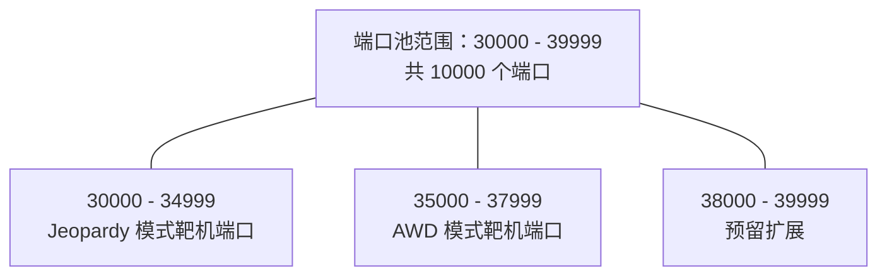

**端口池管理（PortAllocator）：**

```go
// 端口分配器 - 基于 bitmap 实现高效分配与回收
type PortAllocator struct {
    mu       sync.Mutex
    bitmap   *roaring.Bitmap  // 使用 Roaring Bitmap 高效管理端口占用状态
    minPort  uint16           // 端口池下界
    maxPort  uint16           // 端口池上界
}

// Allocate 从端口池中分配指定数量的连续端口
// 返回起始端口号；如端口不足返回错误
func (pa *PortAllocator) Allocate(count int) ([]uint16, error)

// Release 释放端口回端口池
func (pa *PortAllocator) Release(ports []uint16) error

// 启动时从数据库恢复已占用端口，避免重启后端口冲突
func (pa *PortAllocator) RecoverFromDB(ctx context.Context) error
```

**端口映射规则：**
- 每个靶机实例根据题目配置映射 1~N 个端口（如 Web 题映射 HTTP 80，PWN 题映射自定义端口）
- 端口分配记录持久化到 `instance_ports` 表，进程重启后可恢复
- 用户访问地址格式：`{宿主机IP}:{分配的端口}`，由前端展示

## 4. 安全隔离方案

CTF 靶机承载的是真实漏洞环境，安全隔离是整个平台的生命线。以下方案采用**纵深防御**策略，多层叠加。

### 4.1 禁止特权容器

```go
// 创建容器时强制设置，不允许题目配置覆盖
hostConfig := &container.HostConfig{
    Privileged: false,  // 绝对禁止特权模式
    ReadonlyRootfs: true, // 只读根文件系统（详见 4.6）
}
```

**平台层校验：** Container Manager 在创建容器前做二次校验，即使题目配置中包含 `privileged: true` 也会被强制覆盖为 `false`，并记录告警日志。

### 4.2 Linux Capabilities 白名单

默认 Drop ALL，仅按需保留最小必要能力：

```go
hostConfig.CapDrop = []string{"ALL"}
hostConfig.CapAdd = []string{
    // 允许绑定 1024 以下端口（部分 Web 题需要监听 80/443）
    "NET_BIND_SERVICE",
}
// 以下 Capabilities 绝对禁止，即使题目声明需要也不授予：
// - SYS_ADMIN：可用于容器逃逸（CVE-2022-0185 等）
// - SYS_PTRACE：可用于调试宿主机进程
// - NET_RAW：可用于 ARP 欺骗（AWD 模式下按需单独评估）
// - SYS_MODULE：可加载内核模块
// - DAC_OVERRIDE：可绕过文件权限检查
```

**特殊题目处理：** 如果题目确实需要额外 Capabilities（如 PWN 题需要 `SYS_PTRACE`），需管理员在题目审核时显式批准，并在题目元数据中标记 `requires_elevated_caps: true`，平台创建时添加额外监控。

### 4.3 seccomp Profile 配置

> **设计原则：基于 Docker 默认 profile 做减法，而非从零构建白名单。**
> Docker 默认 seccomp profile 已允许约 300+ 个常用系统调用，能满足绝大多数应用运行需求。
> 从零构建白名单（仅允许 30 个调用）会导致靶机内的 Web 服务器、数据库、编译器等无法正常运行。
> 正确做法是：继承默认 profile，仅额外禁止高危调用。

```json
{
  "comment": "CTF 靶机专用 seccomp profile — 继承 Docker 默认 profile，额外禁止高危调用",
  "defaultAction": "SCMP_ACT_ERRNO",
  "archMap": [
    { "architecture": "SCMP_ARCH_X86_64", "subArchitectures": ["SCMP_ARCH_X86", "SCMP_ARCH_X32"] },
    { "architecture": "SCMP_ARCH_AARCH64", "subArchitectures": ["SCMP_ARCH_ARM"] }
  ],
  "syscalls": [
    {
      "comment": "继承 Docker 默认白名单（约 300+ 系统调用），此处省略完整列表",
      "comment2": "实际部署时，从 Docker 源码复制默认 profile 的完整 syscalls 列表",
      "comment3": "参考：https://github.com/moby/moby/blob/master/profiles/seccomp/default.json",
      "names": ["... 继承 Docker 默认 profile 的全部 ALLOW 规则 ..."],
      "action": "SCMP_ACT_ALLOW"
    },
    {
      "comment": "额外禁止：内核模块操作（防止加载恶意内核模块）",
      "names": ["init_module", "finit_module", "delete_module"],
      "action": "SCMP_ACT_ERRNO",
      "errnoRet": 1
    },
    {
      "comment": "额外禁止：挂载操作（防止容器逃逸）",
      "names": ["mount", "umount2", "pivot_root"],
      "action": "SCMP_ACT_ERRNO",
      "errnoRet": 1
    },
    {
      "comment": "额外禁止：命名空间操作（防止逃逸到宿主机命名空间）",
      "names": ["unshare", "setns"],
      "action": "SCMP_ACT_ERRNO",
      "errnoRet": 1
    },
    {
      "comment": "额外禁止：密钥管理（防止访问宿主机密钥环）",
      "names": ["keyctl", "add_key", "request_key"],
      "action": "SCMP_ACT_ERRNO",
      "errnoRet": 1
    },
    {
      "comment": "额外禁止：reboot/kexec（防止重启宿主机）",
      "names": ["reboot", "kexec_load", "kexec_file_load"],
      "action": "SCMP_ACT_ERRNO",
      "errnoRet": 1
    }
  ]
}
```

**实际部署步骤：**

1. 从 Docker 官方仓库下载默认 seccomp profile：
   ```bash
   curl -o /etc/docker/seccomp/docker-default.json \
     https://raw.githubusercontent.com/moby/moby/master/profiles/seccomp/default.json
   ```
2. 复制为 CTF 专用 profile，在 `syscalls` 数组末尾追加上述额外禁止规则
3. 验证靶机镜像能否正常运行：`docker run --security-opt seccomp=/etc/docker/seccomp/ctf-default.json <image> <cmd>`

**部署位置：** `/etc/docker/seccomp/ctf-default.json`，在 Container Manager 创建容器时指定：

```go
hostConfig.SecurityOpt = []string{
    "seccomp=/etc/docker/seccomp/ctf-default.json",
}
```

### 4.4 AppArmor Profile

自定义 AppArmor profile 限制容器内进程的文件访问和能力：

```
# /etc/apparmor.d/ctf-container
#include <tunables/global>

profile ctf-container flags=(attach_disconnected,mediate_deleted) {
  #include <abstractions/base>

  # 禁止写入 /proc/sysrq-trigger（防止触发内核功能）
  deny /proc/sysrq-trigger rwklx,

  # 禁止写入 /proc/sys/**（防止修改内核参数）
  deny /proc/sys/** w,

  # 禁止访问 /sys/firmware/**（防止读取固件信息）
  deny /sys/firmware/** rwklx,

  # 禁止挂载操作
  deny mount,
  deny umount,

  # 禁止访问宿主机设备文件（仅允许 null、zero、random、urandom）
  deny /dev/sd* rwklx,
  deny /dev/xvd* rwklx,
  /dev/null rw,
  /dev/zero rw,
  /dev/random r,
  /dev/urandom r,
  /dev/tty rw,

  # 允许网络访问（靶机服务需要）
  network inet stream,
  network inet dgram,
  network inet6 stream,
  network inet6 dgram,

  # 禁止 raw socket（防止 ARP 欺骗等，AWD 模式另行配置）
  deny network raw,
  deny network packet,
}
```

**加载与使用：**

```bash
# 加载 profile
sudo apparmor_parser -r /etc/apparmor.d/ctf-container

# Container Manager 创建容器时指定
hostConfig.SecurityOpt = append(hostConfig.SecurityOpt,
    "apparmor=ctf-container",
)
```

### 4.5 容器运行用户（非 root）

```go
// 强制以非 root 用户运行容器内进程
containerConfig := &container.Config{
    User: "1000:1000", // ctf-runner 用户
}
```

**题目镜像规范要求：**
- 镜像 Dockerfile 中必须创建非 root 用户并切换：`RUN useradd -m ctfuser && USER ctfuser`
- 如果题目服务必须以 root 启动（如需要绑定 80 端口），使用 `gosu` 或 `su-exec` 降权
- 平台在镜像审核阶段检查 Dockerfile，拒绝未设置 `USER` 指令的镜像
- 对于需要 root 的特殊题目，使用 `NET_BIND_SERVICE` capability 替代 root 权限

### 4.6 只读根文件系统 + tmpfs 可写目录

```go
hostConfig.ReadonlyRootfs = true

// 通过 tmpfs 挂载提供必要的可写目录
hostConfig.Tmpfs = map[string]string{
    "/tmp":     "rw,noexec,nosuid,size=64m",  // 临时文件，限制 64MB
    "/var/tmp": "rw,noexec,nosuid,size=32m",  // 临时文件
    "/run":     "rw,noexec,nosuid,size=16m",  // 运行时文件（PID 等）
}

// 如果题目需要持久化写入（如数据库题），使用 Docker Volume
// Volume 也设置大小限制（通过 local driver opts 或 quota）
hostConfig.Mounts = []mount.Mount{
    {
        Type:   mount.TypeVolume,
        Source: fmt.Sprintf("ctf_%s_data", instanceID),
        Target: "/var/lib/mysql",
        VolumeOptions: &mount.VolumeOptions{
            DriverConfig: &mount.Driver{
                Options: map[string]string{
                    "size": "256m", // 限制 Volume 大小
                },
            },
        },
    },
}
```

**设计考量：**
- 只读根文件系统防止攻击者在容器内植入后门或修改系统文件
- `noexec` 标志防止在 tmpfs 中执行二进制文件（部分 PWN 题可能需要去掉此限制）
- `nosuid` 防止 SUID 提权

### 4.7 未来可选：gVisor / Kata Containers 沙箱运行时

当前方案基于 Linux 内核原生隔离机制（namespace + cgroup + seccomp + AppArmor），对于校园级场景已足够。未来如需更强隔离，可引入沙箱运行时：

| 方案 | 隔离级别 | 性能开销 | 适用场景 |
|------|----------|----------|----------|
| Docker 默认 (runc) | 内核共享，namespace 隔离 | 最低 | 大部分题目 |
| gVisor (runsc) | 用户态内核拦截系统调用 | 中等（~10-20%） | 高危题目（内核漏洞类） |
| Kata Containers | 轻量级 VM，独立内核 | 较高（~30%） | 极高危题目（0day 类） |

**gVisor 集成方式（预留）：**

```json
// /etc/docker/daemon.json 中注册 gVisor 运行时
{
  "runtimes": {
    "runsc": {
      "path": "/usr/local/bin/runsc",
      "runtimeArgs": [
        "--network=sandbox",
        "--platform=systrap"
      ]
    }
  }
}
```

```go
// 高危题目创建时指定 gVisor 运行时
if challenge.SecurityLevel == "high" {
    hostConfig.Runtime = "runsc"
}
```

### 4.8 安全配置汇总

完整的安全参数在容器创建时统一注入：

```go
func buildSecureHostConfig(challenge *Challenge) *container.HostConfig {
    return &container.HostConfig{
        Privileged:     false,
        ReadonlyRootfs: true,
        CapDrop:        []string{"ALL"},
        CapAdd:         challenge.AllowedCaps, // 默认仅 ["NET_BIND_SERVICE"]
        SecurityOpt: []string{
            "no-new-privileges:true",                    // 禁止进程获取新权限
            "seccomp=/etc/docker/seccomp/ctf-default.json",
            "apparmor=ctf-container",
        },
        Tmpfs: map[string]string{
            "/tmp":     "rw,noexec,nosuid,size=64m",
            "/var/tmp": "rw,noexec,nosuid,size=32m",
            "/run":     "rw,noexec,nosuid,size=16m",
        },
        // 资源限制见第 5 节
    }
}
```

## 5. 资源限制方案

### 5.1 默认资源配额

平台为靶机容器定义三个资源等级，题目创建时选择对应等级：

| 等级 | CPU | 内存 | 内存+Swap | PID 上限 | 磁盘写入速率 | 适用场景 |
|------|-----|------|-----------|----------|-------------|----------|
| `small` | 0.5 核 | 128MB | 256MB | 64 | 10MB/s | 静态 Web、Crypto、Misc |
| `medium` | 1.0 核 | 256MB | 512MB | 128 | 20MB/s | 动态 Web、Reverse |
| `large` | 2.0 核 | 512MB | 1024MB | 256 | 40MB/s | PWN、多服务组合题 |

> 管理员可为特殊题目自定义配额，但不得超过单机硬上限（由平台全局配置控制）。

### 5.2 资源限制配置代码

```go
// 根据题目资源等级构建资源限制配置
func buildResourceConfig(level ResourceLevel) *container.Resources {
    presets := map[ResourceLevel]*container.Resources{
        ResourceLevelSmall: {
            NanoCPUs:     500_000_000,  // 0.5 核（单位：纳核）
            Memory:       128 << 20,    // 128MB
            MemorySwap:   256 << 20,    // 128MB 内存 + 128MB Swap
            PidsLimit:    ptr(int64(64)),
            BlkioDeviceWriteBps: []*blkiodev.ThrottleDevice{
                {Path: "/dev/sda", Rate: 10 << 20}, // 10MB/s
            },
        },
        ResourceLevelMedium: {
            NanoCPUs:     1_000_000_000, // 1.0 核
            Memory:       256 << 20,
            MemorySwap:   512 << 20,
            PidsLimit:    ptr(int64(128)),
            BlkioDeviceWriteBps: []*blkiodev.ThrottleDevice{
                {Path: "/dev/sda", Rate: 20 << 20},
            },
        },
        ResourceLevelLarge: {
            NanoCPUs:     2_000_000_000, // 2.0 核
            Memory:       512 << 20,
            MemorySwap:   1024 << 20,
            PidsLimit:    ptr(int64(256)),
            BlkioDeviceWriteBps: []*blkiodev.ThrottleDevice{
                {Path: "/dev/sda", Rate: 40 << 20},
            },
        },
    }
    return presets[level]
}
```

**关键参数说明：**
- `NanoCPUs`：CPU 限制，单位为十亿分之一核。`500_000_000` = 0.5 核
- `Memory`：硬内存限制，超出后容器内进程被 OOM Kill
- `MemorySwap`：内存 + Swap 总量。设为 `Memory` 的 2 倍，允许一定的 Swap 使用
- `PidsLimit`：容器内最大进程数，防止 Fork Bomb（`:(){ :|:& };:`）
- `BlkioDeviceWriteBps`：磁盘写入速率限制，防止恶意写满磁盘

### 5.3 网络带宽限制

Docker 原生不支持容器级网络带宽限制，通过 `tc`（Traffic Control）在容器创建后注入：

```bash
#!/bin/bash
# 对容器的 veth 接口设置带宽限制
# 参数：$1=容器ID, $2=带宽上限(如 10mbit)

CONTAINER_ID=$1
BANDWIDTH=$2

# 获取容器在宿主机上的 veth 接口名
VETH=$(ip link | grep -A1 "if$(docker exec $CONTAINER_ID cat /sys/class/net/eth0/iflink)" \
       | head -1 | awk -F: '{print $2}' | tr -d ' ')

# 设置 tc 规则：限制出站带宽
tc qdisc add dev $VETH root tbf rate $BANDWIDTH burst 32kbit latency 400ms

# 设置入站带宽限制（通过 ingress qdisc）
tc qdisc add dev $VETH handle ffff: ingress
tc filter add dev $VETH parent ffff: protocol ip u32 \
    match u32 0 0 police rate $BANDWIDTH burst 32k drop flowid :1
```

**默认带宽配额：**

| 资源等级 | 上行带宽 | 下行带宽 |
|----------|----------|----------|
| `small` | 5 Mbit/s | 5 Mbit/s |
| `medium` | 10 Mbit/s | 10 Mbit/s |
| `large` | 20 Mbit/s | 20 Mbit/s |

### 5.4 全局资源水位监控

单机资源总量有限，需要全局水位控制防止超卖：

```go
// 全局资源水位配置（通过配置文件注入）
type ResourceWatermark struct {
    MaxContainers    int     `yaml:"max_containers"`     // 单机最大容器数，默认 250
    CPUHighWatermark float64 `yaml:"cpu_high_watermark"` // CPU 使用率高水位，默认 0.85
    MemHighWatermark float64 `yaml:"mem_high_watermark"` // 内存使用率高水位，默认 0.80
    DiskHighWatermark float64 `yaml:"disk_high_watermark"` // 磁盘使用率高水位，默认 0.75
}

// 创建实例前检查资源水位
func (cm *containerManager) checkResourceAvailable(ctx context.Context, required *container.Resources) error {
    current := cm.monitor.GetCurrentUsage()

    if current.ContainerCount >= cm.config.MaxContainers {
        return ErrMaxContainersReached
    }
    if current.CPUUsage > cm.config.CPUHighWatermark {
        return ErrCPUHighWatermark
    }
    if current.MemUsage > cm.config.MemHighWatermark {
        return ErrMemHighWatermark
    }
    return nil
}
```

**水位超限处理：**
- 达到高水位时，新创建请求进入排队队列（详见第 8 节）
- 达到危险水位（95%）时，触发紧急回收：优先销毁已过期但未清理的实例
- 所有水位数据通过 Prometheus 指标暴露，Grafana 面板实时展示

## 6. 容器回收与清理

### 6.1 定时扫描过期实例

```go
// CleanupScheduler 定时扫描配置（通过配置文件注入）
type CleanupConfig struct {
    ScanInterval       time.Duration `yaml:"scan_interval"`        // 扫描间隔，默认 30s
    BatchSize          int           `yaml:"batch_size"`           // 每批回收数量，默认 10
    DestroyTimeout     time.Duration `yaml:"destroy_timeout"`      // 单个销毁超时，默认 30s
    FailedRetainTime   time.Duration `yaml:"failed_retain_time"`   // failed 状态保留时间，默认 30min
    CrashedRetainTime  time.Duration `yaml:"crashed_retain_time"`  // crashed 状态保留时间，默认 30min
}
```

**扫描流程：**

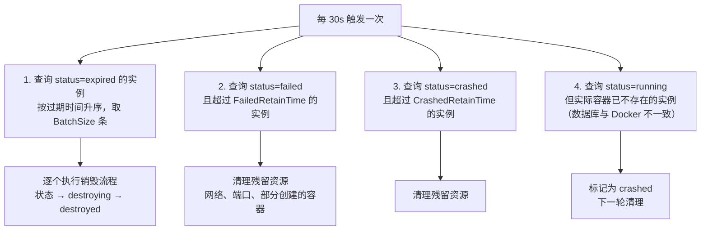

### 6.2 容器崩溃检测与自动清理

通过 Docker Events API 实时监听容器状态变化：

```go
// 监听 Docker 事件流，实时感知容器异常退出
func (cm *containerManager) watchContainerEvents(ctx context.Context) {
    filters := filters.NewArgs()
    filters.Add("type", "container")
    filters.Add("event", "die")
    filters.Add("event", "oom")
    // 仅监听 CTF 靶机容器（通过 label 过滤）
    filters.Add("label", "managed-by=ctf-platform")

    eventCh, errCh := cm.dockerClient.Events(ctx, types.EventsOptions{
        Filters: filters,
    })

    for {
        select {
        case event := <-eventCh:
            switch event.Action {
            case "die":
                exitCode := event.Actor.Attributes["exitCode"]
                if exitCode != "0" {
                    // 非正常退出，标记为 crashed
                    cm.handleContainerCrash(ctx, event.Actor.ID, exitCode)
                }
            case "oom":
                // OOM Kill，记录日志并标记
                cm.handleContainerOOM(ctx, event.Actor.ID)
            }
        case err := <-errCh:
            // 事件流断开，重连
            log.Error("Docker 事件流断开，准备重连", "error", err)
            time.Sleep(time.Second * 5)
            // 重新建立监听...
        case <-ctx.Done():
            return
        }
    }
}
```

### 6.3 孤儿网络/卷清理

平台重启或异常宕机后，可能遗留未被正确清理的 Docker 资源。通过定期对账机制处理：

```go
// 每 10 分钟执行一次孤儿资源对账
func (cm *containerManager) reconcileOrphanResources(ctx context.Context) {
    // 1. 获取所有 CTF 平台创建的 Docker 网络
    networks, _ := cm.dockerClient.NetworkList(ctx, types.NetworkListOptions{
        Filters: filters.NewArgs(filters.Arg("label", "managed-by=ctf-platform")),
    })

    // 2. 获取数据库中所有活跃实例关联的网络 ID
    activeNetworkIDs := cm.repo.GetActiveNetworkIDs(ctx)

    // 3. 差集即为孤儿网络
    for _, net := range networks {
        if !activeNetworkIDs.Contains(net.ID) {
            // 宽限期 5 分钟，避免误删正在创建中的网络
            if time.Since(net.Created) > 5*time.Minute {
                log.Warn("发现孤儿网络，执行清理",
                    "network_id", net.ID, "name", net.Name)
                cm.dockerClient.NetworkRemove(ctx, net.ID)
            }
        }
    }

    // 4. 同理清理孤儿 Volume（命名前缀为 ctf_ 的 Volume）
    volumes, _ := cm.dockerClient.VolumeList(ctx, volume.ListOptions{
        Filters: filters.NewArgs(
            filters.Arg("label", "managed-by=ctf-platform")),
    })
    // ... 类似差集逻辑，清理不在活跃列表中的 Volume
}
```

### 6.4 镜像缓存策略

**预拉取机制：**
- 竞赛开始前，平台根据题目列表自动预拉取所有需要的镜像
- 常用基础镜像（如 `ubuntu:22.04`、`nginx:alpine`、`mysql:8.0`）保持常驻
- 镜像拉取状态通过 WebSocket 推送给管理员，展示进度

**LRU 清理策略：**

```go
// 镜像缓存管理配置（通过配置文件注入）
type ImageCacheConfig struct {
    MaxCacheSize    int64         `yaml:"max_cache_size"`    // 镜像缓存上限，默认 50GB
    CleanupInterval time.Duration `yaml:"cleanup_interval"`  // 清理检查间隔，默认 1h
    MinRetainTime   time.Duration `yaml:"min_retain_time"`   // 最短保留时间，默认 24h
    PinnedImages    []string      `yaml:"pinned_images"`     // 常驻镜像列表，不参与清理
}

// 镜像清理流程
// 1. 计算当前镜像总占用空间
// 2. 如超过 MaxCacheSize，按最后使用时间排序
// 3. 跳过 PinnedImages 和 MinRetainTime 内使用过的镜像
// 4. 从最久未使用的开始删除，直到低于阈值
```

**镜像安全扫描：**
- 题目镜像上传后，使用 Trivy 进行漏洞扫描（这里扫描的是镜像本身的安全性，非题目漏洞）
- 扫描结果记录到题目元数据，供管理员审核参考

## 7. Flag 注入机制

### 7.1 Flag 类型与生成策略

| 类型 | 生成方式 | 适用场景 |
|------|----------|----------|
| 静态 Flag | 题目创建时由出题人设定，所有用户相同 | 非动态容器题（附件题、签到题） |
| 动态 Flag | 基于用户身份实时计算，每人不同 | Jeopardy 动态容器题 |
| 轮换 Flag | 每轮比赛生成新 Flag，写入各队靶机 | AWD 模式 |

### 7.2 动态 Flag 生成算法

> **与 01-system-architecture.md ADR-004 保持一致。** 采用三层密钥分离架构。

```go
import (
    "crypto/hmac"
    "crypto/sha256"
    "encoding/hex"
    "fmt"
)

// GenerateDynamicFlag 动态 Flag 生成
// 三层密钥分离：global_secret / contest_salt / instance_nonce
// 算法：HMAC-SHA256(global_secret + contest_salt, user_id:challenge_id:instance_nonce)
//
// 安全保证：
// 1. 不同用户得到不同 Flag（防止抄袭）
// 2. 无法从 Flag 反推其他用户的 Flag
// 3. 单一密钥泄露不会导致全部 Flag 可计算
// 4. 同一用户同一题的不同实例产生不同 Flag（instance_nonce）
func GenerateDynamicFlag(globalSecret, contestSalt string,
    userID, challengeID uint64, instanceNonce string) string {

    key := []byte(globalSecret + contestSalt)
    message := fmt.Sprintf("%d:%d:%s", userID, challengeID, instanceNonce)

    mac := hmac.New(sha256.New, key)
    mac.Write([]byte(message))
    hash := hex.EncodeToString(mac.Sum(nil))

    // 取前 32 位作为 Flag 内容
    return fmt.Sprintf("flag{%s}", hash[:32])
}
```

**安全要点：**
- `globalSecret` 存储在环境变量 `CTF_FLAG_SECRET`，禁止写入数据库或日志
- `contestSalt` 每场竞赛独立随机 32 字节，在数据库中使用 AES-GCM 加密存储
- `instanceNonce` 每个实例创建时随机生成，存入 instances 表
- Flag 验证时服务端重新计算比对，不依赖容器内的 Flag 值

### 7.3 Flag 注入方式

> **安全原则：Flag 不落盘宿主机文件系统。** 原方案通过 bind mount 将 Flag 文件从宿主机挂载到容器内，
> 导致 Flag 明文存储在宿主机 `/var/ctf/flags/` 目录，一旦宿主机被入侵即可批量获取所有 Flag。
> 改为 tmpfs + docker exec 注入，Flag 仅存在于容器内存中。

容器创建时通过两种方式同时注入 Flag：

```go
// 方式 1：环境变量注入（容器创建时设置）
containerConfig := &container.Config{
    Env: []string{
        fmt.Sprintf("FLAG=%s", generatedFlag),
        fmt.Sprintf("CTF_FLAG=%s", generatedFlag), // 兼容别名
    },
}

// 方式 2：tmpfs 挂载 + docker exec 写入（替代 bind mount，Flag 不落盘宿主机）
// 2a. 创建容器时挂载 tmpfs（内存文件系统）到 /flag 目录
hostConfig.Tmpfs = map[string]string{
    "/flag": "rw,noexec,nosuid,size=4k", // 限制 4KB，仅存放 Flag 文件
}

// 2b. 容器启动后，通过 Docker API CopyToContainer 写入 Flag 文件
func (cm *containerManager) injectFlagFile(ctx context.Context, containerID, flag string) error {
    // 构建 tar 归档（CopyToContainer 要求 tar 格式）
    var buf bytes.Buffer
    tw := tar.NewWriter(&buf)
    flagBytes := []byte(flag)
    tw.WriteHeader(&tar.Header{
        Name: "flag.txt",
        Mode: 0444, // 容器内只读
        Size: int64(len(flagBytes)),
    })
    tw.Write(flagBytes)
    tw.Close()

    // 通过 Docker API 写入，不经过 shell，无命令注入风险
    return cm.dockerClient.CopyToContainer(ctx, containerID,
        "/flag", &buf, container.CopyToContainerOptions{})
}
```

**注入时序：**
1. 生成 Flag → 2. 创建容器（含环境变量 + tmpfs 挂载）→ 3. 启动容器 → 4. CopyToContainer 写入 `/flag/flag.txt`
- Flag 仅存在于容器 tmpfs 中，容器销毁后自动清除，无需额外清理

### 7.4 AWD 模式 Flag 轮换

AWD 模式下，每轮比赛需要更新所有队伍靶机中的 Flag：

```go
// AWD Flag 轮换流程
func (cm *containerManager) RotateAWDFlags(ctx context.Context, gameID uint64, round int) error {
    // 1. 获取本场比赛所有队伍的靶机实例
    instances, err := cm.repo.GetAWDInstances(ctx, gameID)
    if err != nil {
        return fmt.Errorf("获取 AWD 实例列表失败: %w", err)
    }

    // 2. 为每个队伍生成本轮 Flag
    for _, inst := range instances {
        flag := GenerateAWDRoundFlag(inst.TeamID, gameID, round, cm.config.AWDSalt)

        // 3. 通过 Docker API CopyToContainer 写入新 Flag（替代 sh -c echo，避免命令注入）
        if err := cm.copyFlagToContainer(ctx, inst.ContainerID, flag); err != nil {
            log.Error("Flag 轮换失败",
                "team_id", inst.TeamID, "round", round, "error", err)
            continue // 单个失败不阻塞其他队伍
        }

        // 4. 记录本轮 Flag 到数据库（用于判题验证）
        cm.repo.SaveRoundFlag(ctx, gameID, inst.TeamID, round, flag)
    }

    return nil
}
```

**轮换时序保障：**
- Flag 轮换由 GameBox 服务在每轮开始时触发，通过分布式锁保证只执行一次
- 轮换超时设置为 30s，超时后记录告警，管理员可手动重试
- 轮换期间暂停该轮的 Flag 提交判定，轮换完成后开放

## 8. 竞赛高峰预热方案

### 8.1 赛前预创建容器池

校赛高峰期（开赛前 10 分钟）会出现大量并发创建请求。通过预创建容器池缓解冲击：

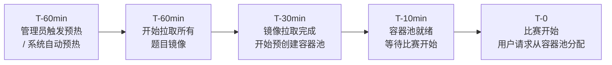

```go
// 容器池配置（通过配置文件注入）
type ContainerPoolConfig struct {
    Enabled       bool `yaml:"enabled"`         // 是否启用预创建
    PoolSize      int  `yaml:"pool_size"`        // 每道题预创建数量，默认 20
    WarmupMinutes int  `yaml:"warmup_minutes"`   // 赛前多少分钟开始预热，默认 30
}

// 预创建的容器处于"挂起"状态：已创建但未注入 Flag，且不映射宿主机端口
// 用户请求时：从池中取出 → 注入该用户的 Flag → 动态添加端口映射 → 注入 iptables ACCEPT 规则 → 标记为 running
// 安全要点：预创建时不映射端口，避免未分配的容器被外部扫描访问
// 好处：跳过镜像拉取和容器创建的耗时，分配延迟从 ~10s 降到 ~1s
type PooledContainer struct {
    ContainerID string
    NetworkID   string
    Ports       []uint16 // 预分配的端口号，但创建时未映射；分配给用户时再通过 iptables DNAT 映射
    ChallengeID uint64
    CreatedAt   time.Time
    Assigned    bool // 是否已分配给用户
}
```

### 8.2 镜像预拉取

```go
// 赛前镜像预拉取流程
func (cm *containerManager) PrePullImages(ctx context.Context, gameID uint64) error {
    // 1. 获取本场比赛所有题目的镜像列表
    challenges, err := cm.repo.GetGameChallenges(ctx, gameID)
    if err != nil {
        return err
    }

    // 2. 检查本地已有镜像，过滤出需要拉取的
    var needPull []string
    for _, ch := range challenges {
        for _, img := range ch.Images {
            _, _, err := cm.dockerClient.ImageInspectWithRaw(ctx, img)
            if err != nil {
                needPull = append(needPull, img)
            }
        }
    }

    // 3. 并发拉取（限制并发数，避免带宽打满）
    sem := make(chan struct{}, 3) // 最多 3 个并发拉取
    var wg sync.WaitGroup
    for _, img := range needPull {
        wg.Add(1)
        go func(image string) {
            defer wg.Done()
            sem <- struct{}{}
            defer func() { <-sem }()

            log.Info("开始拉取镜像", "image", image)
            reader, err := cm.dockerClient.ImagePull(ctx, image,
                image.PullOptions{})
            if err != nil {
                log.Error("镜像拉取失败", "image", image, "error", err)
                return
            }
            defer reader.Close()
            io.Copy(io.Discard, reader) // 等待拉取完成
            log.Info("镜像拉取完成", "image", image)
        }(img)
    }
    wg.Wait()
    return nil
}
```

### 8.3 排队机制设计

当前代码已落地的是**数据库持久化排队 + 后台调度器**，不是独立的 Redis 队列：

- 开题请求先写入 `instances(status=pending)`；
- 后台 `practice_instance_scheduler` 周期性领取最早的 `pending` 实例；
- 调度器受 `max_concurrent_starts` 和 `max_active_instances` 双阈值保护；
- 真正的容器创建发生在 `pending -> creating -> running` 的后台推进阶段。

在此基础上，后续如果需要排队位置、超时取消、消息确认和重投递，再演进到 Redis Stream / MQ。

概念流程如下：

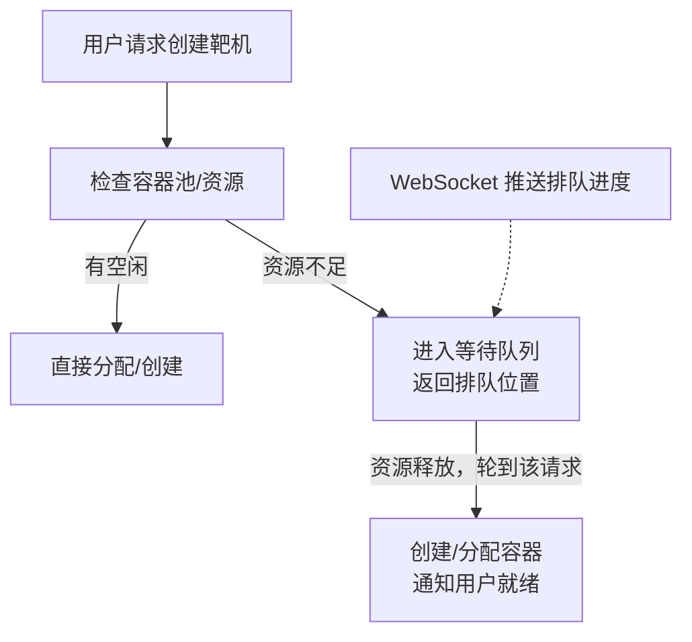

当前前端体验是：
- 用户发起创建请求后立即拿到 `instance_id` 和 `status=pending`
- 前端通过现有实例查询接口轮询实例状态，而不是轮询独立 `request_id`
- 当状态推进到 `running` 后再展示访问地址

## 9. 多物理机扩展方案（预留）

### 9.1 架构演进路径

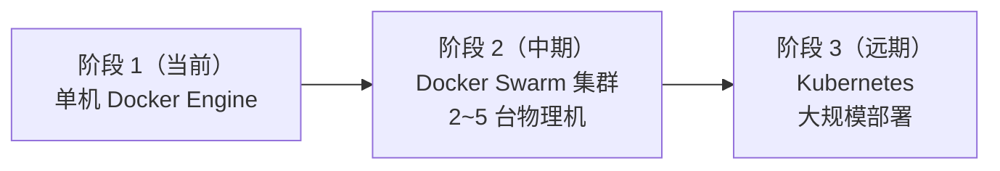

当前架构基于单机 Docker Engine 设计，但 Container Manager 封装层已预留多宿主机扩展能力。当单机无法承载时，优先采用 Docker Swarm 作为中间方案（部署成本低，与现有 Docker Compose 兼容性好）。

### 9.2 Docker Swarm 集群方案

**集群拓扑：**

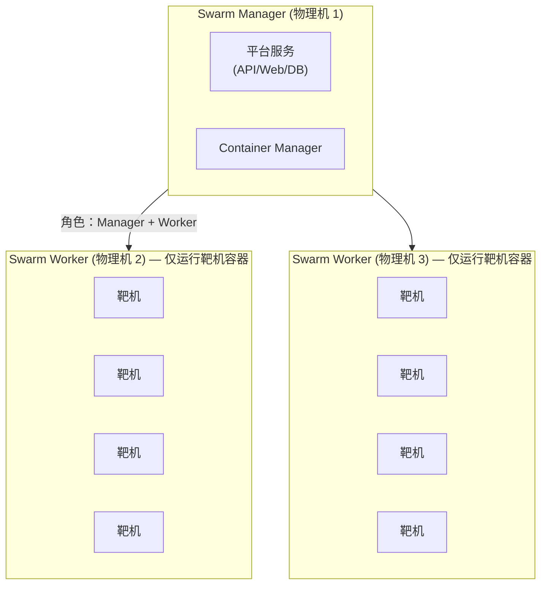

**Swarm 初始化命令：**

```bash
# Manager 节点初始化
docker swarm init --advertise-addr <MANAGER_IP>

# Worker 节点加入（在每台 Worker 物理机上执行）
docker swarm join --token <WORKER_TOKEN> <MANAGER_IP>:2377

# 为 Worker 节点打标签（用于调度约束）
docker node update --label-add role=ctf-worker <NODE_ID>
```

### 9.3 容器调度策略（资源感知分配）

Container Manager 在多节点环境下需要智能选择目标节点：

```go
// 节点资源信息（由各 Worker 定期上报）
type NodeStatus struct {
    NodeID          string
    Hostname        string
    CPUTotal        float64 // 总 CPU 核数
    CPUUsed         float64 // 已使用 CPU
    MemTotal        int64   // 总内存（字节）
    MemUsed         int64   // 已使用内存
    ContainerCount  int     // 当前容器数
    MaxContainers   int     // 最大容器数
    Labels          map[string]string
    LastHeartbeat   time.Time
}

// 调度策略：加权最少负载优先
func (s *Scheduler) SelectNode(ctx context.Context,
    required *container.Resources) (*NodeStatus, error) {

    nodes := s.getHealthyNodes() // 过滤掉心跳超时的节点

    var bestNode *NodeStatus
    var bestScore float64 = -1

    for _, node := range nodes {
        // 检查节点是否有足够资源
        if !node.HasCapacity(required) {
            continue
        }

        // 计算综合负载分数（越低越好）
        cpuScore := node.CPUUsed / node.CPUTotal
        memScore := float64(node.MemUsed) / float64(node.MemTotal)
        containerScore := float64(node.ContainerCount) / float64(node.MaxContainers)

        // 加权综合分（CPU 40%、内存 40%、容器数 20%）
        score := 1.0 - (cpuScore*0.4 + memScore*0.4 + containerScore*0.2)

        if score > bestScore {
            bestScore = score
            bestNode = node
        }
    }

    if bestNode == nil {
        return nil, ErrNoAvailableNode
    }
    return bestNode, nil
}
```

### 9.4 多机扩展注意事项

| 关注点 | 单机方案 | 多机方案变化 |
|--------|----------|-------------|
| 网络隔离 | Docker Bridge + iptables | Overlay Network（Swarm 内置加密） |
| 端口映射 | 宿主机端口直接映射 | Swarm Ingress Routing Mesh 或指定节点发布 |
| Flag 文件注入 | 本地 bind mount | 需通过 Docker Config/Secret 或 docker exec |
| 镜像分发 | 本地缓存 | 需搭建私有 Registry，各节点从 Registry 拉取 |
| 容器监控 | 单机 Docker Events | 各节点 Agent 上报 + 中心聚合 |
| 日志收集 | 本地文件 | 统一日志收集（Loki / EFK） |

**私有 Registry 部署（多机必备）：**

仓库提供了带 Basic Auth 的部署脚本，单机演示或小规模内网部署可以直接使用：

```bash
cp scripts/registry/deploy-private-registry.conf.example scripts/registry/deploy-private-registry.conf
vim scripts/registry/deploy-private-registry.conf
scripts/registry/deploy-private-registry.sh
```

`scripts/registry/deploy-private-registry.conf` 是本机部署配置文件，已被 `.gitignore` 忽略，不应提交到仓库。也可以通过 `--config` 指定其他配置文件：

```bash
scripts/registry/deploy-private-registry.sh --config /etc/ctf/private-registry.conf
```

脚本会启动 `registry:2` 容器，生成 htpasswd 认证文件，并在认证目录写入后端可加载的 `ctf-platform-registry.env`：

```bash
source "$HOME/ctf-registry/auth/ctf-platform-registry.env"
```

这两个文件要看成同一次部署产物：

- `$HOME/ctf-registry/auth/htpasswd`
- `$HOME/ctf-registry/auth/ctf-platform-registry.env`

如果要重置用户名或密码，必须重新执行 `deploy-private-registry.sh`，让脚本同时更新这两处并按需重建 `ctf-registry` 容器。不要只手改其中一份，否则很容易出现下面这种错位状态：

- 后端环境变量里还是旧用户名或旧密码
- `ctf-registry` 容器实际加载的是另一份新 `htpasswd`
- `docker login`、`docker push` 和平台运行时拉取全部返回 `401 Unauthorized`

本地演示如果继续使用仓库默认口径，推荐显式执行：

```bash
scripts/registry/deploy-private-registry.sh \
  --name ctf-registry \
  --port 5000 \
  --server 127.0.0.1:5000 \
  --scheme http \
  --username ctf \
  --password 123456 \
  --force-recreate
```

如果需要手工部署，等价流程如下：

```bash
# 使用 Docker Registry 搭建私有镜像仓库
docker run -d \
  --name registry \
  --restart always \
  -p 5000:5000 \
  -v /data/registry:/var/lib/registry \
  registry:2

# 题目镜像推送到私有 Registry
docker tag challenge-web:v1 registry.ctf.local:5000/challenge-web:v1
docker push registry.ctf.local:5000/challenge-web:v1
```

平台运行节点拉取私有镜像时，可以在后端配置中启用 `container.registry`。该配置只负责运行时 `docker pull` 的认证，不负责构建镜像或管理 registry 生命周期。

```yaml
container:
  registry:
    enabled: true
    server: registry.ctf.local:5000
    username: ctf
    password: ${CTF_CONTAINER_REGISTRY_PASSWORD}
```

当前实现会按镜像引用中的 registry 域名匹配 `container.registry.server`，只有匹配时才向 Docker Engine 传递认证信息。例如 `registry.ctf.local:5000/challenge-web:v1` 会使用上述凭据，`nginx:latest` 不会使用该凭据。

**私有 Registry 拉取烟测：**

平台侧验证私有仓库拉取时，应使用带认证的 registry、已推送镜像和后端 runtime engine 共同验证，而不是只检查配置是否能读取。推荐流程如下：

```bash
# 1. 准备带认证的 registry，并确认未认证访问会被拒绝
curl -o /dev/null -w '%{http_code}' http://127.0.0.1:15000/v2/
# 预期：401

# 2. 使用临时 Docker config 登录并推送测试镜像
DOCKER_CONFIG=/tmp/ctf-registry-smoke-docker-config \
  docker login 127.0.0.1:15000 -u ctf --password-stdin
docker tag busybox:1.36 127.0.0.1:15000/ctf/private-registry-smoke:v1
DOCKER_CONFIG=/tmp/ctf-registry-smoke-docker-config \
  docker push 127.0.0.1:15000/ctf/private-registry-smoke:v1

# 3. 删除本地同名 tag，确保后端必须从 registry 拉取
docker image rm 127.0.0.1:15000/ctf/private-registry-smoke:v1

# 4. 运行后端集成测试
CTF_TEST_PRIVATE_REGISTRY_IMAGE=127.0.0.1:15000/ctf/private-registry-smoke:v1 \
CTF_TEST_PRIVATE_REGISTRY_SERVER=127.0.0.1:15000 \
CTF_TEST_PRIVATE_REGISTRY_USERNAME=ctf \
CTF_TEST_PRIVATE_REGISTRY_PASSWORD=registry-token \
go test -count=1 ./internal/module/runtime/infrastructure \
  -run TestEnginePullsImageFromPrivateRegistryWithConfiguredAuth -v
```

该测试默认跳过，只有显式提供 `CTF_TEST_PRIVATE_REGISTRY_*` 环境变量时才会访问 Docker Engine 和私有 registry。测试通过表示平台运行时可以使用 `container.registry` 凭据完成真实 `docker pull`。

---

## 附录 A：容器创建完整流程

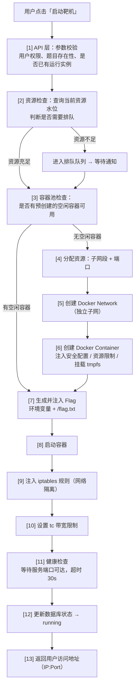

## 附录 B：关键配置参数汇总

以下参数均通过配置文件注入，禁止硬编码：

```yaml
# config/container.yaml

container:
  # 网络配置
  network:
    jeopardy_subnet_base: "10.10.0.0/16"   # Jeopardy 子网基地址
    awd_subnet_base: "10.20.0.0/16"         # AWD 子网基地址
    subnet_mask: 24                          # 每实例子网掩码

  # 端口配置
  port:
    jeopardy_range_min: 30000
    jeopardy_range_max: 34999
    awd_range_min: 35000
    awd_range_max: 37999
    # 备注：如不区分模式端口池，也可使用「统一端口范围」策略（对应 01 文档中的 port_range_start/end），PortAllocator 内部按需划分/复用即可。

  # 资源水位
  watermark:
    max_containers: 250
    cpu_high: 0.85
    mem_high: 0.80
    disk_high: 0.75
    cpu_danger: 0.95
    mem_danger: 0.95

  # 清理配置
  cleanup:
    scan_interval: "30s"
    batch_size: 10
    destroy_timeout: "30s"
    failed_retain_time: "30m"
    crashed_retain_time: "30m"
    orphan_reconcile_interval: "10m"
    orphan_grace_period: "5m"

  # 容器池配置
  pool:
    enabled: true
    pool_size: 20
    warmup_minutes: 30

  # 启动调度配置
  scheduler:
    enabled: true
    poll_interval: "1s"
    batch_size: 4
    max_concurrent_starts: 4
    max_active_instances: 60

  # 镜像缓存配置
  image_cache:
    max_cache_size: "50GB"
    cleanup_interval: "1h"
    min_retain_time: "24h"
    pinned_images:
      - "ubuntu:22.04"
      - "nginx:alpine"
      - "mysql:8.0"
      - "redis:7.4-alpine"

  # Flag 配置
  flag:
    # 仅用于临时工作目录（如必须落地中间文件时使用），**必须挂载在 tmpfs**（例如 /run/ctf），禁止写入持久化磁盘。
    # 推荐实现：CopyToContainer 直接使用内存构建 tar（buf），避免任何宿主机落盘。
    tmp_dir: "/run/ctf"
    # 动态 Flag 全局密钥通过环境变量注入：CTF_FLAG_SECRET（禁止写入数据库或日志）
    # contest_salt 为每场竞赛独立随机值，存库时 AES-GCM 加密（contests.contest_salt_enc），服务端解密后参与 HMAC 计算

  # 安全配置
  security:
    seccomp_profile: "/etc/docker/seccomp/ctf-default.json"
    apparmor_profile: "ctf-container"
    default_caps: ["NET_BIND_SERVICE"]
    forbidden_caps: ["SYS_ADMIN", "SYS_PTRACE", "SYS_MODULE", "DAC_OVERRIDE"]
```
