# 关键流程设计文档

> 本文档描述 CTF 靶场平台的核心业务流程，包含时序图、关键决策点、异常处理与并发控制策略。

---

## 目录

1. [靶机实例启动流程](#1-靶机实例启动流程)
2. [Flag 提交与计分流程](#2-flag-提交与计分流程)
3. [动态计分流程](#3-动态计分流程)
4. [排行榜实时更新流程](#4-排行榜实时更新流程)
5. [容器生命周期回收流程](#5-容器生命周期回收流程)
6. [竞赛状态流转](#6-竞赛状态流转)
7. [AWD 轮次执行流程](#7-awd-轮次执行流程)
8. [作弊检测流程](#8-作弊检测流程)
9. [竞赛高峰排队机制](#9-竞赛高峰排队机制)

---

## 1. 靶机实例启动流程

### 1.1 流程描述

用户请求启动靶机实例时，系统需要完成前置校验、资源分配、容器创建、Flag 注入等一系列操作。
整个流程是一个**有状态的编排过程**，任何步骤失败都需要回滚已创建的资源，避免资源泄漏。

### 1.2 时序图

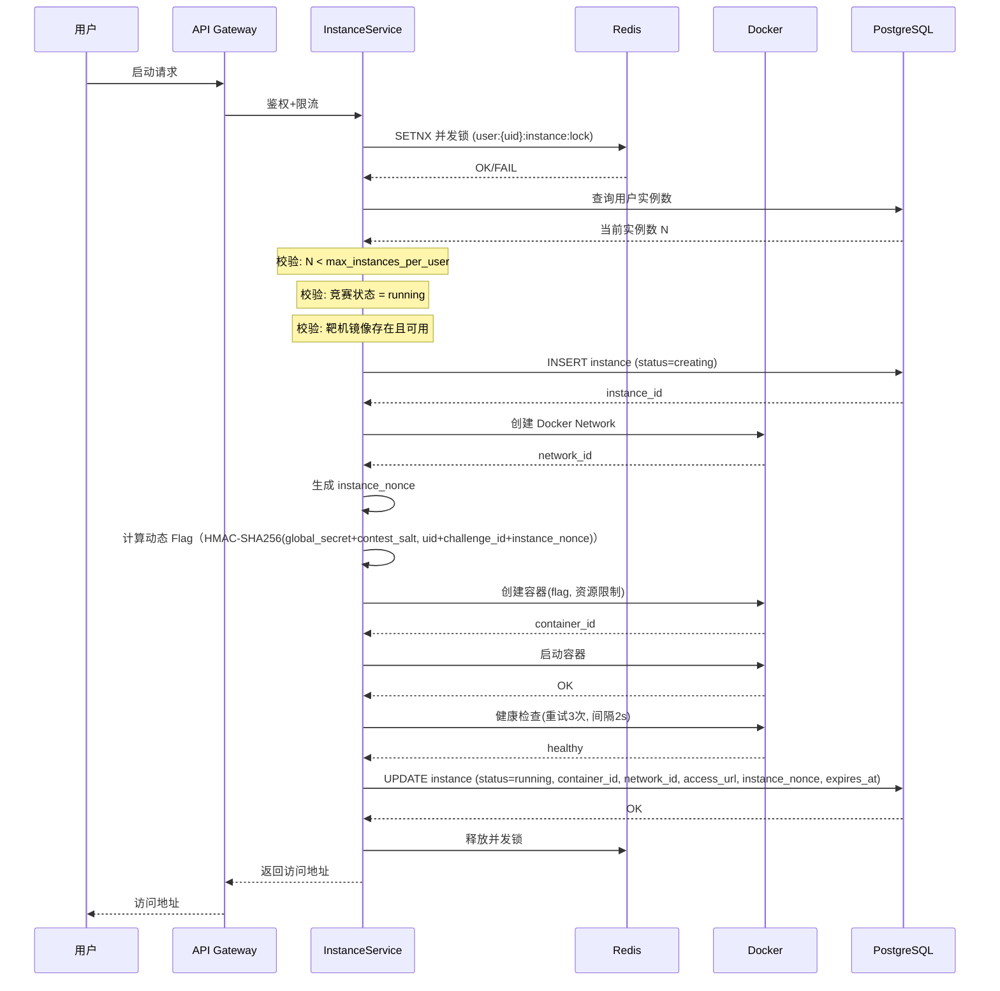
```mermaid
sequenceDiagram
    participant 用户
    participant API as API Gateway
    participant IS as InstanceService
    participant Redis
    participant Docker
    participant PG as PostgreSQL

    用户->>API: 启动请求
    API->>IS: 鉴权+限流

    IS->>Redis: SETNX 并发锁 (user:{uid}:instance:lock)
    Redis-->>IS: OK/FAIL

    IS->>PG: 查询用户实例数
    PG-->>IS: 当前实例数 N

    Note over IS: 校验: N < max_instances_per_user
    Note over IS: 校验: 竞赛状态 = running
    Note over IS: 校验: 靶机镜像存在且可用

    IS->>PG: INSERT instance (status=creating)
    PG-->>IS: instance_id

    IS->>Docker: 创建 Docker Network
    Docker-->>IS: network_id

    IS->>IS: 生成 instance_nonce
    IS->>IS: 计算动态 Flag（HMAC-SHA256(global_secret+contest_salt, uid+challenge_id+instance_nonce)）

    IS->>Docker: 创建容器(flag, 资源限制)
    Docker-->>IS: container_id

    IS->>Docker: 启动容器
    Docker-->>IS: OK

    IS->>Docker: 健康检查(重试3次, 间隔2s)
    Docker-->>IS: healthy

    IS->>PG: UPDATE instance (status=running, container_id, network_id, access_url, instance_nonce, expires_at)
    PG-->>IS: OK

    IS->>Redis: 释放并发锁
    IS-->>API: 返回访问地址
    API-->>用户: 访问地址
```

### 1.3 关键决策点

| 决策点 | 方案 | 理由 |
|--------|------|------|
| 并发控制 | Redis SETNX `user:{uid}:instance:lock`，TTL 30s | 防止同一用户并发发起多个启动请求，TTL 兜底防死锁 |
| 实例数限制 | 数据库 `SELECT COUNT(*) WHERE user_id=? AND status IN ('pending','creating','running')` | 以数据库为准，Redis 锁仅防并发，不做计数 |
| Flag 生成算法 | `HMAC-SHA256(global_secret + contest_salt, uid + ":" + challenge_id + ":" + instance_nonce)` | 三层密钥分离（详见 01 ADR-004）：global_secret 环境变量注入、contest_salt 每赛独立加密存储、instance_nonce 每实例随机 |
| 资源限制 | Docker `--memory`、`--cpus`、`--pids-limit` 从 challenge 配置读取 | 防止恶意容器耗尽宿主机资源 |
| 网络隔离 | 每个实例独立 Docker Network，仅暴露指定端口 | 防止实例间横向渗透 |
| 健康检查 | 启动后轮询 3 次，间隔 2s，检测指定端口是否可达 | 确保容器真正就绪后再返回用户 |
| 实例有效期 | `expires_at = now() + challenge.duration`，默认 2 小时 | 防止资源长期占用，到期自动回收 |

### 1.4 异常处理

| 异常场景 | 处理策略 | 回滚操作 |
|----------|----------|----------|
| 用户并发实例数超限 | 返回 429，提示"已达最大实例数" | 释放 Redis 锁 |
| 竞赛不在 running 状态 | 返回 403，提示"竞赛未开始或已结束" | 释放 Redis 锁 |
| 镜像不存在 | 返回 500，记录告警日志 | 释放 Redis 锁，更新实例状态为 failed |
| Docker Network 创建失败 | 返回 500，记录错误 | 释放 Redis 锁，更新实例状态为 failed |
| 容器创建/启动失败 | 返回 500，记录错误 | 删除已创建的 Network，更新实例状态为 failed |
| 健康检查超时（3 次均失败） | 返回 500，提示"启动超时" | 停止并删除容器、删除 Network，更新实例状态为 failed |
| 宿主机资源不足 | 返回 503，引导用户进入排队 | 释放 Redis 锁；排队状态由 Redis 队列维护（如已创建 instance 记录则更新为 pending） |
| 数据库写入失败 | 返回 500 | 停止并删除容器、删除 Network，释放 Redis 锁 |

### 1.5 回滚编排（补偿模式）

```go
// 使用 defer 栈实现资源回滚，任何步骤失败时按逆序清理
func (s *InstanceService) StartInstance(ctx context.Context, req *StartReq) (*Instance, error) {
    // 1. 获取 Redis 分布式锁
    lockKey := fmt.Sprintf("user:%d:instance:lock", req.UserID)
    acquired, err := s.redis.SetNX(ctx, lockKey, "1", 30*time.Second).Result()
    if !acquired {
        return nil, ErrConcurrentRequest
    }
    defer s.redis.Del(ctx, lockKey)

    // 2. 前置校验（实例数、竞赛状态、镜像）
    // ...省略校验逻辑...

    // 3. 创建数据库记录（status=creating）
    instance, err := s.repo.CreateInstance(ctx, &Instance{Status: StatusCreating, ...})
    if err != nil {
        return nil, err
    }

    // 4. 资源创建与回滚栈
    var cleanups []func()
    defer func() {
        if err != nil {
            for i := len(cleanups) - 1; i >= 0; i-- {
                cleanups[i]()
            }
            _ = s.repo.UpdateInstanceStatus(ctx, instance.ID, StatusFailed)
        }
    }()

    // 5. 创建 Docker Network
    networkID, err := s.docker.CreateNetwork(ctx, instance.ID)
    if err != nil {
        return nil, fmt.Errorf("创建网络失败: %w", err)
    }
    cleanups = append(cleanups, func() { _ = s.docker.RemoveNetwork(ctx, networkID) })

    // 6. 生成动态 Flag（三层密钥分离，详见 01 ADR-004）
    flag := s.generateFlag(s.config.GlobalSecret, contest.Salt, req.UserID, req.ChallengeID, instance.Nonce)

    // 7. 创建并启动容器
    containerID, err := s.docker.CreateAndStart(ctx, &ContainerConfig{
        Image:     challenge.Image,
        Flag:      flag,
        Memory:    challenge.MemoryLimit,
        CPUs:      challenge.CPULimit,
        PidsLimit: challenge.PidsLimit,
        NetworkID: networkID,
        Ports:     challenge.ExposedPorts,
    })
    if err != nil {
        return nil, fmt.Errorf("创建容器失败: %w", err)
    }
    cleanups = append(cleanups, func() {
        _ = s.docker.StopContainer(ctx, containerID, 5*time.Second)
        _ = s.docker.RemoveContainer(ctx, containerID)
    })

    // 8. 健康检查
    if err := s.waitForHealthy(ctx, containerID, 3, 2*time.Second); err != nil {
        return nil, fmt.Errorf("健康检查超时: %w", err)
    }

    // 9. 更新数据库（status=running）
    err = s.repo.UpdateInstance(ctx, instance.ID, &InstanceUpdate{
        Status:      StatusRunning,
        ContainerID: containerID,
        NetworkID:   networkID,
        AccessURL:   buildAccessURL(containerID, challenge.ExposedPorts),
        ExpiresAt:   time.Now().Add(challenge.Duration),
    })
    if err != nil {
        return nil, err
    }

    // 成功，清空回滚栈
    cleanups = nil
    return instance, nil
}
```

### 1.6 并发与一致性考虑

- **同一用户并发启动**：Redis SETNX 互斥锁保证同一时刻只有一个启动请求在执行，TTL 30s 兜底防死锁。
- **实例计数准确性**：以数据库 `status IN ('creating','running')` 为准，不依赖 Redis 计数，避免缓存与数据库不一致。
- **资源泄漏防护**：defer 回滚栈 + 定时孤儿资源清理（见流程 5）双重保障。
- **幂等性**：同一请求重复提交时，Redis 锁会拒绝第二次请求；如果锁已释放但实例已存在，通过数据库唯一约束 `(user_id, challenge_id, status=running)` 防止重复创建。

---

## 2. Flag 提交与计分流程

### 2.1 流程描述

用户提交 Flag 后，系统需要完成身份校验、频率限制、Flag 验证、计分、幂等去重、事件发布等操作。
该流程是平台的核心交互路径，必须保证**高并发下的正确性**和**严格的幂等性**。

### 2.2 时序图

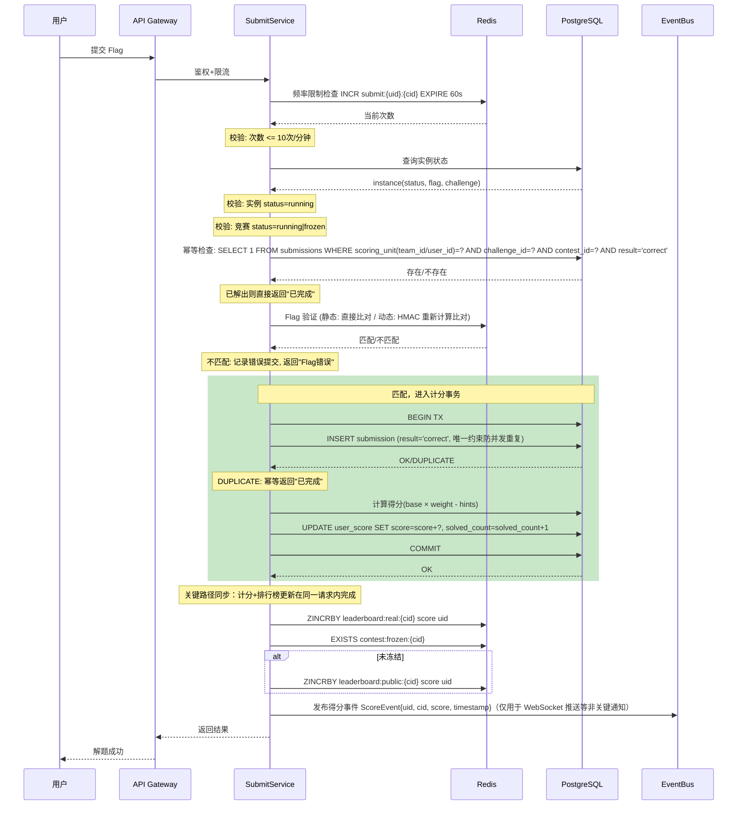
```mermaid
sequenceDiagram
    participant 用户
    participant API as API Gateway
    participant SS as SubmitService
    participant Redis
    participant PG as PostgreSQL
    participant EB as EventBus

    用户->>API: 提交 Flag
    API->>SS: 鉴权+限流

    SS->>Redis: 频率限制检查 INCR submit:{uid}:{cid} EXPIRE 60s
    Redis-->>SS: 当前次数

    Note over SS: 校验: 次数 <= 10次/分钟

    SS->>PG: 查询实例状态
    PG-->>SS: instance(status, flag, challenge)

    Note over SS: 校验: 实例 status=running
    Note over SS: 校验: 竞赛 status=running|frozen

    SS->>PG: 幂等检查: SELECT 1 FROM submissions WHERE scoring_unit(team_id/user_id)=? AND challenge_id=? AND contest_id=? AND result='correct'
    PG-->>SS: 存在/不存在

    Note over SS: 已解出则直接返回"已完成"

    SS->>Redis: Flag 验证 (静态: 直接比对 / 动态: HMAC 重新计算比对)
    Redis-->>SS: 匹配/不匹配

    Note over SS: 不匹配: 记录错误提交, 返回"Flag错误"

    rect rgb(200, 230, 200)
        Note over SS, PG: 匹配，进入计分事务
        SS->>PG: BEGIN TX
        SS->>PG: INSERT submission (result='correct', 唯一约束防并发重复)
        PG-->>SS: OK/DUPLICATE
        Note over SS: DUPLICATE: 幂等返回"已完成"
        SS->>PG: 计算得分(base × weight - hints)
        SS->>PG: UPDATE user_score SET score=score+?, solved_count=solved_count+1
        SS->>PG: COMMIT
        PG-->>SS: OK
    end

    Note over SS: 关键路径同步：计分+排行榜更新在同一请求内完成
    SS->>Redis: ZINCRBY leaderboard:real:{cid} score uid
    SS->>Redis: EXISTS contest:frozen:{cid}
    alt 未冻结
        SS->>Redis: ZINCRBY leaderboard:public:{cid} score uid
    end

    SS->>EB: 发布得分事件 ScoreEvent{uid, cid, score, timestamp}（仅用于 WebSocket 推送等非关键通知）
    SS-->>API: 返回结果
    API-->>用户: 解题成功
```

### 2.3 关键决策点

| 决策点 | 方案 | 理由 |
|--------|------|------|
| 频率限制 | Redis `INCR` + `EXPIRE`，每用户每题 10 次/分钟 | 防止暴力枚举 Flag，使用滑动窗口更精确但此场景固定窗口足够 |
| Flag 验证方式 | 静态题：`SHA-256(submitted_flag + salt)` 与数据库存储的哈希比对；动态题：用 `instance.nonce` 重新 HMAC 计算后比对 | 静态 Flag 不存明文（仅存哈希+盐），动态 Flag 不存明文（只存 nonce），防止数据库泄露后 Flag 暴露 |
| 幂等保证 | 数据库部分唯一索引：竞赛 `UNIQUE(user_id, challenge_id, contest_id) WHERE result='correct' AND contest_id IS NOT NULL`；练习 `UNIQUE(user_id, challenge_id) WHERE result='correct' AND contest_id IS NULL` | 数据库层面兜底，即使并发请求同时通过应用层检查也不会重复计分 |
| 计分公式 | `score = base_score × difficulty_weight - hint_penalty` | 简单直观，hint_penalty 从已使用的提示累加 |
| 得分更新 | 原子累加 `UPDATE ... SET score=score+?, solved_count=solved_count+1` | 无需乐观锁版本校验，PostgreSQL 行锁保证原子性；同一用户不会高频得分，行锁持有时间极短 |
| 事件发布 | 事务提交后同步更新 Redis 排行榜，再异步发布 `ScoreEvent` 用于 WebSocket 推送 | 排行榜更新是关键路径，必须同步完成；WebSocket 推送等非关键通知走异步事件总线 |

### 2.4 异常处理

| 异常场景 | 处理策略 |
|----------|----------|
| 频率超限 | 返回 429，提示"提交过于频繁，请稍后再试"，不记录提交历史 |
| 实例不存在或已停止 | 返回 400，提示"靶机实例未运行" |
| 竞赛已结束 | 返回 403，提示"竞赛已结束，无法提交" |
| Flag 格式非法（不符合 `flag{...}` 格式） | 返回 400，前端校验 + 后端兜底，不消耗频率限制次数 |
| Flag 错误 | 返回 200（result='incorrect'），记录错误提交到 submissions 表 |
| Redis 排行榜更新失败 | 记录错误日志，主流程仍返回成功（数据库已持久化）；后台补偿任务定期从数据库重建排行榜 |
| 事件发布失败 | 记录错误日志，不影响主流程返回（事件仅用于 WebSocket 推送等非关键通知） |

### 2.5 并发与一致性考虑

- **同一用户并发提交同一题**：数据库部分唯一索引保证只有一条正确记录（竞赛/练习分别约束）。第二个并发请求会触发唯一约束冲突，应用层捕获后返回"已完成"。INSERT 和 UPDATE 在同一事务内，唯一约束冲突时整个事务回滚，不会出现"INSERT 成功但 UPDATE 未执行"的中间状态。
- **不同用户同时提交**：各自独立事务，互不影响。`score=score+?` 原子累加由 PostgreSQL 行锁保证，不同用户操作不同行，无冲突。
- **计分与排行榜的强一致性**：排行榜 Redis 更新在事务提交后同步执行（同一请求内），不依赖异步事件总线。如果 Redis 更新失败，数据库得分已持久化，后台补偿任务每 5 分钟从数据库全量重建排行榜。事件总线仅用于 WebSocket 推送等非关键异步通知。
- **frozen 状态下的提交**：竞赛进入 frozen 状态后，Flag 提交仍然正常处理并记录得分，同步更新 `leaderboard:real` 但不更新 `leaderboard:public`（排行榜冻结逻辑见流程 4）。

---

## 3. 动态计分流程

### 3.1 流程描述

动态计分（Dynamic Scoring）根据解题人数动态调整题目分值：解题人数越多，分值越低。
当有新的解题记录产生时，需要**重新计算该题分值**，并**回溯更新所有已解出该题的计分单元（队伍/个人）得分**，最终同步到排行榜。

计分公式：
```
score = max(min_score, base_score × (decay_factor ^ solve_count))
```

参数说明：
- `base_score`：题目初始分值（如 1000）
- `min_score`：最低分值下限（如 100）
- `decay_factor`：衰减因子（如 0.95）
- `solve_count`：当前解题总计分单元数（含本次；组队赛按队伍，未组队按个人）

### 3.2 时序图

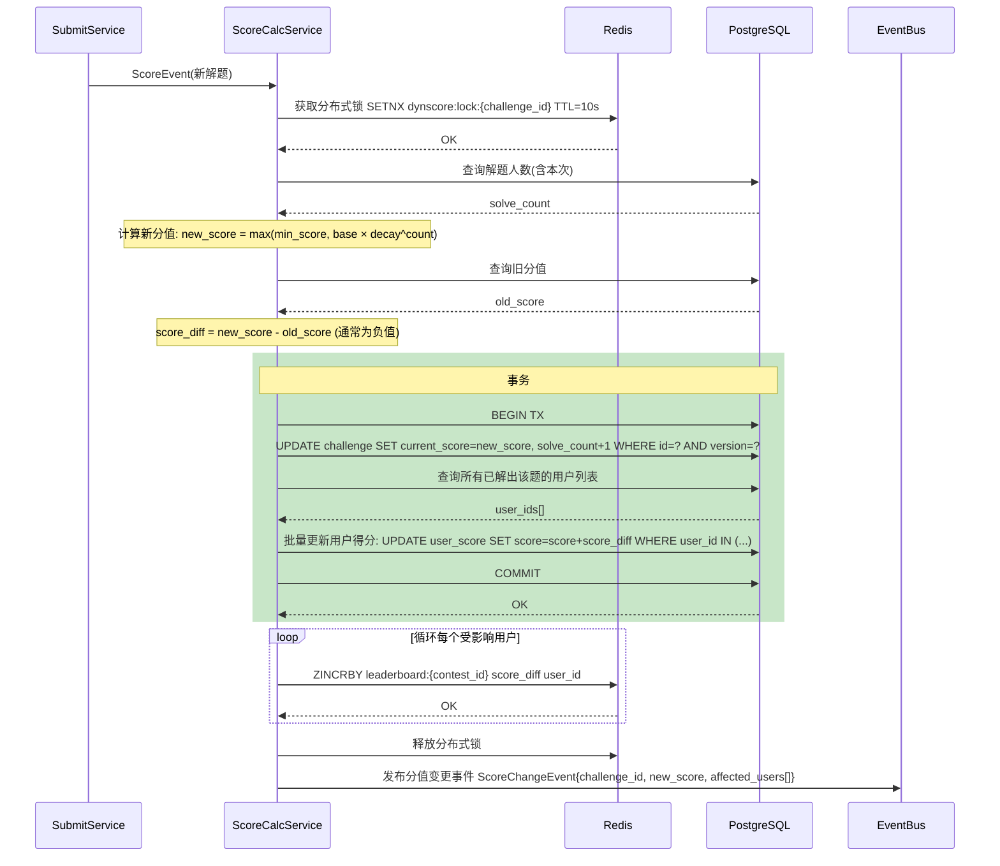
```mermaid
sequenceDiagram
    participant SS as SubmitService
    participant SC as ScoreCalcService
    participant Redis
    participant PG as PostgreSQL
    participant EB as EventBus

    SS->>SC: ScoreEvent(新解题)

    SC->>Redis: 获取分布式锁 SETNX dynscore:lock:{challenge_id} TTL=10s
    Redis-->>SC: OK

    SC->>PG: 查询解题人数(含本次)
    PG-->>SC: solve_count

    Note over SC: 计算新分值: new_score = max(min_score, base × decay^count)

    SC->>PG: 查询旧分值
    PG-->>SC: old_score

    Note over SC: score_diff = new_score - old_score (通常为负值)

    rect rgb(200, 230, 200)
        Note over SC, PG: 事务
        SC->>PG: BEGIN TX
        SC->>PG: UPDATE challenge SET current_score=new_score, solve_count+1 WHERE id=? AND version=?
        SC->>PG: 查询所有已解出该题的用户列表
        PG-->>SC: user_ids[]
        SC->>PG: 批量更新用户得分: UPDATE user_score SET score=score+score_diff WHERE user_id IN (...)
        SC->>PG: COMMIT
        PG-->>SC: OK
    end

    loop 循环每个受影响用户
        SC->>Redis: ZINCRBY leaderboard:{contest_id} score_diff user_id
        Redis-->>SC: OK
    end

    SC->>Redis: 释放分布式锁

    SC->>EB: 发布分值变更事件 ScoreChangeEvent{challenge_id, new_score, affected_users[]}
```

### 3.3 关键决策点

| 决策点 | 方案 | 理由 |
|--------|------|------|
| 并发控制 | Redis 分布式锁 `dynscore:lock:{challenge_id}`，TTL 30s + watchdog 续期（每 10s 续期一次） | 同一题目同时有多人解出时，必须串行计算分值；TTL 10s 不够（锁内含数据库事务+Redis 批量更新），改为 30s + watchdog 自动续期防超时 |
| 分值更新粒度 | 计算 `score_diff` 增量，批量 `score + diff` | 避免全量重算所有用户总分，只调整差值，性能更优 |
| 排行榜同步 | 循环 `ZINCRBY` 更新每个受影响用户 | ZINCRBY 是原子操作，单个用户的排行榜更新不需要额外加锁 |
| 乐观锁 | challenge 表 `version` 字段 | 防止并发更新 solve_count 导致计算错误 |
| 批量更新策略 | 校园级场景（解题人数通常 < 500）单事务批量 UPDATE；超过 500 人时分批，每批 200，使用断点续传机制 | 保证分值变更的原子性；分批时记录已完成批次，失败后从断点恢复而非全量重试 |

### 3.4 异常处理

| 异常场景 | 处理策略 |
|----------|----------|
| 分布式锁获取失败 | 重试 3 次，间隔 100ms；仍失败则将事件放入延迟队列，5s 后重新消费 |
| 乐观锁冲突（version 不匹配） | 重新读取最新 solve_count 和 version，重新计算后重试 |
| 批量更新部分失败 | 单事务场景：事务回滚，整体重试。分批场景：记录已完成批次到 Redis（`dynscore:progress:{challenge_id}`），失败后从断点恢复 |
| Redis 排行榜更新失败 | 记录错误日志，标记该题需要补偿；后台任务定期从数据库重建排行榜 |
| 受影响用户数过多（>500） | 分批更新，每批 200 个用户，每批一个事务；记录断点进度，支持失败后续传 |

### 3.5 并发与一致性考虑

- **同一题目并发解题**：Redis 分布式锁保证同一时刻只有一个计分任务在执行。后到的事件等待锁释放后重新获取最新 solve_count 计算。
- **数据库与 Redis 一致性**：数据库是权威数据源，Redis 排行榜是衍生视图。如果 Redis 更新失败，后台补偿任务会从数据库重建。
- **分值回溯的公平性**：所有已解出该题的用户统一调整分值，不存在"先解题得高分、后解题得低分但先解题的人分值不变"的不公平情况。

---

## 4. 排行榜实时更新流程

### 4.1 流程描述

排行榜是竞赛的核心展示组件，需要支持**实时更新**和**高频查询**。
采用 Redis Sorted Set 作为排行榜存储，数据库作为权威数据源，通过事件驱动保持两者同步。
竞赛末期支持**榜单冻结**（frozen），冻结后前端展示停止更新，但后端继续记录真实得分，赛后揭榜。

### 4.2 数据结构设计

```
Redis Key 设计：

# 公开排行榜（前端可见，frozen 后停止写入）
leaderboard:public:{contest_id}    -> Sorted Set (score -> user_id/team_id)

# 真实排行榜（始终更新，frozen 期间也写入）
leaderboard:real:{contest_id}      -> Sorted Set (score -> user_id/team_id)

# 冻结标记
contest:frozen:{contest_id}        -> "1" (存在即冻结)

# 用户解题详情缓存
user:solves:{contest_id}:{user_id} -> Hash (challenge_id -> score)
```

### 4.3 时序图 — 得分更新

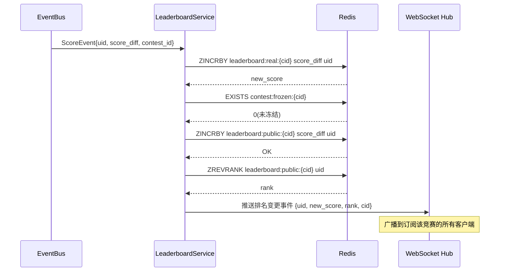
```mermaid
sequenceDiagram
    participant EB as EventBus
    participant LS as LeaderboardService
    participant Redis
    participant WS as WebSocket Hub

    EB->>LS: ScoreEvent{uid, score_diff, contest_id}

    LS->>Redis: ZINCRBY leaderboard:real:{cid} score_diff uid
    Redis-->>LS: new_score

    LS->>Redis: EXISTS contest:frozen:{cid}
    Redis-->>LS: 0(未冻结)

    LS->>Redis: ZINCRBY leaderboard:public:{cid} score_diff uid
    Redis-->>LS: OK

    LS->>Redis: ZREVRANK leaderboard:public:{cid} uid
    Redis-->>LS: rank

    LS->>WS: 推送排名变更事件 {uid, new_score, rank, cid}
    Note over WS: 广播到订阅该竞赛的所有客户端
```

### 4.4 时序图 — 排行榜查询（分页）

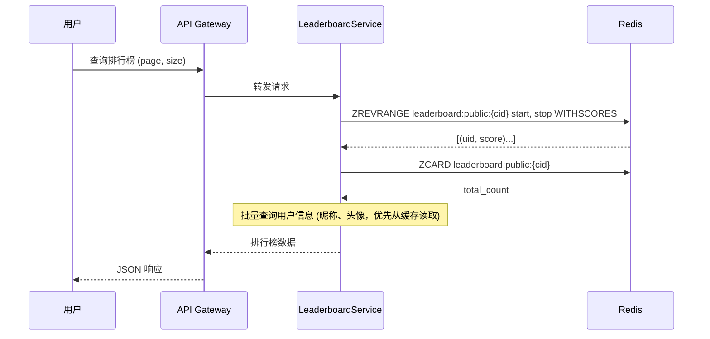
```mermaid
sequenceDiagram
    participant 用户
    participant API as API Gateway
    participant LS as LeaderboardService
    participant Redis

    用户->>API: 查询排行榜 (page, size)
    API->>LS: 转发请求

    LS->>Redis: ZREVRANGE leaderboard:public:{cid} start, stop WITHSCORES
    Redis-->>LS: [(uid, score)...]

    LS->>Redis: ZCARD leaderboard:public:{cid}
    Redis-->>LS: total_count

    Note over LS: 批量查询用户信息 (昵称、头像，优先从缓存读取)

    LS-->>API: 排行榜数据
    API-->>用户: JSON 响应
```

### 4.5 榜单冻结与揭榜流程

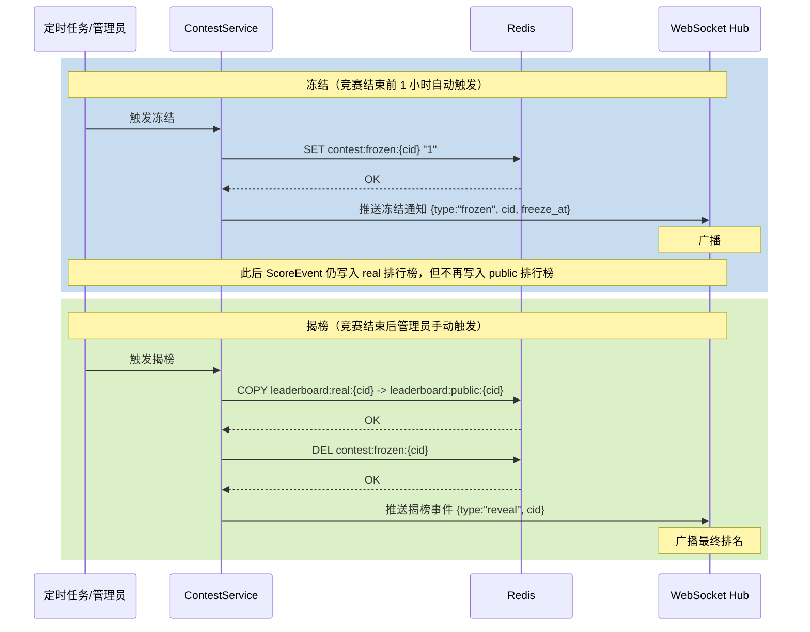
```mermaid
sequenceDiagram
    participant 触发者 as 定时任务/管理员
    participant CS as ContestService
    participant Redis
    participant WS as WebSocket Hub

    rect rgb(200, 220, 240)
        Note over 触发者, WS: 冻结（竞赛结束前 1 小时自动触发）
        触发者->>CS: 触发冻结
        CS->>Redis: SET contest:frozen:{cid} "1"
        Redis-->>CS: OK
        CS->>WS: 推送冻结通知 {type:"frozen", cid, freeze_at}
        Note over WS: 广播
        Note over 触发者, WS: 此后 ScoreEvent 仍写入 real 排行榜，但不再写入 public 排行榜
    end

    rect rgb(220, 240, 200)
        Note over 触发者, WS: 揭榜（竞赛结束后管理员手动触发）
        触发者->>CS: 触发揭榜
        CS->>Redis: COPY leaderboard:real:{cid} -> leaderboard:public:{cid}
        Redis-->>CS: OK
        CS->>Redis: DEL contest:frozen:{cid}
        Redis-->>CS: OK
        CS->>WS: 推送揭榜事件 {type:"reveal", cid}
        Note over WS: 广播最终排名
    end
```

### 4.6 关键决策点

| 决策点 | 方案 | 理由 |
|--------|------|------|
| 存储结构 | Redis Sorted Set，score 为复合编码值（`total_score * 1e10 + (MAX_TS - last_solve_ts)`），member 为 user_id | O(logN) 插入/更新，O(logN+M) 范围查询；复合编码解决同分排序问题（同分时最后提交更早的排名靠前） |
| 双排行榜 | public（前端可见）+ real（始终更新） | 冻结期间前端看到的是冻结时刻的快照，后端继续记录真实得分 |
| 得分更新 | ZINCRBY 增量更新 | 原子操作，无需读-改-写，天然并发安全 |
| 分页查询 | ZREVRANGE + ZCARD | 降序排列，支持 offset/limit 分页 |
| WebSocket 推送 | 只推送变更事件（delta），不推送全量排行榜 | 减少带宽消耗，前端增量更新 DOM |
| 揭榜实现 | COPY real -> public（Redis 6.2+ COPY 命令） | 原子替换，避免逐条同步的中间状态 |

### 4.7 异常处理

| 异常场景 | 处理策略 |
|----------|----------|
| Redis 不可用 | 降级为数据库查询排行榜（`ORDER BY score DESC LIMIT`），性能下降但功能可用 |
| WebSocket 推送失败 | 客户端定时轮询兜底（每 10s 拉取一次排行榜） |
| public 与 real 排行榜不一致 | 后台补偿任务每 5 分钟对比两个 Sorted Set，非冻结期间自动修复 |
| 排行榜数据丢失（Redis 重启） | 从数据库 `user_score` 表全量重建，启动时自动检测并恢复 |

### 4.8 并发与一致性考虑

- **ZINCRBY 原子性**：Redis 单线程模型保证 ZINCRBY 的原子性，多个 ScoreEvent 并发更新同一用户得分不会丢失。
- **冻结判断的竞态**：冻结标记写入和得分更新之间可能存在短暂竞态（冻结瞬间有得分写入 public）。可接受，因为冻结时间点本身就有 ±1s 的容差。如需严格一致，可用 Redis Lua 脚本将"检查冻结标记 + ZINCRBY"合并为原子操作。
- **排行榜与数据库的最终一致性**：Redis 排行榜是数据库的衍生视图，数据库是权威源。任何不一致都可通过重建修复。

---

## 5. 容器生命周期回收流程

### 5.1 流程描述

容器回收是平台资源管理的核心环节，需要处理三种场景：
1. **定时过期回收**：实例到达 `expires_at` 后自动清理
2. **容器崩溃检测**：Docker 事件监听，容器异常退出后通知用户
3. **孤儿资源清理**：数据库记录与 Docker 实际状态不一致时的全量对账

三种机制互为补充，确保不会出现资源泄漏。

### 5.2 时序图 — 定时过期回收

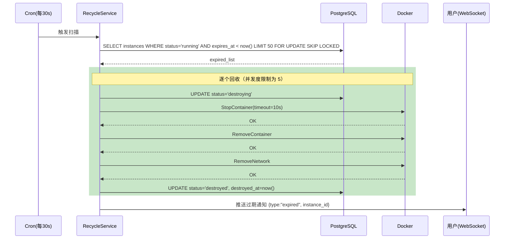
```mermaid
sequenceDiagram
    participant Cron as Cron(每30s)
    participant RS as RecycleService
    participant PG as PostgreSQL
    participant Docker
    participant WS as 用户(WebSocket)

    Cron->>RS: 触发扫描

    RS->>PG: SELECT instances WHERE status='running' AND expires_at < now() LIMIT 50 FOR UPDATE SKIP LOCKED
    PG-->>RS: expired_list

    rect rgb(200, 230, 200)
        Note over RS, Docker: 逐个回收（并发度限制为 5）
        RS->>PG: UPDATE status='destroying'
        RS->>Docker: StopContainer(timeout=10s)
        Docker-->>RS: OK
        RS->>Docker: RemoveContainer
        Docker-->>RS: OK
        RS->>Docker: RemoveNetwork
        Docker-->>RS: OK
        RS->>PG: UPDATE status='destroyed', destroyed_at=now()
    end

    RS->>WS: 推送过期通知 {type:"expired", instance_id}
```

### 5.3 时序图 — 容器崩溃检测

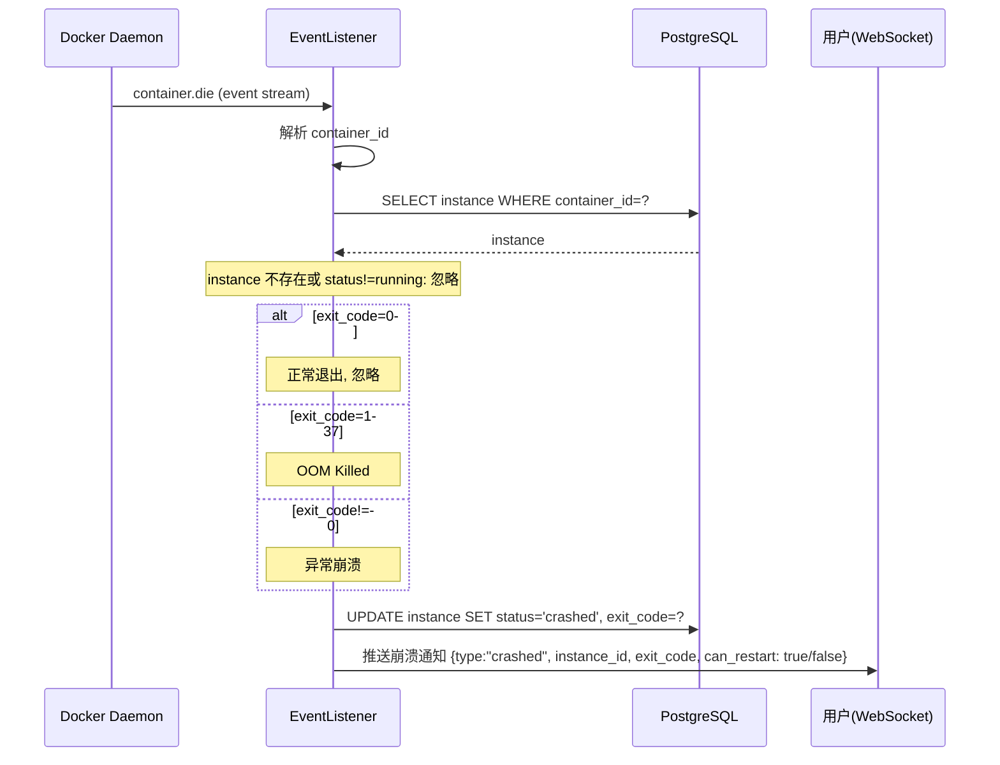
```mermaid
sequenceDiagram
    participant DD as Docker Daemon
    participant EL as EventListener
    participant PG as PostgreSQL
    participant WS as 用户(WebSocket)

    DD->>EL: container.die (event stream)

    EL->>EL: 解析 container_id

    EL->>PG: SELECT instance WHERE container_id=?
    PG-->>EL: instance

    Note over EL: instance 不存在或 status!=running: 忽略

    alt exit_code=0
        Note over EL: 正常退出, 忽略
    else exit_code=137
        Note over EL: OOM Killed
    else exit_code!=0
        Note over EL: 异常崩溃
    end

    EL->>PG: UPDATE instance SET status='crashed', exit_code=?

    EL->>WS: 推送崩溃通知 {type:"crashed", instance_id, exit_code, can_restart: true/false}
```

### 5.4 时序图 — 孤儿资源清理（全量对账）

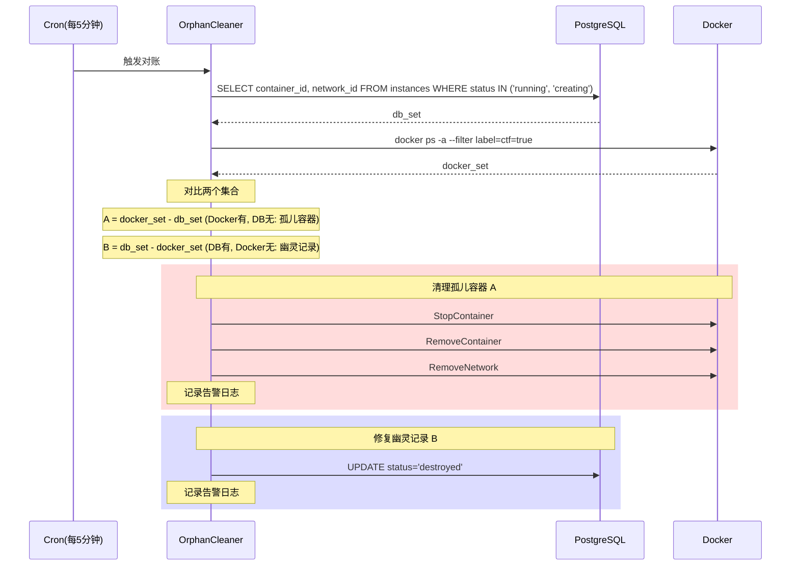
```mermaid
sequenceDiagram
    participant Cron as Cron(每5分钟)
    participant OC as OrphanCleaner
    participant PG as PostgreSQL
    participant Docker

    Cron->>OC: 触发对账

    OC->>PG: SELECT container_id, network_id FROM instances WHERE status IN ('running', 'creating')
    PG-->>OC: db_set

    OC->>Docker: docker ps -a --filter label=ctf=true
    Docker-->>OC: docker_set

    Note over OC: 对比两个集合
    Note over OC: A = docker_set - db_set (Docker有, DB无: 孤儿容器)
    Note over OC: B = db_set - docker_set (DB有, Docker无: 幽灵记录)

    rect rgb(255, 220, 220)
        Note over OC, Docker: 清理孤儿容器 A
        OC->>Docker: StopContainer
        OC->>Docker: RemoveContainer
        OC->>Docker: RemoveNetwork
        Note over OC: 记录告警日志
    end

    rect rgb(220, 220, 255)
        Note over OC, PG: 修复幽灵记录 B
        OC->>PG: UPDATE status='destroyed'
        Note over OC: 记录告警日志
    end
```

### 5.5 关键决策点

| 决策点 | 方案 | 理由 |
|--------|------|------|
| 扫描频率 | 过期回收 30s，孤儿对账 5 分钟 | 过期回收需要及时释放资源；孤儿对账是兜底机制，频率可低 |
| 批量回收并发度 | 限制为 5 个并发 goroutine | 避免瞬间大量 Docker API 调用导致 daemon 压力过大 |
| 行锁策略 | `SELECT ... FOR UPDATE SKIP LOCKED` | 多个回收 worker 不会争抢同一条记录，避免死锁 |
| 容器停止超时 | 10s graceful shutdown，超时后 SIGKILL | 给容器内进程合理的清理时间 |
| 崩溃重启策略 | 用户手动触发重启，不自动重启 | 自动重启可能导致恶意容器反复消耗资源 |
| 孤儿容器识别 | Docker label `ctf=true` 过滤 | 只清理平台创建的容器，不误删其他容器 |

### 5.6 异常处理

| 异常场景 | 处理策略 |
|----------|----------|
| Docker API 不可用 | 记录错误日志，跳过本轮回收，下轮重试 |
| 容器停止超时（SIGKILL 也失败） | 标记为 `destroy_failed`，告警通知运维人工处理 |
| Network 删除失败（仍有容器挂载） | 先强制删除残留容器，再删除 Network |
| 数据库更新失败 | 容器已删除但状态未更新：下轮孤儿对账会修复幽灵记录 |
| 事件监听断开 | 自动重连，重连后从断点继续消费；重连期间的崩溃事件由定时扫描兜底 |

### 5.7 并发与一致性考虑

- **多 worker 并发回收**：`SKIP LOCKED` 保证不同 worker 处理不同实例，无锁竞争。
- **回收与用户操作的竞态**：用户可能在回收过程中请求续期。通过数据库状态机保证：只有 `status=running` 的实例才能续期，回收时先将状态改为 `destroying`，续期请求会因状态不匹配而失败。
- **孤儿清理的安全性**：只清理带有 `ctf=true` label 的容器，且清理前再次确认数据库中确实没有对应记录。

---

## 6. 竞赛状态流转

### 6.1 流程描述

竞赛生命周期通过有限状态机管理，状态流转由**定时任务自动驱动**和**管理员手动操作**两种方式触发。
每个状态下有明确的行为约束，确保业务逻辑在正确的时间窗口内执行。

### 6.2 状态机定义

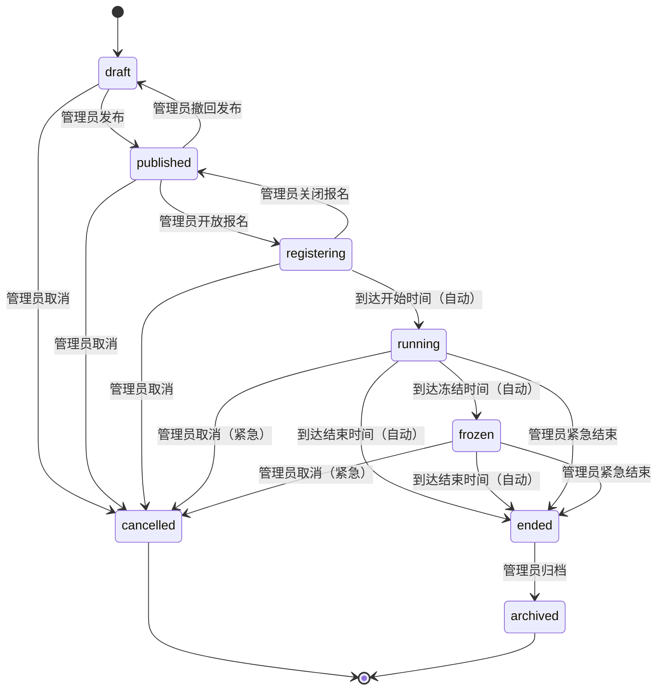
```mermaid
stateDiagram-v2
    [*] --> draft
    draft --> published : 管理员发布
    published --> registering : 管理员开放报名
    registering --> running : 到达开始时间（自动）
    running --> frozen : 到达冻结时间（自动）
    running --> ended : 到达结束时间（自动）
    frozen --> ended : 到达结束时间（自动）
    ended --> archived : 管理员归档

    %% 管理员紧急操作（逆向/终止转换）
    published --> draft : 管理员撤回发布
    registering --> published : 管理员关闭报名
    running --> ended : 管理员紧急结束
    frozen --> ended : 管理员紧急结束

    %% 取消终态（任何非终态均可取消）
    draft --> cancelled : 管理员取消
    published --> cancelled : 管理员取消
    registering --> cancelled : 管理员取消
    running --> cancelled : 管理员取消（紧急）
    frozen --> cancelled : 管理员取消（紧急）

    cancelled --> [*]
    archived --> [*]
```

### 6.3 状态转换规则

| 当前状态 | 目标状态 | 触发方式 | 触发条件 |
|----------|----------|----------|----------|
| draft | published | 管理员手动 | 题目数 >= 1，时间配置完整 |
| published | registering | 管理员手动 | 开放报名 |
| registering | running | 定时任务 | `now() >= start_time` |
| running | frozen | 定时任务 | `now() >= freeze_time`（可选，未配置则跳过） |
| running | ended | 定时任务 | `now() >= end_time` |
| frozen | ended | 定时任务 | `now() >= end_time` |
| ended | archived | 管理员手动 | 成绩已确认，资源已回收 |

### 6.4 各状态行为约束

| 状态 | 允许的操作 | 禁止的操作 |
|------|-----------|-----------|
| draft | 编辑竞赛信息、添加/删除题目、配置时间 | 报名、启动靶机、提交 Flag |
| published | 查看竞赛信息 | 报名（未开放）、启动靶机、提交 Flag |
| registering | 报名/退出报名、查看竞赛信息 | 启动靶机、提交 Flag |
| running | 启动靶机、提交 Flag、查看排行榜、使用提示 | 编辑题目、报名 |
| frozen | 启动靶机、提交 Flag（得分不更新公开榜） | 编辑题目、报名 |
| ended | 查看最终排行榜、查看解题记录 | 启动靶机、提交 Flag、报名 |
| archived | 查看历史记录 | 所有写操作 |

### 6.5 定时任务驱动状态流转

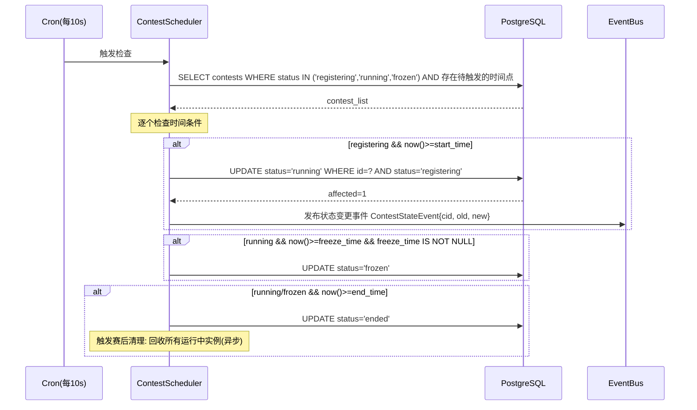
```mermaid
sequenceDiagram
    participant Cron as Cron(每10s)
    participant CS as ContestScheduler
    participant PG as PostgreSQL
    participant EB as EventBus

    Cron->>CS: 触发检查

    CS->>PG: SELECT contests WHERE status IN ('registering','running','frozen') AND 存在待触发的时间点
    PG-->>CS: contest_list

    Note over CS: 逐个检查时间条件

    alt registering && now()>=start_time
        CS->>PG: UPDATE status='running' WHERE id=? AND status='registering'
        PG-->>CS: affected=1
        CS->>EB: 发布状态变更事件 ContestStateEvent{cid, old, new}
    end

    alt running && now()>=freeze_time && freeze_time IS NOT NULL
        CS->>PG: UPDATE status='frozen'
    end

    alt running/frozen && now()>=end_time
        CS->>PG: UPDATE status='ended'
        Note over CS: 触发赛后清理: 回收所有运行中实例(异步)
    end
```

### 6.6 关键决策点

| 决策点 | 方案 | 理由 |
|--------|------|------|
| 状态流转原子性 | `UPDATE ... WHERE status=?` 条件更新 | CAS 语义，防止并发重复流转 |
| 扫描频率 | 每 10s 一次 | 状态流转对时间精度要求不高，10s 延迟可接受 |
| 行为约束实现 | 中间件/拦截器统一校验竞赛状态 | 避免每个接口重复校验，集中管理 |
| 赛后资源清理 | 异步批量回收，不阻塞状态流转 | ended 状态写入后立即生效，容器回收可延迟 |

### 6.7 异常处理

| 异常场景 | 处理策略 |
|----------|----------|
| 定时任务宕机 | 重启后自动补偿：扫描所有"应该已流转但未流转"的竞赛 |
| 状态流转失败（数据库异常） | 记录错误日志，下轮重试；不会跳过状态 |
| 管理员误操作（如提前结束） | 提供"回退到上一状态"功能，仅限 admin 角色 |

### 6.8 并发与一致性考虑

- **多实例部署下的重复流转**：`UPDATE ... WHERE status='registering'` 的 CAS 语义保证只有一个实例成功更新，`affected_rows=0` 的实例自动跳过。
- **状态校验与业务操作的竞态**：业务接口先读取竞赛状态，再执行操作。如果在读取后、操作前状态发生变化，通过数据库约束兜底（如 Flag 提交时再次校验竞赛状态）。

---

## 7. AWD 轮次执行流程

### 7.1 流程描述

AWD（Attack With Defense）模式下，竞赛按固定时间间隔（如每 5 分钟）划分为多个轮次。
每轮需要完成：Flag 轮换注入、服务存活检测、攻击得分收集、防守得分计算、排行榜更新。
整个轮次执行是一个**严格有序的编排流程**，各步骤之间有依赖关系。

当前代码落地边界（2026-03-10）：

- 已实现后台 `AWDRoundUpdater`，按 `contest.start_time/end_time` 与全局配置 `contest.awd.scheduler_interval`、`contest.awd.round_interval` 自动补齐历史轮次并推进当前轮次。
- 已实现 Redis 幂等锁 `ctf:awd:round:lock:{contest_id}:{round_number}`，避免多实例重复推进同一轮。
- 已实现当前轮 Flag 生成与 Redis 存储：按 `team_id + challenge_id + round_number` 生成动态 Flag，写入 `ctf:awd:{contest_id}:round:{round_id}:flags`，字段为 `team_id:challenge_id`。
- 已实现 `AWDFlagInjector` 对运行中容器的文件注入：当前按“队伍成员的运行中实例 + challenge_id”定位目标容器，并将 Flag 写入 `/flag/flag.txt`。
- 已实现最小版 Checker：对当前轮每个 `team_id + challenge_id`，按“队伍成员的运行中实例 + challenge_id”做健康探测，优先 `HTTP GET {access_url}{contest.awd.checker_health_path}`，失败后回退 `TCP dial`，结果自动写入 `awd_team_services` 与 Redis `ctf:awd:{contest_id}:service_status`。
- 已实现学员接口按“当前轮 + victim_team_id + challenge_id”校验攻击 Flag，并在 `contest.awd.previous_round_grace` 宽限期内兼容上一轮 Flag，复用攻击日志去重计分。
- 当前仍未实现独立团队实例模型；Checker 与 Flag 注入都暂按“队伍成员运行中实例”口径工作。更细粒度的团队实例、分段网络与专用 Checker 仍属于二期能力。

### 7.2 时序图

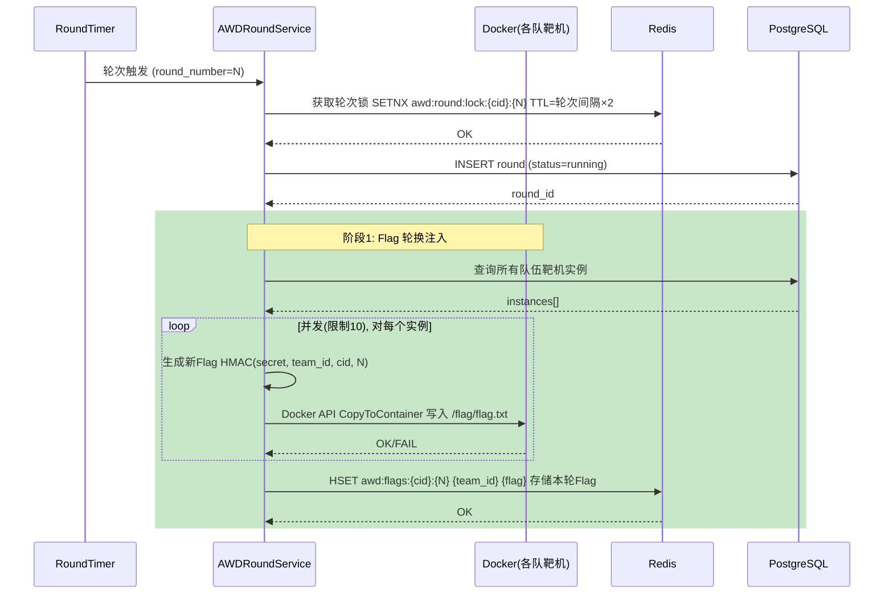
```mermaid
sequenceDiagram
    participant RT as RoundTimer
    participant AWD as AWDRoundService
    participant Docker as Docker(各队靶机)
    participant Redis
    participant PG as PostgreSQL

    RT->>AWD: 轮次触发 (round_number=N)

    AWD->>Redis: 获取轮次锁 SETNX awd:round:lock:{cid}:{N} TTL=轮次间隔×2
    Redis-->>AWD: OK

    AWD->>PG: INSERT round (status=running)
    PG-->>AWD: round_id

    rect rgb(200, 230, 200)
        Note over AWD, Docker: 阶段1: Flag 轮换注入
        AWD->>PG: 查询所有队伍靶机实例
        PG-->>AWD: instances[]

        loop 并发(限制10), 对每个实例
            AWD->>AWD: 生成新Flag HMAC(secret, team_id, cid, N)
            AWD->>Docker: Docker API CopyToContainer 写入 /flag/flag.txt
            Docker-->>AWD: OK/FAIL
        end

        AWD->>Redis: HSET awd:flags:{cid}:{N} {team_id} {flag} 存储本轮Flag
        Redis-->>AWD: OK
    end
```

接续时序图：

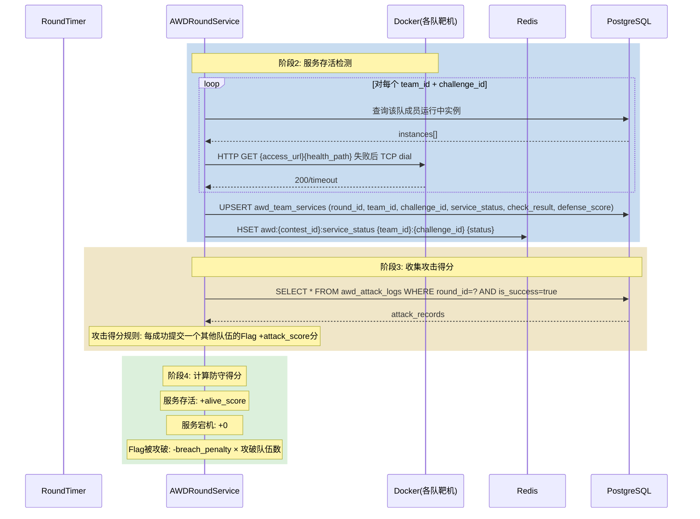
```mermaid
sequenceDiagram
    participant RT as RoundTimer
    participant AWD as AWDRoundService
    participant Docker as Docker(各队靶机)
    participant Redis
    participant PG as PostgreSQL

    rect rgb(200, 220, 240)
        Note over AWD, Docker: 阶段2: 服务存活检测
        loop 对每个 team_id + challenge_id
            AWD->>PG: 查询该队成员运行中实例
            PG-->>AWD: instances[]
            AWD->>Docker: HTTP GET {access_url}{health_path} 失败后 TCP dial
            Docker-->>AWD: 200/timeout
        end
        AWD->>PG: UPSERT awd_team_services (round_id, team_id, challenge_id, service_status, check_result, defense_score)
        AWD->>Redis: HSET awd:{contest_id}:service_status {team_id}:{challenge_id} {status}
    end

    rect rgb(240, 230, 200)
        Note over AWD, PG: 阶段3: 收集攻击得分
        AWD->>PG: SELECT * FROM awd_attack_logs WHERE round_id=? AND is_success=true
        PG-->>AWD: attack_records
        Note over AWD: 攻击得分规则: 每成功提交一个其他队伍的Flag +attack_score分
    end

    rect rgb(220, 240, 220)
        Note over AWD: 阶段4: 计算防守得分
        Note over AWD: 服务存活: +alive_score
        Note over AWD: 服务宕机: +0
        Note over AWD: Flag被攻破: -breach_penalty × 攻破队伍数
    end
```

接续时序图（阶段5: 汇总与更新排行榜）：

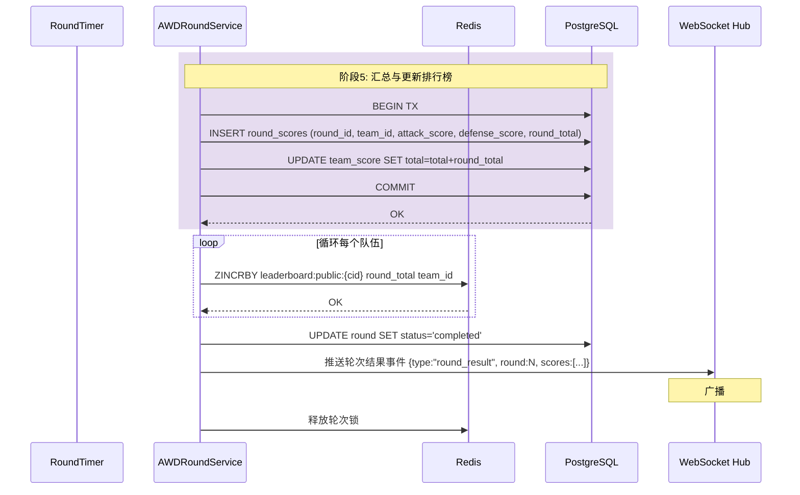
```mermaid
sequenceDiagram
    participant RT as RoundTimer
    participant AWD as AWDRoundService
    participant Redis
    participant PG as PostgreSQL
    participant WS as WebSocket Hub

    rect rgb(230, 220, 240)
        Note over AWD, PG: 阶段5: 汇总与更新排行榜
        AWD->>PG: BEGIN TX
        AWD->>PG: INSERT round_scores (round_id, team_id, attack_score, defense_score, round_total)
        AWD->>PG: UPDATE team_score SET total=total+round_total
        AWD->>PG: COMMIT
        PG-->>AWD: OK
    end

    loop 循环每个队伍
        AWD->>Redis: ZINCRBY leaderboard:public:{cid} round_total team_id
        Redis-->>AWD: OK
    end

    AWD->>PG: UPDATE round SET status='completed'

    AWD->>WS: 推送轮次结果事件 {type:"round_result", round:N, scores:[...]}
    Note over WS: 广播

    AWD->>Redis: 释放轮次锁
```

### 7.3 关键决策点

| 决策点 | 方案 | 理由 |
|--------|------|------|
| 轮次幂等 | Redis SETNX `awd:round:lock:{cid}:{N}`，TTL = 轮次间隔 × 2 | 防止定时器抖动导致同一轮次重复执行 |
| Flag 注入方式 | Docker API `CopyToContainer` 写入 `/flag/flag.txt` | 避免 `sh -c` 命令拼接注入风险；无需重启容器，实时生效；权限由容器内 entrypoint 控制 |
| Flag 存储 | Redis Hash `awd:flags:{cid}:{round}` | 验证时 O(1) 查找，轮次结束后可批量清理 |
| 服务存活检测 | 优先 HTTP GET `/health`，降级为 TCP dial | HTTP 能检测应用层健康，TCP 只能检测端口存活 |
| 检测超时 | 5s | 过短会误判网络抖动，过长会拖慢轮次执行 |
| 并发度控制 | Flag 注入和存活检测均限制 10 并发 goroutine | 避免瞬间大量 Docker exec 和网络请求 |

### 7.4 异常处理

| 异常场景 | 处理策略 |
|----------|----------|
| Flag 注入失败（CopyToContainer 超时） | 标记该队本轮 Flag 注入失败，跳过该队的攻击得分收集；记录告警 |
| 服务存活检测超时 | 标记为宕机（is_alive=false），计 0 分防守分 |
| 轮次执行超时（超过轮次间隔的 80%） | 强制终止当前轮次，标记为 `timeout`，已完成的步骤结果保留 |
| 数据库事务失败 | 回滚本轮所有得分变更，标记轮次为 `failed`，管理员可手动重跑 |
| Redis 排行榜更新失败 | 数据库已提交的得分不回滚，标记需要补偿，后台任务从数据库重建排行榜 |

### 7.5 并发与一致性考虑

- **轮次幂等执行**：Redis SETNX 锁以 `{contest_id}:{round_number}` 为粒度，保证同一轮次全局只执行一次。TTL 设为轮次间隔的 2 倍，兜底防死锁。
- **Flag 注入与提交的竞态**：新轮次 Flag 注入期间存在时间窗口，部分队伍已注入新 Flag、部分尚未注入。解决方案：先将新轮次 Flag 写入 Redis Hash（`awd:flags:{cid}:{N}`），再逐个注入容器；Flag 验证时同时检查当前轮次和上一轮次的 Flag（`round=N` 和 `round=N-1`），在注入全部完成后（标记 `awd:round:{cid}:{N}:injected=true`）才停止接受上一轮 Flag。这样即使注入过程中有提交，也不会因为新旧 Flag 混合而误判。
- **多实例部署**：轮次定时器在所有实例上运行，但 Redis 锁保证只有一个实例执行。其他实例获取锁失败后直接跳过。
- **轮次间隔与执行时间**：轮次执行时间必须小于轮次间隔的 80%，否则触发超时保护。建议轮次间隔 >= 3 分钟，给执行留足余量。

---

## 8. 作弊检测流程

### 8.1 流程描述

作弊检测主要针对**动态 Flag 共享**场景：不同队伍在短时间窗口内提交了相同的动态 Flag，
说明 Flag 可能通过非正常渠道传播。系统自动标记可疑记录并通知管理员，**不自动判罚**，
由管理员人工审核后决定处理方式。

### 8.2 检测触发点

作弊检测嵌入在 Flag 提交流程中，每次正确提交后同步执行检测逻辑。

### 8.3 时序图

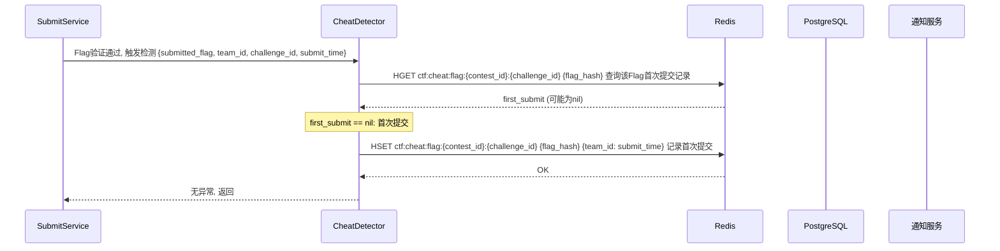
```mermaid
sequenceDiagram
    participant SS as SubmitService
    participant CD as CheatDetector
    participant Redis
    participant PG as PostgreSQL
    participant 通知服务

    SS->>CD: Flag验证通过, 触发检测 {submitted_flag, team_id, challenge_id, submit_time}

    CD->>Redis: HGET ctf:cheat:flag:{contest_id}:{challenge_id} {flag_hash} 查询该Flag首次提交记录
    Redis-->>CD: first_submit (可能为nil)

    Note over CD: first_submit == nil: 首次提交

    CD->>Redis: HSET ctf:cheat:flag:{contest_id}:{challenge_id} {flag_hash} {team_id: submit_time} 记录首次提交
    Redis-->>CD: OK

    CD-->>SS: 无异常, 返回
```

当同一 Flag 被不同队伍提交时，触发可疑检测：

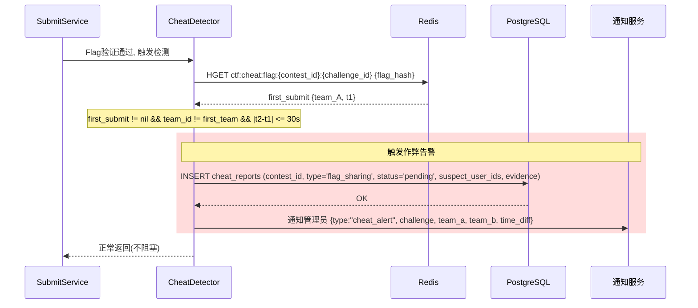
```mermaid
sequenceDiagram
    participant SS as SubmitService
    participant CD as CheatDetector
    participant Redis
    participant PG as PostgreSQL
    participant 通知服务

    SS->>CD: Flag验证通过, 触发检测

    CD->>Redis: HGET ctf:cheat:flag:{contest_id}:{challenge_id} {flag_hash}
    Redis-->>CD: first_submit {team_A, t1}

    Note over CD: first_submit != nil && team_id != first_team && |t2-t1| <= 30s

    rect rgb(255, 220, 220)
        Note over CD, 通知服务: 触发作弊告警
        CD->>PG: INSERT cheat_reports (contest_id, type='flag_sharing', status='pending', suspect_user_ids, evidence)
        PG-->>CD: OK
        CD->>通知服务: 通知管理员 {type:"cheat_alert", challenge, team_a, team_b, time_diff}
    end

    CD-->>SS: 正常返回(不阻塞)
```

### 8.4 关键决策点

| 决策点 | 方案 | 理由 |
|--------|------|------|
| 时间窗口 | 30s | 动态 Flag 每个用户唯一，30s 内不同队伍提交相同 Flag 极大概率是共享行为 |
| Flag 索引 | Redis Hash，key=`ctf:cheat:flag:{contest_id}:{challenge_id}`，field=`SHA256(submitted_flag)` | 用 hash 而非明文存储，防止 Redis 泄露后暴露 Flag |
| 检测时机 | Flag 验证通过后同步执行 | 实时检测，不遗漏；检测逻辑轻量（1 次 Redis 读 + 条件判断），不影响主流程性能 |
| 判罚策略 | 不自动判罚，仅标记 + 通知管理员 | 避免误判（如同一队伍多设备登录），人工审核更可靠 |
| 告警通道 | WebSocket 推送到管理员面板 + 站内消息 | 实时感知，管理员可在竞赛进行中处理 |

### 8.5 异常处理

| 异常场景 | 处理策略 |
|----------|----------|
| Redis 查询失败 | 跳过本次检测，不阻塞 Flag 提交主流程；记录错误日志 |
| 数据库写入 cheat_reports 失败 | 记录错误日志，不影响主流程；后台补偿任务定期扫描 Redis 中的可疑记录 |
| 通知发送失败 | 记录到数据库即可，管理员可在面板中查看未处理的告警 |
| 时间窗口边界误判 | 管理员审核时可查看完整提交日志、IP 地址、提交间隔等辅助信息 |

### 8.6 并发与一致性考虑

- **并发提交同一 Flag**：两个队伍几乎同时提交同一 Flag 时，Redis HGET/HSET 不是原子的，可能两个都读到 nil。解决方案：使用 `HSETNX`（仅当 field 不存在时设置），只有第一个成功的才是"首次提交"，第二个 HSETNX 返回 0 后再 HGET 获取首次提交信息进行比对。
- **检测不阻塞主流程**：作弊检测的数据库写入和通知发送可以异步执行（goroutine），只有 Redis 查询是同步的（< 1ms）。
- **数据清理**：竞赛结束后，`ctf:cheat:flag:{contest_id}:*` 相关的 Redis key 由竞赛清理任务统一删除。

---

## 9. 竞赛高峰排队机制

### 9.1 流程描述

竞赛开始瞬间，大量用户同时请求启动靶机实例，可能导致 Docker daemon 过载。
排队机制将突发请求缓冲到 Redis List 中，由后台消费者按顺序处理容器创建，
实现**削峰填谷**。前端通过轮询获取排队位置，超时自动取消。

### 9.2 数据结构设计

```
Redis Key 设计：

# 排队队列（FIFO）
ctf:queue:instance:{contest_id}     -> List (元素为 JSON: {request_id, user_id, challenge_id, enqueue_at})

# 排队状态（每个请求的处理状态）
ctf:queue:status:{request_id}       -> Hash {
                                         status: "queued" | "processing" | "completed" | "failed" | "cancelled",
                                         position: 当前排队位置（仅 queued 状态有效）,
                                         instance_id: 实例ID（仅 completed 状态有效）,
                                         error: 错误信息（仅 failed 状态有效）,
                                         enqueue_at: 入队时间戳
                                       }
                                       TTL = 10 分钟

# 用户排队标记（防重复入队）
ctf:queue:user:{cid}:{uid}          -> String (value=request_id, TTL=10分钟)

# 队列长度监控
ctf:queue:metrics:{contest_id}      -> Hash {length, avg_wait_ms, processing_count}
```

### 9.3 时序图 — 请求入队

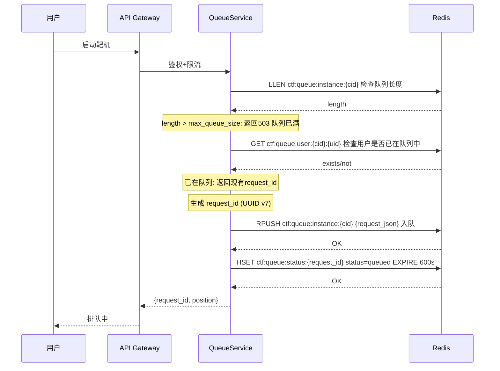
```mermaid
sequenceDiagram
    participant 用户
    participant API as API Gateway
    participant QS as QueueService
    participant Redis

    用户->>API: 启动靶机
    API->>QS: 鉴权+限流

    QS->>Redis: LLEN ctf:queue:instance:{cid} 检查队列长度
    Redis-->>QS: length

    Note over QS: length > max_queue_size: 返回503 队列已满

    QS->>Redis: GET ctf:queue:user:{cid}:{uid} 检查用户是否已在队列中
    Redis-->>QS: exists/not

    Note over QS: 已在队列: 返回现有request_id

    Note over QS: 生成 request_id (UUID v7)

    QS->>Redis: RPUSH ctf:queue:instance:{cid} {request_json} 入队
    Redis-->>QS: OK

    QS->>Redis: HSET ctf:queue:status:{request_id} status=queued EXPIRE 600s
    Redis-->>QS: OK

    QS-->>API: {request_id, position}
    API-->>用户: 排队中
```

### 9.4 时序图 — 前端轮询排队位置

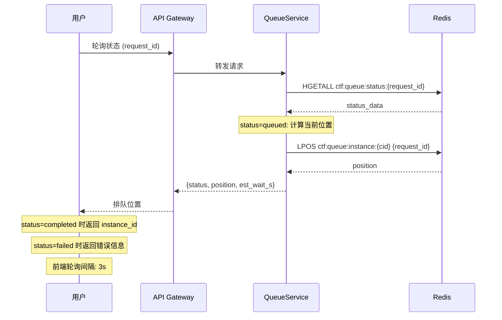
```mermaid
sequenceDiagram
    participant 用户
    participant API as API Gateway
    participant QS as QueueService
    participant Redis

    用户->>API: 轮询状态 (request_id)
    API->>QS: 转发请求

    QS->>Redis: HGETALL ctf:queue:status:{request_id}
    Redis-->>QS: status_data

    Note over QS: status=queued: 计算当前位置

    QS->>Redis: LPOS ctf:queue:instance:{cid} {request_id}
    Redis-->>QS: position

    QS-->>API: {status, position, est_wait_s}
    API-->>用户: 排队位置

    Note over 用户: status=completed 时返回 instance_id
    Note over 用户: status=failed 时返回错误信息
    Note over 用户: 前端轮询间隔: 3s
```

### 9.5 时序图 — 消费者处理

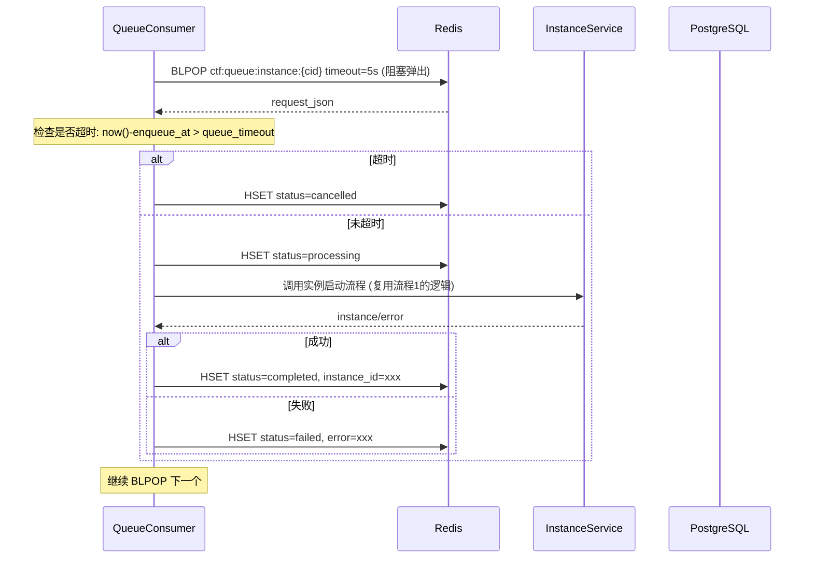
```mermaid
sequenceDiagram
    participant QC as QueueConsumer
    participant Redis
    participant IS as InstanceService
    participant PG as PostgreSQL

    QC->>Redis: BLPOP ctf:queue:instance:{cid} timeout=5s (阻塞弹出)
    Redis-->>QC: request_json

    Note over QC: 检查是否超时: now()-enqueue_at > queue_timeout

    alt 超时
        QC->>Redis: HSET status=cancelled
    else 未超时
        QC->>Redis: HSET status=processing

        QC->>IS: 调用实例启动流程 (复用流程1的逻辑)
        IS-->>QC: instance/error

        alt 成功
            QC->>Redis: HSET status=completed, instance_id=xxx
        else 失败
            QC->>Redis: HSET status=failed, error=xxx
        end
    end

    Note over QC: 继续 BLPOP 下一个
```

### 9.6 关键决策点

| 决策点 | 方案 | 理由 |
|--------|------|------|
| 队列实现 | Redis List（RPUSH 入队，BLPOP 出队） | FIFO 语义，BLPOP 阻塞等待避免空轮询，性能优异 |
| 消费者并发度 | 可配置的 N 个 goroutine 并发消费（默认 5） | 控制 Docker daemon 并发压力，可根据宿主机性能调整 |
| 排队超时 | 入队后超过配置时间（默认 5 分钟）自动取消 | 避免用户无限等待，超时后用户可重新排队 |
| 位置查询 | Redis `LPOS` 命令（Redis 6.0.6+） | O(N) 但队列长度有限（max_queue_size），性能可接受 |
| 状态 TTL | 10 分钟 | 比排队超时长一倍，确保前端能查到最终状态后自然过期 |
| 重复排队防护 | 入队前检查用户是否已有 queued/processing 状态的请求 | 防止同一用户重复排队占位 |
| 队列容量上限 | `max_queue_size` 可配置，默认 200 | 超过上限直接拒绝，避免队列无限增长 |

### 9.7 异常处理

| 异常场景 | 处理策略 |
|----------|----------|
| 队列已满（超过 max_queue_size） | 返回 503，提示"当前排队人数过多，请稍后再试" |
| 消费者宕机（BLPOP 中断） | 重启后自动恢复消费；已弹出但未处理的请求通过超时机制自动取消 |
| 实例创建失败 | 标记 status=failed，前端轮询到后提示用户重试 |
| Redis 不可用 | 降级为直接创建（跳过排队），但限制并发度；记录告警 |
| 排队超时 | 消费者弹出后检查 enqueue_at，超时则标记 cancelled 并跳过 |
| 用户主动取消 | 前端调用取消接口，标记 status=cancelled；消费者弹出后检查状态，已取消则跳过 |

### 9.8 并发与一致性考虑

- **BLPOP 的原子性**：Redis BLPOP 保证每个元素只被一个消费者弹出，多个消费者 goroutine 不会重复处理同一请求。
- **入队与重复检查的竞态**：用户快速点击两次可能导致两次入队。解决方案：使用 Redis Lua 脚本将"检查是否已排队 + RPUSH"合并为原子操作。

```lua
-- 原子入队 Lua 脚本：防止重复排队
-- KEYS[1] = ctf:queue:instance:{cid}
-- KEYS[2] = ctf:queue:status:{request_id}
-- KEYS[3] = ctf:queue:user:{cid}:{uid} (用户排队标记)
-- ARGV[1] = request_json
-- ARGV[2] = max_queue_size
-- ARGV[3] = status_ttl_seconds
-- ARGV[4] = request_id

-- 1. 检查用户是否已在排队
if redis.call('EXISTS', KEYS[3]) == 1 then
    return {-1, redis.call('GET', KEYS[3])}  -- 返回已有的 request_id
end

-- 2. 检查队列长度
local length = redis.call('LLEN', KEYS[1])
if length >= tonumber(ARGV[2]) then
    return {-2, length}  -- 队列已满
end

-- 3. 入队
redis.call('RPUSH', KEYS[1], ARGV[1])

-- 4. 设置状态
redis.call('HSET', KEYS[2], 'status', 'queued', 'enqueue_at', redis.call('TIME')[1])
redis.call('EXPIRE', KEYS[2], tonumber(ARGV[3]))

-- 5. 标记用户已排队
redis.call('SET', KEYS[3], ARGV[4], 'EX', tonumber(ARGV[3]))

return {length + 1, ARGV[4]}  -- 返回位置和 request_id
```

- **消费者弹出后宕机**：BLPOP 弹出后如果消费者宕机，该请求会丢失。可接受的原因：用户轮询超时后会发现 status key 过期（无状态），前端提示"排队超时，请重试"。如需更强保障，可改用 Redis Stream 的 consumer group（XREADGROUP + XACK），支持消息确认和重投递。
- **排队与直接创建的切换**：通过配置开关 `queue.enabled` 控制。非高峰期关闭排队，请求直接走流程 1 的实例启动逻辑。高峰期开启后，所有启动请求统一入队。判断标准：当前运行中的实例数超过阈值时自动开启排队。

### 9.9 监控指标

| 指标 | 采集方式 | 告警阈值 |
|------|----------|----------|
| 队列长度 | Redis LLEN，每 10s 采集 | > max_queue_size × 80% |
| 平均等待时间 | 消费者处理时记录 `now() - enqueue_at` | > 3 分钟 |
| 消费者处理速率 | 每分钟处理的请求数 | < 预期吞吐量的 50% |
| 超时取消率 | cancelled / total | > 20% |
| 创建失败率 | failed / (completed + failed) | > 10% |

---

## 附录：流程间依赖关系

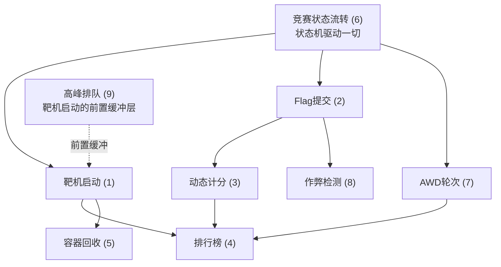
```mermaid
flowchart TD
    F6["竞赛状态流转 (6)<br/>状态机驱动一切"]

    F1["靶机启动 (1)"]
    F2["Flag提交 (2)"]
    F7["AWD轮次 (7)"]
    F3["动态计分 (3)"]
    F4["排行榜 (4)"]
    F5["容器回收 (5)"]
    F8["作弊检测 (8)"]
    F9["高峰排队 (9)<br/>靶机启动的前置缓冲层"]

    F6 --> F1
    F6 --> F2
    F6 --> F7

    F2 --> F3
    F2 --> F8

    F3 --> F4
    F1 --> F4
    F7 --> F4

    F1 --> F5

    F9 -.->|前置缓冲| F1
```

> 说明：
> - 流程 6（竞赛状态流转）是全局控制器，决定其他流程是否可执行
> - 流程 9（排队机制）是流程 1（靶机启动）的前置缓冲层，高峰期自动启用
> - 流程 2（Flag 提交）触发流程 3（动态计分）和流程 8（作弊检测）
> - 流程 1/2/3/7 的结果最终汇聚到流程 4（排行榜更新）
> - 流程 5（容器回收）独立运行，清理流程 1 创建的资源
