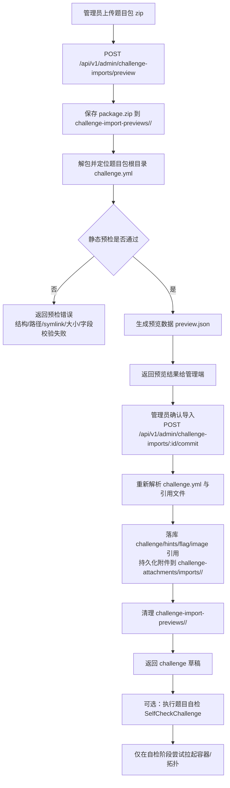

# CTF 靶场平台 — 文件存储设计（MVP：宿主机文件系统）

> 版本：v1.0 | 日期：2026-03-03 | 状态：草稿
> 关联：题目包规范 `ctf/docs/contracts/challenge-pack-v1.md`

---

## 1. 目标与约束

### 1.1 目标

- 支撑教师/管理员上传题目包（Zip）、题目附件、导出文件（报告/成绩单）、以及构建日志等文件对象的存储与分发。
- 确保“选手可控输入”不会导致任意文件读写、路径穿越、Zip 炸弹、敏感信息泄露等安全事故。
- 在保持单机可部署的前提下，为未来迁移到对象存储（MinIO/S3）预留兼容边界（不要求一期就引入运维组件）。

### 1.2 约束（MVP）

- 单机部署，运维零门槛（不强制引入 MinIO）。
- 题目包可能包含 Dockerfile 构建上下文，属于高风险输入，必须在导入流程中严格隔离与校验。
- 容器靶机本身含漏洞，文件存储路径与平台服务必须不被靶机容器访问（防止选手通过靶机读取题库/附件/构建产物）。

---

## 2. 存储对象清单（建议）

文件存储按“对象类型”分类，便于权限控制、生命周期管理与清理：

- `challenge_pack`：教师/管理员上传的原始题目包 Zip（用于审计、复现、重新导入）。
- `challenge_attachment`：题目附件（从题目包中提取并校验后入库/入存储）。
- `build_log`：镜像构建日志（如果平台支持在线构建）。
- `export`：导出文件（竞赛成绩、班级报告、审计导出）。
- `misc`：平台其他静态资源（如模板、示例文件等，尽量由代码仓库管理，避免走上传）。

---

## 3. 存储方案选择

### 3.1 MVP 方案：宿主机文件系统（LocalFS）

默认选择 LocalFS 的原因：

- 单机可部署、少组件、易备份（目录级快照/rsync）。
- 访问控制可集中在 API 层（鉴权 + 审计），不需要额外对象存储策略与凭据管理。

**硬性要求（必须）**

- 存储根目录必须独立且权限收敛，建议仅平台服务用户可读写（例如 `ctf` 用户）。
- 靶机容器禁止挂载该目录（避免选手读题库/附件/导出）。

### 3.2 二期可选：MinIO（S3 兼容）

适用场景：

- 多机部署需要共享同一份题目包/附件。
- 需要预签名 URL、断点续传、更强的对象级权限与多副本。

迁移策略见第 7 节。

---

## 4. LocalFS 目录布局（建议）

存储根目录建议配置化，例如：

- `STORAGE_ROOT=/var/lib/ctf/storage`

子目录建议：

```text
${STORAGE_ROOT}/
  challenge-import-previews/  # 后台导入预览工作目录（zip/source/preview.json）
  challenge-attachments/      # 已持久化的题目附件
  build_logs/             # 构建日志（如启用在线构建）
  exports/                # 导出文件（可设置短期保留）
  tmp/                    # 导入/解包/构建的临时目录（定时清理）
```

### 4.1 文件命名与去重（建议）

建议采用“内容寻址”命名，避免重名覆盖并可去重：

- 计算 `sha256` 作为对象 key。
- 采用分层目录减少单目录文件数：
  - `attachments/ab/cd/<sha256>`
  - `challenge-import-previews/<preview-id>/package.zip`

平台对外暴露“下载 URL”时不要泄露真实路径，只暴露对象 ID（数据库主键）或对象 key。

---

## 5. 上传、导入与下载流程（建议）

### 5.1 题目包上传与导入（教师/管理员）

推荐流程（安全优先）：

1. 上传原始 Zip 到导入预览目录（当前实现为 `challenge-import-previews/<preview-id>/package.zip`）。
2. 在同一预览工作目录内解包并定位“题目包根目录”（当前支持 Zip 根目录直接包含 `challenge.yml`，或仅包含一个题目子目录）。
3. 静态校验：
   - 结构校验：`challenge.yml`、题面 Markdown，以及题目包中引用的附件/运行时信息等必需项存在。
   - 安全校验：拒绝 zip-slip 路径、symlink、zip bomb；限制文件数与大小。
   - `challenge.yml` 字段校验（meta/category/difficulty/flag/runtime/extensions 等）。
4. 附件提取：
   - 仅允许提取 `challenge.yml` 中显式声明的附件文件。
   - 当前实现会把导入后的附件持久化到 `challenge-attachments/imports/<slug>/`，并生成 `/api/v1/challenges/attachments/imports/...` 下载路径。
5. 生成题目记录，并同步 Hint、Flag、运行时镜像引用与附件下载地址。
6. commit 完成后清理该次导入预览目录。

> 在线构建（dockerfile build）如果启用，必须异步化，并在隔离 builder 上执行，禁止 builder 访问平台内网与敏感配置。

#### 5.1.1 当前实现流程图（上传 + 预检 + 导入）



说明：

- `preview` 与 `commit` 都属于静态解析/落库流程，不会启动容器。
- 容器或拓扑的实际拉起，仅发生在后续自检流程（`SelfCheckChallenge`）。

### 5.2 下载（学员/教师/管理员）

下载必须走鉴权与审计：

- 学员：仅允许下载“当前可见且有权限”的题目附件；禁止下载导入预览原始 Zip、Dockerfile、构建日志等。
- 教师/管理员：当前可通过后台导入流程复现与审计题目包；若后续开放原始包回下载，也应单独做鉴权与审计。

实现建议：

- API 返回统一的“下载令牌/对象 ID”，由后端完成权限校验后再流式返回文件。
- 如使用 Nginx，可通过 `X-Accel-Redirect` 提升大文件分发性能，但仍必须先在应用层做鉴权。

---

## 6. 安全与资源控制（必须）

### 6.1 路径与解包安全

- 禁止写入任意路径：拒绝绝对路径与 `..`。
- 禁止 symlink：防止绕过目录约束读取/写入。
- 限制资源：最大文件数、最大单文件、最大总大小；解包在独立目录。

### 6.2 文件类型与内容策略

- 附件下载使用 `Content-Disposition: attachment`，避免浏览器直接执行潜在恶意内容。
- 可选：对可执行脚本/二进制附件做额外策略（白名单/仅教师可见）。

### 6.3 速率限制与配额（建议）

- 上传与导出接口加限流与并发限制（防止单用户拖垮磁盘/IO）。
- 设定存储配额与告警阈值（磁盘剩余空间、tmp 目录增长、导出堆积）。

---

## 7. 迁移到 MinIO/S3 的兼容点（建议）

为了未来平滑迁移：

- 把“对象 key”（如 sha256）作为稳定标识，对存储后端透明。
- LocalFS 与 S3 只在“读写实现”不同：
  - `PutObject(key, bytes|stream)`
  - `GetObject(key) -> stream`
  - `DeleteObject(key)`
- 数据库层只存元数据与 key（size/sha256/content-type/created_by/created_at），不要存真实路径。
- 下载链路保持“应用层鉴权”，S3/MinIO 可选用预签名 URL，但依然要确保对象 key 不可枚举并且短 TTL。

---

## 8. 备份与清理策略（建议）

- `challenge-import-previews/`：仅作短期预览缓存，commit 后或超时后应清理。
- `challenge-attachments/`：长期保留，与题目生命周期一致。
- `build_logs/`：可设置保留期（例如 30 天）并可按镜像状态清理。
- `exports/`：建议短期保留（例如 7~30 天），并提供手动删除。
- `tmp/`：必须定期清理（例如每小时/每天），并在服务启动时清一次“过期残留”。
