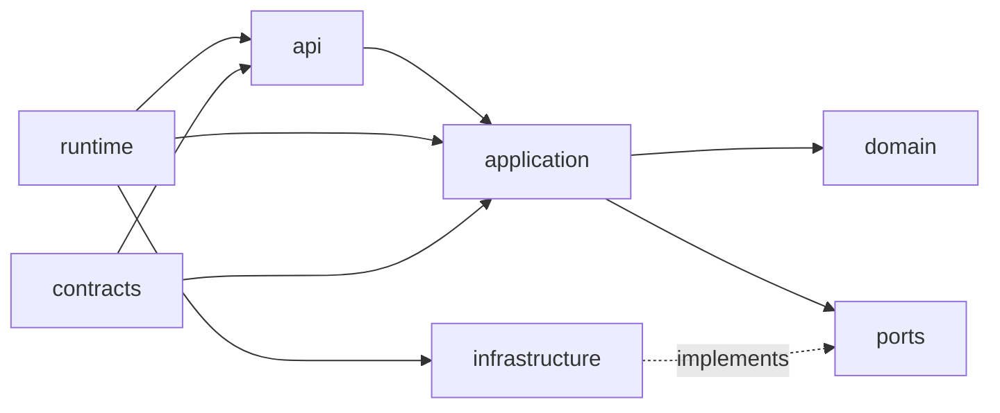
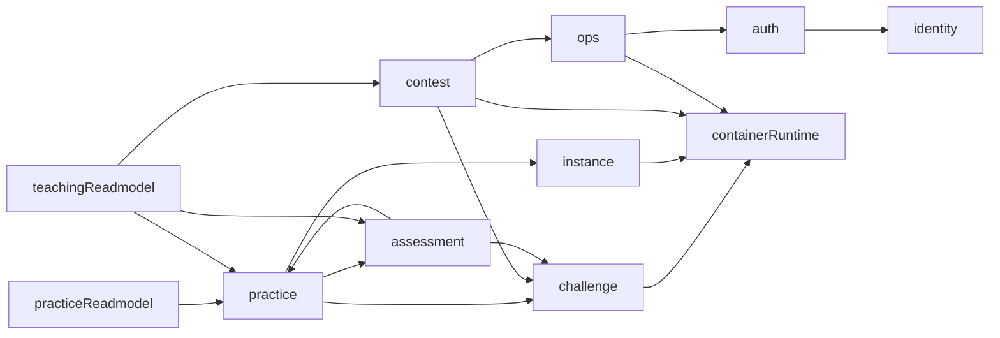

# CTF 平台后端 Onion 架构与模块边界

> 状态：Current
> 事实源：`code/backend/internal/app/composition/`、`code/backend/internal/module/`、`code/backend/internal/app/router.go`
> 替代：无

## 定位

本文档说明当前后端模块化单体的 owner 边界、依赖方向和运行时装配规则。

- 负责：描述单进程部署下的 Onion 模块划分、读写 owner、composition root 和跨模块协作约束。
- 不负责：承载历史迁移步骤、一次性重构任务单，或把旧的 `teacher / system / container` 模块叙事继续保留成当前事实。

## 当前设计

- `code/backend/internal/app/composition/*.go`、`code/backend/internal/app/router.go`
  - 负责：在进程级 composition root 中装配 `container_runtime`、`ops`、`instance`、`identity`、`auth`、`challenge`、`assessment`、`teaching_readmodel`、`contest`、`practice`、`practice_readmodel` 模块，并统一管理 background jobs 与 closers；其中 `ContainerRuntimeModule` 是容器/运行时能力视图，`InstanceModule` 是实例与访问入口视图
  - 不负责：实现模块内部业务规则或绕过模块 runtime 直接在 app 层拼接业务依赖

- `code/backend/internal/module/*/{api,application,domain,ports,infrastructure,runtime,contracts}`
  - 负责：按 Onion 依赖方向组织写模型和读模型模块，确保 `api -> application -> domain`，`infrastructure -> ports`，`runtime` 只做模块内 wiring
  - 不负责：跨模块直接依赖对方 `infrastructure`，或让 handler 成为“页面控制器式”大杂烩

- `code/backend/internal/app/router.go`、`code/backend/internal/module/auth/contracts/token_service.go`
  - 负责：在 app 层创建 `auth` 的 token service，并把它传给认证中间件、`auth` runtime、通知 WebSocket 和竞赛实时 WebSocket handler
  - 不负责：把 token/session 能力重新挂回 `identity` 模块，或在 `identity` 里再包装一层认证抽象

- `code/backend/internal/app/composition/instance_module.go`、`code/backend/internal/app/composition/runtime_module.go`
  - 负责：在 app 层把同一个 `internal/module/runtime/runtime.Module` 收口成两个组合视图；`InstanceModule` 直接装配 `internal/module/instance/application/*` 的实例命令、查询、proxy ticket 和 maintenance use case，并通过 `internal/module/instance/contracts` 把它们交给 runtime access adapter，对外暴露实例/AWD 访问 handler、`practice` 依赖的实例仓储和运行时服务，同时注册 `runtime_cleaner` 与 AWD 防守 SSH gateway；`ContainerRuntimeModule` 只保留 `challenge`、`contest`、`ops` 需要的 container-facing 能力，`RuntimeModule` 仅保留兼容别名
  - 不负责：继续让 `runtime/runtime.Module` 承担实例 handler / cleaner 的生产装配，或把 `runtime/application/*` 的 compat import path 误写成长期 owner；当前 compat mirror 已压成基于 `instance/contracts` 的薄 wrapper，但它仍不是生产 wiring owner

- `code/backend/internal/module/instance/contracts/*.go`
  - 负责：作为 `runtime -> instance` 的合法跨模块落点，定义实例 owner 暴露给外部模块的 command / query / proxy ticket / maintenance service contract
  - 不负责：承载实例业务规则实现，或把 runtime adapter 便利方法反向塞回 instance owner contract

- `code/backend/internal/module/practice_readmodel`、`code/backend/internal/module/teaching_readmodel`
  - 负责：承担教师视角、练习视角和复盘聚合查询，把跨 owner 只读拼装集中到 readmodel 层
  - 不负责：拥有练习、竞赛、题目、评估的写侧状态，也不反向成为新的万能 owner

- `code/backend/internal/platform/events/bus.go`
  - 负责：提供进程内事件总线给异步通知和非关键路径联动使用
  - 不负责：替代强一致性的同步模块调用，或成为跨进程消息中间件抽象

## 接口或数据影响

- 模块对外稳定 contract 位于各自 `contracts` 目录，外部 HTTP / WebSocket 路由则经由 `code/backend/internal/app/router_routes.go` 暴露。
- 写模型 owner 负责自己的表和状态变更；读模型只消费 owner 暴露的 query / contract / repository 能力，不直接回写底层表。
- 当前模块边界与依赖方向由 `docs/architecture/backend/01-system-architecture.md` 和本文件共同构成后端组织事实。

## Guardrail

- 模块依赖方向：`code/backend/internal/module/architecture_test.go`
- 进程级装配规则：`code/backend/internal/app/architecture_rules_test.go`
- composition 边界回归：`code/backend/internal/app/composition/architecture_test.go`
- 路由与运行时装配：`code/backend/internal/app/router_test.go`、`code/backend/internal/app/full_router_integration_test.go`
- compat mirror 当前限制：`code/backend/internal/app/architecture_rules_test.go` 明确禁止 `runtime -> instance application` 的 concrete cross-module import，因此 `runtime/application/*` 只能通过 `instance/contracts` 做 wrapper，不能直接 import `instance/application/*`

## 历史迁移

- 当前模块边界已经从旧的 `teacher / system / container` 叙事收口到 `teaching_readmodel / ops / runtime`。
- 下文保留的“结论 / 版图 / 硬规则 / 统一口径”是当前事实的详细展开；如果与 `composition` 或模块代码冲突，以代码和 guardrail test 为准。

## 目标演进稿

- [../../design/backend-module-boundary-target.md](../../design/backend-module-boundary-target.md)
  - 状态：`Draft`，不是当前已落地事实。
  - 用途：记录后端模块边界的目标划分、依赖方向、对外暴露规则和迁移债务，避免把当前历史遗留结构直接写成合理终态。
  - 回收条件：完成对应迁移并通过架构 guardrail 后，再把目标结论回收到本文档的 `Current` 事实中。

## 1. 结论

当前后端的事实口径如下：

- **运行形态**：单个 Go API 进程，配套 PostgreSQL、Redis、Docker Engine，整体仍是单体部署。
- **代码架构**：按业务模块组织的 Onion Architecture，而不是大一统的 handler/service/repository 三层堆叠。
- **模块类型**：写模型模块负责状态变更，读模型模块负责跨模块只读聚合。
- **边界口径**：不再把 `teacher`、`system`、`container` 作为当前主模块叙事；当前代码分别收敛为 `teaching_readmodel`、`ops`、`runtime` 物理模块，并在 app 层明确成 `container_runtime + instance` 两个组合视图。

这里关注的是“系统现在是什么”，不记录迁移过程。

---

## 2. 当前模块版图

| 模块 | 类型 | 当前 owner 能力 | 典型对外暴露 |
|------|------|----------------|--------------|
| `auth` | 写模型 | 注册、登录、登出、CAS、会话票据、WebSocket ticket、基于 session 的当前用户解析 | 认证 handler、token service、登录链路应用服务 |
| `identity` | 写模型 | 用户、角色、账号状态、资料、管理端用户能力 | 用户查询、资料命令/查询、管理端用户 handler |
| `challenge` | 写模型 | 题目元数据、附件、镜像信息、Flag 规则、题包导入/导出 | 题目查询、镜像探针、Flag 规则读取 |
| `runtime` | 基础运行时物理模块 | Docker 运行时、镜像探针、容器文件访问、运行时统计，以及 practice / challenge / contest 仍在复用的 container-facing adapter；底层实现仍落在 `internal/module/runtime/*` | `runtimemodule.Build(...)`、`Engine`、practice runtime bridge、底层容器适配实现 |
| `container_runtime` | app 层组合视图（迁移中） | 在 `internal/app/composition/runtime_module.go` 中承接 challenge / contest / ops 依赖的容器与运行时能力；当前主类型是 `ContainerRuntimeModule`，`RuntimeModule` 仅保留兼容别名 | image runtime、runtime probe、运行时统计 query、AWD 文件写入 |
| `instance` | 写模型（物理模块 + app 层组合视图） | `internal/module/instance/*` 承接实例命令、查询、proxy ticket、maintenance；`internal/app/composition/instance_module.go` 把这些 use case 接到 runtime repo / engine，并对外暴露实例访问 handler、`PracticeInstanceRepository`、`PracticeRuntimeService` 与实例清理任务 | instance command/query、proxy ticket service、maintenance service、实例访问 handler |
| `practice` | 写模型 | 练习开题、排队与 provisioning、Flag 提交、个人训练进度 | 开题/续期/销毁/提交等应用服务与 handler |
| `contest` | 写模型 | 竞赛配置、队伍、排行榜、公告、AWD 轮次与服务运行态 | 竞赛应用服务、实时广播、AWD 编排 |
| `assessment` | 写模型 | 评估任务、技能画像、报告导出、评估归档 | 画像查询、报告导出、归档能力 |
| `ops` | 写模型 / 运营支撑 | 审计日志、站内通知、WebSocket 管理、运行时概览与后台支撑 | 审计服务、通知 handler、运行时统计查询 |
| `practice_readmodel` | 读模型 | 练习态只读聚合查询 | 列表页、只读聚合查询 |
| `teaching_readmodel` | 读模型 | 教师视角证据、复盘、学员画像、教学分析聚合查询 | 教师端查询 handler 与 query service |

补充说明：

- `/api/v1/teacher/*` 只是外部路由命名空间，不代表存在名为 `teacher` 的写模型模块。
- `practice_readmodel` 与 `teaching_readmodel` 不拥有业务状态，只负责把多个 owner 的只读事实整理成可查询结果。

---

## 3. 模块内部 Onion 结构

### 3.1 依赖方向

### 3.2 目录职责

| 目录 | 作用 |
|------|------|
| `api` | HTTP / WebSocket 协议适配、参数绑定、响应映射 |
| `application` | 用例编排、事务边界、权限判断、跨模块协作 |
| `domain` | 纯业务规则、状态机、领域校验 |
| `ports` | 由消费方定义的最小依赖接口 |
| `infrastructure` | GORM、Redis、Docker、导出器、任务执行器等适配器 |
| `runtime` | 模块内装配、对外暴露组合后的 handler / service / background jobs |
| `contracts` | 模块对外稳定 contract，避免泄漏内部 persistence 结构 |

### 3.3 硬规则

- `api` 只做协议适配，不承载业务规则。
- `application` 通过 `ports`、`contracts` 获取外部能力，不直接依赖 Gin、GORM、Redis、Docker SDK。
- `domain` 不感知任何框架或外部资源类型。
- `infrastructure` 只实现端口，不反向依赖上层用例。
- `runtime` 是模块唯一允许集中 wiring 的位置。
- 读模型模块可以没有 `domain` 或 `contracts`，但依赖方向仍然向内。

---

## 4. 组合根与运行时装配

### 4.1 进程级 composition root

`internal/app/composition.Root` 是进程级装配根，统一持有：

- `config`
- `logger`
- `db`
- `cache`
- `events.Bus`
- 后台任务注册表

### 4.2 当前装配顺序

`internal/app/buildRouterRuntime` 当前按以下顺序创建模块：

1. `container_runtime`
2. `ops`
3. `instance`
4. `identity`
5. `auth`
6. `challenge`
7. `assessment`
8. `teaching_readmodel`
9. `contest`
10. `practice`
11. `practice_readmodel`

这个顺序体现的是依赖准备关系，而不是页面菜单顺序。

### 4.3 生命周期管理

- 模块自己的后台任务通过 `composition.Root.RegisterBackgroundJob` 注册到进程级任务表。
- `instance` 组合视图当前负责注册 `runtime_cleaner` 和 AWD 防守 SSH gateway，并统一构建实例访问 handler；`container_runtime` 组合视图不再负责实例清理任务装配。
- `HTTPServer` 启动时统一拉起 background jobs，关闭时统一停止任务并关闭模块异步组件。
- `routerRuntime.closers` 负责承接需要显式 `Close(ctx)` 的模块级异步资源。

约束：

- 禁止在 handler、协程或子流程里重新 new 一套模块 service。
- 新增后台任务必须接入 composition root，不允许自启自停。

---

## 5. 跨模块协作边界

### 5.1 当前主要依赖关系

### 5.2 协作方式

| 方式 | 当前用途 | 规则 |
|------|----------|------|
| `application` / `contracts` 调用 | 同步、强一致性用例 | 只能依赖对方暴露的最小能力，不能越过到 `infrastructure` |
| `ports` + 适配器 | Docker、Redis、导出器、统计等外部能力 | 端口由消费方定义，适配器在 provider 侧实现 |
| `readmodel` 聚合 | 教师端、复盘、统计、跨模块列表查询 | 只读，不拥有状态变更 |
| `events.Bus` | 异步通知、非关键路径广播 | 不能替代关键写路径事务语义 |

### 5.3 共享运行时边界

`runtime` 当前仍是共享的底层物理模块，但 app 层已经把“实例入口”从“容器运行能力”中拆成两个显式组合视图，并把实例 owner use case 直接装到 `internal/module/instance/*`：

- `challenge` 继续通过 `ContainerRuntimeModule` 做镜像探测和运行时探针接入
- `contest` 继续通过 `ContainerRuntimeModule` 完成 AWD 服务运行态、容器文件写入和运行时编排
- `ops` 继续通过 `ContainerRuntimeModule` 读取运行时统计与概览信息
- `practice` 现在只通过 `InstanceModule` 使用实例仓储和运行时服务，不再直接拿整个 `ContainerRuntimeModule`
- 用户实例路由、教师实例路由、AWD target proxy 与 defense SSH 入口统一挂到 `InstanceModule.Handler`
- `runtime/runtime.Module` 不再组装实例 handler、proxy ticket service 或 `runtime_cleaner`；这些生产 wiring 已上移到 `composition.InstanceModule`
- `runtime/runtime/adapters.go` 已开始直接依赖 `internal/module/instance/contracts`，而不是继续在 runtime 模块里声明一组本地临时 instance owner 接口
- `runtime/application/{commands,queries}` 里的 instance / proxy ticket / maintenance compat service 已压成基于 `internal/module/instance/contracts` 的委托 wrapper，不再保留第二份实例业务实现
- `practice_flow_integration_test.go`、`runtime/service_test.go` 以及 `runtime/application` 目录里的实例行为测试都已经继续切到 `instance/*` owner；`runtime/application/*` 当前只剩 compat import path 和最小 wrapper 测试

这部分共享能力通过 query / service / ports 暴露，而不是把 Docker 细节散落到各业务模块。

---

## 6. 数据 ownership 口径

这里只保留能力边界，不把页面视角混成 owner：

- 用户、角色、账号状态、资料与管理端用户能力：`identity`。
- 会话、token、WebSocket ticket 与当前用户解析：`auth`。
- 题目元数据、附件、Flag 规则、题包信息：`challenge`。
- 运行时资源、镜像探针、容器文件读写、端口与 ACL、运行时任务：`runtime`。
- 容器运行时能力视图：当前在 app 层由 `container_runtime` 组合视图对外收口，底层实现仍落在 `runtime` 物理模块。
- 实例记录、实例续期/销毁、实例可见性查询、proxy ticket 与实例维护调度：`internal/module/instance`。
- 实例访问入口、AWD target / defense SSH 访问入口，以及实例 owner 与 runtime adapter 的最终装配：当前在 app 层由 `instance` 组合视图对外收口。
- 练习开题、个人训练进度、Flag 提交与练习态更新：`practice`。
- 竞赛配置、队伍、排行榜、AWD 轮次与服务运行态：`contest`。
- 评估任务、画像、报告导出、归档：`assessment`。
- 审计、通知、运营支撑视图：`ops`。
- 教师视角或复盘视角的跨模块查询：`teaching_readmodel`。

当一个查询同时跨越多个 owner 时，优先进入读模型，而不是在某个写模块里继续堆跨表 SQL。

---

## 7. 当前架构约束

- `internal/app/composition/architecture_test.go` 已经阻止 composition 和 runtime 回退到旧的 `internal/module/container` 依赖。
- `code/backend/internal/app/router_test.go` 已经约束 `ContainerRuntimeModule` 不再暴露 `Handler` / `PracticeRuntimeService`，并要求 `BuildPracticeModule` 依赖 `InstanceModule`。
- `code/backend/internal/app/architecture_rules_test.go` 已经阻止 `runtime` 模块继续跨模块直连 `instance/application`、`api` 或 `infrastructure` 层。
- 新增模块时先确定 owner，再决定是否需要 `domain`、`ports`、`contracts`；禁止为了“看起来像 Clean Architecture”机械建空目录。
- 长期事实文档只保留最终架构，不再保留“迁移中间态”“重构收口过程”文档。
- 如果未来确实要拆分独立服务，应沿现有模块的 `application + ports + contracts` 边界抽离，而不是重新按页面或角色分组。

---

## 8. 对答辩与维护的统一口径

现在可以统一这样描述后端：

> 本系统在部署上保持单体形态，但在代码结构上采用按业务模块组织的 Onion Architecture。模块内部遵循 `api -> application -> domain` 的依赖方向，外部资源通过 `ports` 和 `infrastructure` 适配，跨模块只读聚合进入 `practice_readmodel` 与 `teaching_readmodel`。这样既控制了校园级项目的运维复杂度，也让后续扩展和局部拆分保持清晰边界。
