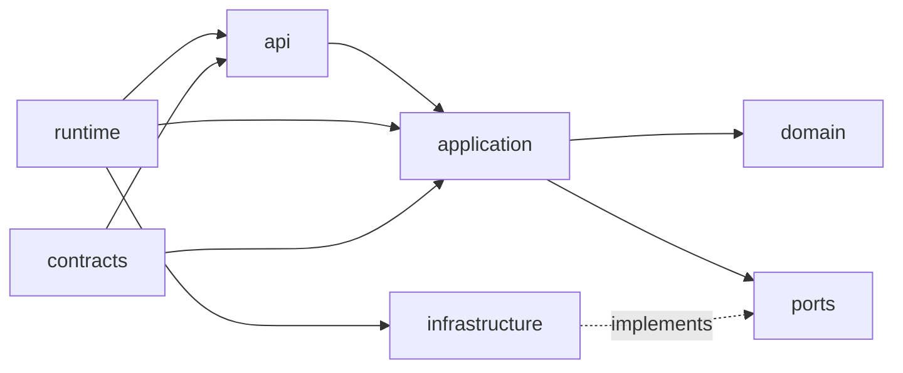
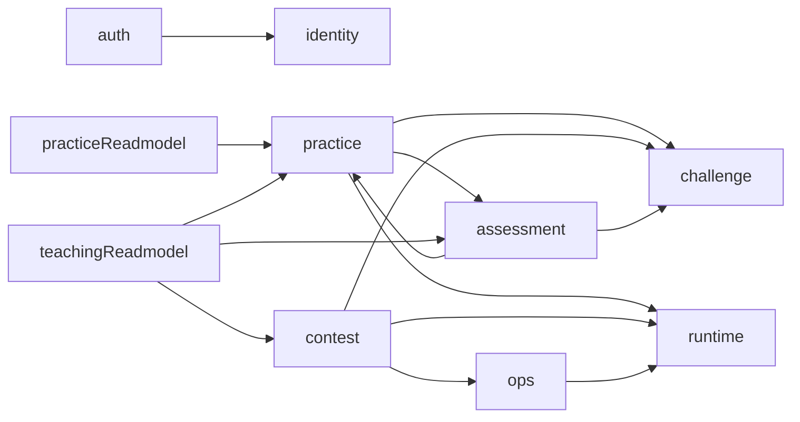

# CTF 平台后端 Onion 架构与模块边界

> 版本：v1.1 | 日期：2026-05-07 | 状态：当前事实

---

## 1. 结论

当前后端的事实口径如下：

- **运行形态**：单个 Go API 进程，配套 PostgreSQL、Redis、Docker Engine，整体仍是单体部署。
- **代码架构**：按业务模块组织的 Onion Architecture，而不是大一统的 handler/service/repository 三层堆叠。
- **模块类型**：写模型模块负责状态变更，读模型模块负责跨模块只读聚合。
- **边界口径**：不再把 `teacher`、`system`、`container` 作为当前主模块叙事；当前代码分别收敛为 `teaching_readmodel`、`ops`、`runtime`。

这里关注的是“系统现在是什么”，不记录迁移过程。

---

## 2. 当前模块版图

| 模块 | 类型 | 当前 owner 能力 | 典型对外暴露 |
|------|------|----------------|--------------|
| `auth` | 写模型 | 注册、登录、登出、CAS、会话票据、WebSocket ticket | 认证 handler、登录链路应用服务 |
| `identity` | 写模型 | 用户、角色、权限、当前用户解析、管理端用户能力 | token service、用户查询、管理端用户 handler |
| `challenge` | 写模型 | 题目元数据、附件、镜像信息、Flag 规则、题包导入/导出 | 题目查询、镜像探针、Flag 规则读取 |
| `runtime` | 写模型 / 基础运行时 | Docker 运行时、代理访问、端口与 ACL、清理任务、运行时统计 | 运行时 query、实例访问 handler、background jobs |
| `practice` | 写模型 | 练习开题、排队与 provisioning、Flag 提交、个人训练进度 | 开题/续期/销毁/提交等应用服务与 handler |
| `contest` | 写模型 | 竞赛配置、队伍、排行榜、公告、AWD 轮次与服务运行态 | 竞赛应用服务、实时广播、AWD 编排 |
| `assessment` | 写模型 | 评估任务、技能画像、报告导出、评估归档 | 画像查询、报告导出、归档能力 |
| `ops` | 写模型 / 运营支撑 | 审计日志、站内通知、WebSocket 管理、运行时概览与后台支撑 | 审计服务、通知 handler、运行时统计查询 |
| `practice_readmodel` | 读模型 | 练习态只读聚合查询 | 列表页、只读聚合查询 |
| `teaching_readmodel` | 读模型 | 教师视角证据、复盘、学员画像、教学分析聚合查询 | 教师端查询 handler 与 query service |

补充说明：

- `/api/v1/teacher/*` 只是外部路由命名空间，不代表存在名为 `teacher` 的写模型模块。
- `practice_readmodel` 与 `teaching_readmodel` 不拥有业务状态，只负责把多个 owner 的只读事实整理成可查询结果。

---

## 3. 模块内部 Onion 结构

### 3.1 依赖方向

### 3.2 目录职责

| 目录 | 作用 |
|------|------|
| `api` | HTTP / WebSocket 协议适配、参数绑定、响应映射 |
| `application` | 用例编排、事务边界、权限判断、跨模块协作 |
| `domain` | 纯业务规则、状态机、领域校验 |
| `ports` | 由消费方定义的最小依赖接口 |
| `infrastructure` | GORM、Redis、Docker、导出器、任务执行器等适配器 |
| `runtime` | 模块内装配、对外暴露组合后的 handler / service / background jobs |
| `contracts` | 模块对外稳定 contract，避免泄漏内部 persistence 结构 |

### 3.3 硬规则

- `api` 只做协议适配，不承载业务规则。
- `application` 通过 `ports`、`contracts` 获取外部能力，不直接依赖 Gin、GORM、Redis、Docker SDK。
- `domain` 不感知任何框架或外部资源类型。
- `infrastructure` 只实现端口，不反向依赖上层用例。
- `runtime` 是模块唯一允许集中 wiring 的位置。
- 读模型模块可以没有 `domain` 或 `contracts`，但依赖方向仍然向内。

---

## 4. 组合根与运行时装配

### 4.1 进程级 composition root

`internal/app/composition.Root` 是进程级装配根，统一持有：

- `config`
- `logger`
- `db`
- `cache`
- `events.Bus`
- 后台任务注册表

### 4.2 当前装配顺序

`internal/app/buildRouterRuntime` 当前按以下顺序创建模块：

1. `runtime`
2. `ops`
3. `identity`
4. `auth`
5. `challenge`
6. `assessment`
7. `teaching_readmodel`
8. `contest`
9. `practice`
10. `practice_readmodel`

这个顺序体现的是依赖准备关系，而不是页面菜单顺序。

### 4.3 生命周期管理

- 模块自己的后台任务通过 `composition.Root.RegisterBackgroundJob` 注册到进程级任务表。
- `runtime` 模块当前会注册清理任务，并在开启防守 SSH 时注册额外网关任务。
- `HTTPServer` 启动时统一拉起 background jobs，关闭时统一停止任务并关闭模块异步组件。
- `routerRuntime.closers` 负责承接需要显式 `Close(ctx)` 的模块级异步资源。

约束：

- 禁止在 handler、协程或子流程里重新 new 一套模块 service。
- 新增后台任务必须接入 composition root，不允许自启自停。

---

## 5. 跨模块协作边界

### 5.1 当前主要依赖关系

### 5.2 协作方式

| 方式 | 当前用途 | 规则 |
|------|----------|------|
| `application` / `contracts` 调用 | 同步、强一致性用例 | 只能依赖对方暴露的最小能力，不能越过到 `infrastructure` |
| `ports` + 适配器 | Docker、Redis、导出器、统计等外部能力 | 端口由消费方定义，适配器在 provider 侧实现 |
| `readmodel` 聚合 | 教师端、复盘、统计、跨模块列表查询 | 只读，不拥有状态变更 |
| `events.Bus` | 异步通知、非关键路径广播 | 不能替代关键写路径事务语义 |

### 5.3 共享运行时边界

`runtime` 是当前多个模块共享的运行时 owner：

- `challenge` 通过它做镜像探测和运行时探针接入
- `practice` 通过它完成实例编排、访问代理、续期与清理
- `contest` 通过它完成 AWD 服务运行态、容器文件写入和运行时编排
- `ops` 通过它读取运行时统计与概览信息

这部分共享能力通过 query / service / ports 暴露，而不是把 Docker 细节散落到各业务模块。

---

## 6. 数据 ownership 口径

这里只保留能力边界，不把页面视角混成 owner：

- 身份、角色、权限、当前用户解析：`identity`，认证入口由 `auth` 承接。
- 题目元数据、附件、Flag 规则、题包信息：`challenge`。
- 运行时资源、访问代理、端口与 ACL、运行时任务：`runtime`。
- 练习开题、个人训练进度、Flag 提交与练习态更新：`practice`。
- 竞赛配置、队伍、排行榜、AWD 轮次与服务运行态：`contest`。
- 评估任务、画像、报告导出、归档：`assessment`。
- 审计、通知、运营支撑视图：`ops`。
- 教师视角或复盘视角的跨模块查询：`teaching_readmodel`。

当一个查询同时跨越多个 owner 时，优先进入读模型，而不是在某个写模块里继续堆跨表 SQL。

---

## 7. 当前架构约束

- `internal/app/composition/architecture_test.go` 已经阻止 composition 和 runtime 回退到旧的 `internal/module/container` 依赖。
- 新增模块时先确定 owner，再决定是否需要 `domain`、`ports`、`contracts`；禁止为了“看起来像 Clean Architecture”机械建空目录。
- 长期事实文档只保留最终架构，不再保留“迁移中间态”“重构收口过程”文档。
- 如果未来确实要拆分独立服务，应沿现有模块的 `application + ports + contracts` 边界抽离，而不是重新按页面或角色分组。

---

## 8. 对答辩与维护的统一口径

现在可以统一这样描述后端：

> 本系统在部署上保持单体形态，但在代码结构上采用按业务模块组织的 Onion Architecture。模块内部遵循 `api -> application -> domain` 的依赖方向，外部资源通过 `ports` 和 `infrastructure` 适配，跨模块只读聚合进入 `practice_readmodel` 与 `teaching_readmodel`。这样既控制了校园级项目的运维复杂度，也让后续扩展和局部拆分保持清晰边界。
