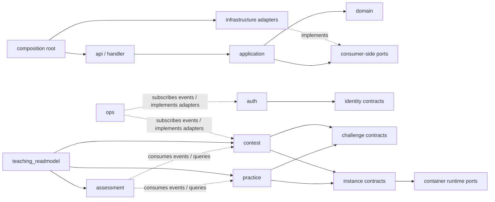

# 后端模块边界目标设计稿

> 状态：Draft
> 事实源：`code/backend/internal/module/` 当前实现、`docs/architecture/backend/07-modular-monolith-refactor.md` 当前事实、模块边界复核结论
> 替代：无；迁移完成后应回收到 `docs/architecture/backend/07-modular-monolith-refactor.md`

## 定位

本文档说明后端模块化单体的目标边界，不把当前代码形态直接视为合理终态。

- 负责：定义目标模块划分、组合方式、依赖方向、对外暴露口径、已知技术债和迁移切片。
- 不负责：记录当前已落地事实、替代当前架构事实源、设计微服务拆分方案、改写外部 HTTP 路由或论文正文。

## 当前设计判断

- 当前后端仍应保持单进程模块化单体。
  - 负责：继续用一个 Go API 进程部署，降低校园内网场景的运维成本。
  - 不负责：提前拆成微服务、引入服务注册发现、跨服务链路治理或分布式事务。

- 目标架构应按业务 owner 划分模块，而不是按页面、角色或历史目录命名。
  - 负责：让每条写路径、状态机、权限判断、重试策略和副作用都有唯一 owner。
  - 不负责：为了目录整齐给每个模块机械创建空 `domain`、空 `ports` 或空 `contracts`。

- `readmodel` 只用于跨 owner 只读聚合。
  - 负责：承接教师视角、复盘视角、跨表统计和页面聚合查询。
  - 不负责：拥有写侧状态、执行业务状态流转，或成为绕开 owner contract 的万能查询仓库。

- 容器运行能力应从业务实例生命周期中拆清。
  - 负责：区分“实例状态与访问权”这种业务事实，以及“Docker 网络、容器、ACL、文件读写”这种运行时适配。
  - 不负责：继续让一个宽泛 `runtime` 同时承担实例写模型、Docker 适配、教师查询、代理 ticket 和 AWD 文件操作。

## 目标模块版图

| 目标模块 | 类型 | 负责 | 不负责 | 对外暴露 |
| --- | --- | --- | --- | --- |
| `identity` | 写模型 | 用户、角色、账号状态、资料、密码哈希与密码变更、管理端用户能力 | session、token、CAS、WebSocket ticket | 用户查询、用户写入、凭据校验、资料命令/查询 contract，管理端 handler |
| `auth` | 认证能力 / 写模型 | 登录、登出、会话、CAS、WebSocket ticket、认证中间件所需 token 能力 | 用户资料 owner、用户仓储实现、管理端用户 CRUD | 认证 handler、session/token contract、认证上下文构造能力 |
| `challenge` | 写模型 | 题目元数据、题包、附件、镜像引用、Flag 策略、Writeup、拓扑模板 | 实例状态、容器生命周期、竞赛计分 | 题目 catalog、Flag validator、image store、题目管理 handler |
| `instance` | 写模型 | 实例记录、排队、状态机、启动/续期/销毁、访问 ticket、实例清理和实例可见性查询 | Docker SDK、题目元数据 owner、提交计分 | 实例 command/query contract、实例 handler、调度 background job |
| `container_runtime` | 平台适配 | Docker Engine、网络、ACL、容器文件读写、探活、镜像探测、资源限制 | 用户权限、竞赛规则、实例业务状态 | container engine ports 的 adapter；默认不暴露 HTTP handler |
| `practice` | 写模型 | 日常训练、练习提交、个人解题状态、练习排行榜、人工评审入口 | 容器底层执行、题目定义、能力画像写入 | 练习 handler、提交/解题事件、练习 query contract |
| `contest` | 写模型 | 竞赛、报名、队伍、题目入赛、排行榜、冻结榜、公告、AWD 轮次、AWD 攻击计分 | 题目定义、容器底层执行、通知发送实现 | 竞赛 handler、AWD handler、排行榜 query、竞赛事件 |
| `assessment` | 分析产物写模型 | 能力画像、推荐、报告、复盘归档、评估重建任务 | 提交判定、竞赛计分主链路、教师页面聚合查询 | 画像/推荐/报告 contract、报告 handler、事件消费者 |
| `ops` | 运营支撑 | 审计、通知、WebSocket 广播适配、运行概览、风险视图 | 业务状态 owner、业务规则决策 | audit recorder、notification handler、realtime broadcaster adapter |
| `teaching_readmodel` | 读模型 | 教师班级、学生证据链、复盘、跨训练/竞赛/评估的只读聚合 | 写入训练/竞赛/评估事实、替代 owner 规则 | 教师端 query handler、只读 query service |
| `practice_readmodel` | 读模型候选 | 仅在个人进度/时间线确实跨多个 owner 时保留 | 如果只读取 practice 自有事实，则不应独立存在 | 个人进度/时间线 query；迁移时需重新判定是否并回 `practice/application/queries` |

### 命名说明

- `instance` 是建议目标名，用来承接“靶机实例业务生命周期”。如果迁移成本较高，可先保留 `runtime` 包名作为兼容 facade，再逐步抽出 `instance` 与 `container_runtime`。
- `container_runtime` 可以落在 `internal/module/container_runtime`，也可以落在 `internal/platform/container`。选择标准不是目录偏好，而是它是否承载业务状态：如果只实现 Docker/ACL/文件等适配，优先放平台适配层；如果还拥有实例表和调度状态，就不应叫 `container_runtime`。

## 目标依赖方向

目标规则：

- `auth -> identity contracts` 可以存在；`identity -> auth` 不应存在。
- `practice` 和 `contest` 可以依赖 `challenge`、`instance` 的 contract；不能依赖它们的 `infrastructure`。
- `instance` 通过 container runtime ports 调用 Docker/ACL/文件能力；业务模块不能直接依赖 Docker SDK。
- `assessment` 不应挂在提交计分的同步写路径上更新画像；优先消费训练/竞赛事件或通过显式重建任务收敛。
- `ops` 不应成为业务模块的硬依赖；业务模块发布事件或使用窄 port，通知和 WebSocket 广播由 `ops` 适配。
- `teaching_readmodel` 可以跨 owner 读取只读事实，但不能反向回写 owner 表，也不能承载状态转换规则。

## 对外暴露规则

### 模块暴露什么

每个模块对外只暴露四类能力：

1. `api/http` handler：只给路由层挂载。
2. `contracts`：其他模块可依赖的稳定业务能力或事件类型。
3. `ports`：消费方定义的最小能力接口，由 composition 绑定具体 adapter。
4. `runtime.Module` 输出：模块装配后的 handler、contract implementation、background job 和 closer。

### 模块不暴露什么

- 不向其他模块暴露 `infrastructure.Repository` 具体类型。
- 不把 GORM、Redis、Docker client、Gin context 放进跨模块 contract。
- 不把 API DTO 当成跨模块内部 contract；跨模块 contract 应使用模块自己的输入输出结构或领域值对象。
- 不把路由命名空间当模块边界，例如 `/teacher/*` 是外部接口分组，不是 `teacher` 写模型。

### 事件暴露

跨模块异步协作使用事件时，事件类型应放在 owner 模块的 `contracts` 或稳定事件包中：

- `practice` 发布 `SubmissionRecorded`、`ChallengeSolved`、`InstanceStarted` 等事实事件。
- `contest` 发布 `ContestSubmissionScored`、`ScoreboardUpdated`、`AWDAttackRecorded`、`ContestStatusChanged` 等事实事件。
- `challenge` 发布 `PublishCheckFinished`、`ChallengePublished` 等事实事件。
- `assessment` 和 `ops` 作为消费者处理画像更新、缓存失效、通知、广播和审计补充。

事件不是事务替代品。强一致写路径仍由 owner application service 和 repository transaction 负责。

## 当前技术债判断

| 债务 | 当前风险 | 目标状态 | 迁移优先级 |
| --- | --- | --- | --- |
| `runtime` 职责过宽 | 实例状态、Docker 适配、proxy ticket、教师查询、AWD 文件能力混在一个 owner | 拆成 `instance` 业务 owner 与 `container_runtime` 适配能力 | 高 |
| `assessment / ops` 事件化边界仍未完全收口 | `practice` 画像链已切到事件消费，但通知、广播、缓存失效和其他副作用仍有继续统一 owner 表达的空间 | 副作用默认经事件或窄 port 触发，避免业务写路径继续同步背负实现细节 | 中 |
| `contest -> ops` 实时广播耦合 | 竞赛业务服务知道 WebSocket 适配细节 | `contest` 使用 broadcaster port 或事件，`ops` 实现适配 | 中 |
| `practice_readmodel` 边界不稳定 | 可能只是 practice 查询被单独拆出，也可能是真跨 owner 聚合 | 复核查询来源；纯 practice 查询并回，跨 owner 查询保留 | 中 |
| application 层 GORM/Redis allowlist 多 | 用例层仍暴露框架和存储实现，影响测试和迁移 | 用 ports 包装事务、缓存、锁和查询能力 | 中 |
| readmodel repository 过宽 | 容易成为跨表万能仓库 | 按教师目录、学生证据、班级洞察等 query capability 拆小 | 低到中 |

## 迁移切片建议

### 阶段 1：先收口认证与身份边界

当前状态（2026-05-11）：

- 已完成首个迁移切片。
- `identitycontracts.Authenticator` 与 `identity -> auth` allowlist 已删除。
- token service 现在由 `code/backend/internal/app/router.go` 统一创建，并传给 `auth` runtime、认证中间件、通知 WS 和竞赛实时 WS。

目标：

- `identity` 不再导入 `auth/contracts`。
- `auth` 保留 session、token、CAS、WS ticket owner。
- `identity` 只暴露用户、凭据、资料和管理能力。

建议动作：

1. 在 `auth/contracts` 或更中性的 `internal/authctx`/`internal/shared/authn` 明确 token/session contract。
2. 删除 `identitycontracts.Authenticator` 对 `authcontracts.TokenService` 的包装关系。
3. composition 直接把 auth token service 传给认证中间件和需要认证能力的适配器。
4. 增加架构测试禁止 `identity -> auth`。

### 阶段 2：拆清实例业务与容器适配

目标：

- 实例状态、调度、访问 ticket、续期和销毁归 `instance`。
- Docker Engine、网络、ACL、文件、探活归 `container_runtime` 或平台适配层。
- `practice`、`contest` 只依赖 `instance` contract，不知道 Docker 细节。

当前状态（2026-05-11，phase 2 / slice 11）：

- `internal/module/instance/` 已经落地 `application/commands`、`application/queries`、`ports`、`domain`，实例命令、实例查询、proxy ticket 和 maintenance use case 已有独立物理 owner。
- `code/backend/internal/app/composition/instance_module.go` 现在直接装配 `instancecmd.NewInstanceService`、`instanceqry.NewInstanceService`、`instanceqry.NewProxyTicketService`、`instancecmd.NewInstanceMaintenanceService`，并把它们接到 runtime repo 与显式 capability adapter。
- `runtime_cleaner` 与 AWD defense SSH gateway 已经从 `runtime/runtime.Module` 上移到 `InstanceModule` 注册；用户实例路由、教师实例路由、AWD target proxy 和 defense SSH 入口继续统一通过 `InstanceModule.Handler` 挂载。
- app 层已经把 challenge / contest / ops 依赖的容器能力显式命名为 `ContainerRuntimeModule`；`BuildChallengeModule`、`BuildContestModule`、`BuildOpsModule`、`BuildInstanceModule` 都已经改依赖这个视图。
- `runtime/runtime/module.go` 不再生产装配 instance command/query、proxy ticket 或 maintenance service，只保留 container-facing builder 与 practice/challenge/ops/contest 仍需复用的显式 runtime capability fields，不再向上暴露宽 `Engine`。
- `code/backend/internal/app/practice_flow_integration_test.go` 与 `code/backend/internal/module/runtime/service_test.go` 已继续切到 `instance/*` owner，减少了外部直接 new compat service 的调用点。
- `internal/module/instance/contracts` 已经落地；生产使用的 runtime HTTP adapter 已收口到 `internal/app/composition/runtime_http_service_adapter.go`，`runtime/runtime/adapters.go` 只保留 practice / challenge / ops 仍在复用的底层 adapter，不再平行保留一份 runtime HTTP adapter。
- `runtime/application/*` 中原本保留的 instance / proxy ticket / maintenance compat wrapper 已删除；实例命令、查询、proxy ticket、maintenance 的唯一 owner 固定在 `instance`。
- 原本放在 `runtime/application` 目录里的实例行为测试已经切到 `instancecmd` / `instanceqry`，compat 层只保留最小 wrapper 测试。
- `runtime/application` 中仍保留的 provisioning / cleanup / container file / image / stats service，已经统一依赖 `runtime/ports/container_runtime.go` 里的 container runtime ports；`runtime/runtime.Module` 现在只暴露 `ProvisioningRuntime`、`CleanupRuntime`、`FileRuntime`、`ManagedContainerInventory`、`InteractiveExecutor` 等显式能力字段，maintenance 需要的 inspect/start 组合留在 composition 边缘完成。

建议动作：

1. 继续判断 `runtime/ports/container_runtime.go` 这组 capability port 的最终物理落点，是继续留在 `runtime` 过渡，还是后续随 `container_runtime` 物理模块一起迁出。
2. 如果未来确实再次出现兼容 import path 需求，需要重新评估边界，而不是默认恢复旧 wrapper。

### 阶段 3：事件化评估与运营副作用

目标：

- 训练和竞赛写路径不被画像、通知、广播实现拖住。
- `assessment`、`ops` 作为消费者处理可重试副作用。

当前状态（2026-05-12，phase 3 / slices 1-3）：

- `practice` runtime / composition 对 `assessment.ProfileService` 的直接注入已删除。
- 正确提交与人工评审通过后的能力画像增量更新，统一通过 `practice.flag_accepted` 事件交给 `assessment` 消费。
- 题目发布自检完成后的教师通知，统一通过 `challenge.publish_check_finished` 事件交给 `ops` 消费。
- 竞赛公告创建/删除、榜单刷新、AWD 预览进度，统一通过 `contest` 事件交给 `ops` relay 做 WebSocket 广播。
- phase 3 里与缓存失效和其他副作用相关的统一收口还没有全部结束。

建议动作：

1. 明确 practice/contest/challenge 的业务事件 contract。
2. 将画像失效、推荐缓存失效、通知发送、WebSocket 广播改为事件消费者或窄 port adapter。
3. 对关键用户可见副作用保留同步 fallback 或失败记录，避免静默丢失。

### 阶段 4：复核 readmodel

目标：

- `teaching_readmodel` 保留为教师视角跨 owner 聚合。
- `practice_readmodel` 只有在确实跨 owner 时保留。

建议动作：

1. 逐个查询标注数据来源和 UI consumer。
2. 纯 practice 查询迁回 `practice/application/queries`。
3. 跨 owner 查询保留 readmodel，并拆小 ports：个人进度、时间线、证据链、班级洞察等。

### 阶段 5：收窄 application concrete allowlist

当前状态（2026-05-12，phase 5 / slice 1）：

- `challenge/application/queries/challenge_service.go` 里的 solved-count 缓存已通过 `challenge/ports.ChallengeSolvedCountCache` 下沉到模块内 infrastructure Redis adapter。
- `code/backend/internal/module/architecture_allowlist_test.go` 已删除 `challenge/application/queries/challenge_service.go -> github.com/redis/go-redis/v9` 这条例外。

目标：

- application 不长期直接依赖 GORM、Redis、Docker、HTTP client。
- 事务、缓存、锁、外部调用都通过用例级 ports 表达。

建议动作：

1. 从高频变更模块开始处理：`contest`、`practice`、`challenge`。
2. 每次只收口一个 use case 或一个事务边界。
3. 每收口一个 allowlist 项，同步架构测试和最小行为测试。

## 迁移完成标准

- `code/backend/internal/module/architecture_allowlist_test.go` 中不再允许 `identity -> auth`。
- `runtime` 不再同时承担实例业务 owner 和 Docker adapter；旧 facade 已删除或只剩兼容薄层。
- `practice`、`contest` 不直接依赖 `ops` 具体实现，通知和广播通过事件或窄 port。
- `practice` 写路径不同步依赖 `assessment` 写服务；画像更新改为事件消费或显式重建。
- 每个模块的 `runtime.Module` 只暴露 handler、contract implementation、background job 和 closer，不暴露具体 repository。
- readmodel 模块只有只读聚合查询，不包含业务状态流转和写路径。
- application concrete dependency allowlist 明显收缩，并且新增项必须有 review 理由。

## 论文写作口径

在迁移完成前，论文只应写当前已落地的模块化单体事实，不能把本文档中的目标模块版图写成已实现架构。

迁移完成后，可以把论文第 3 章中的后端模块关系更新为：

- 认证与身份分离：`auth` 负责认证会话，`identity` 负责用户与凭据。
- 实例业务与容器适配分离：`instance` 负责实例生命周期，`container_runtime` 封装 Docker。
- 训练、竞赛、评估通过事件和 contract 协作，读模型负责教师复盘和跨模块聚合。
